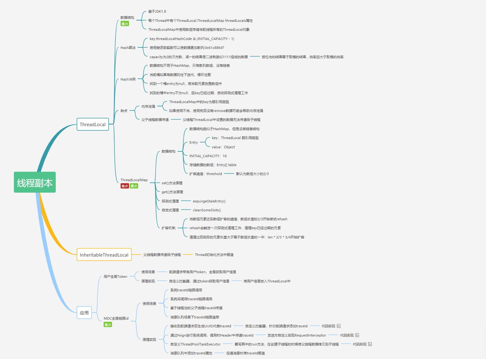
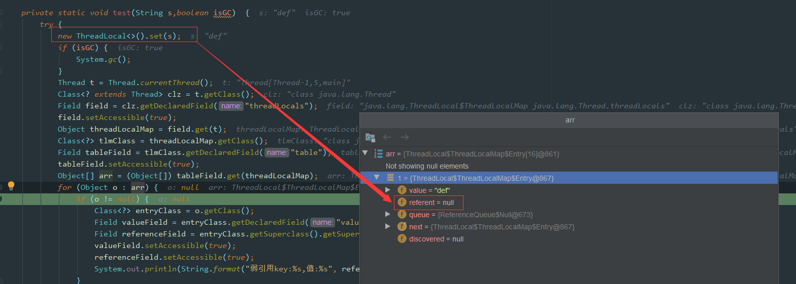
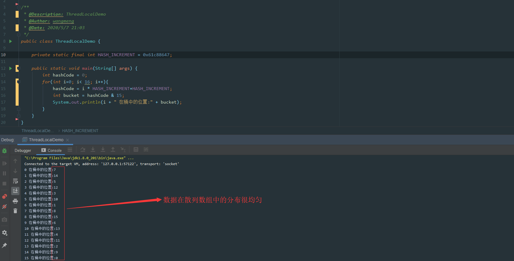
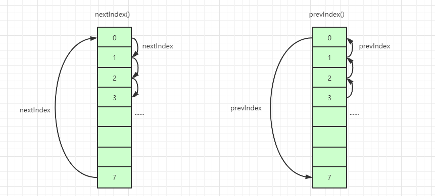
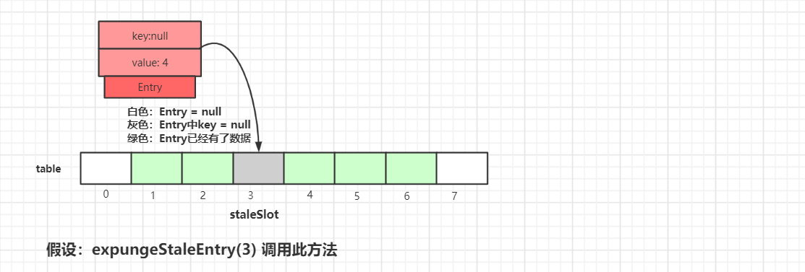
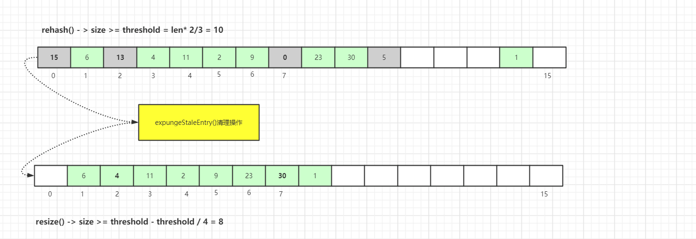
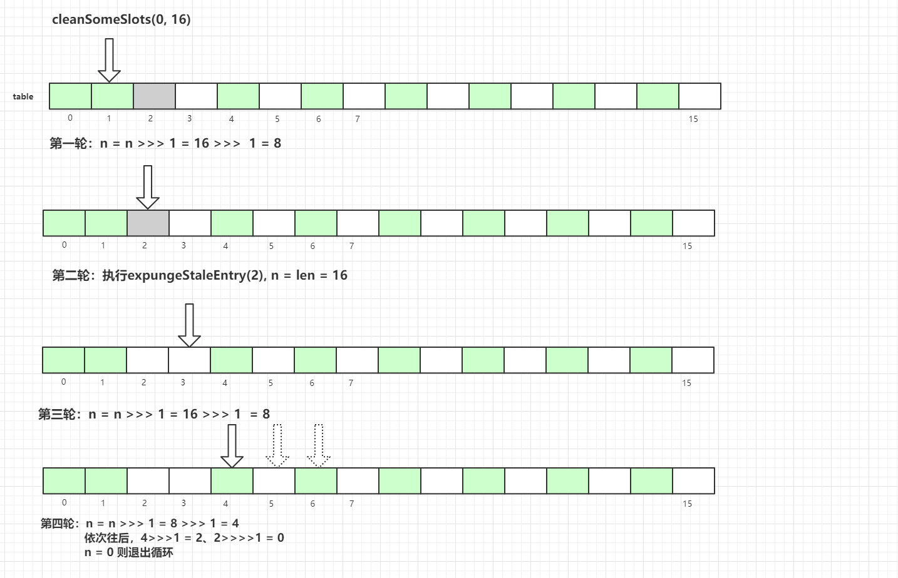
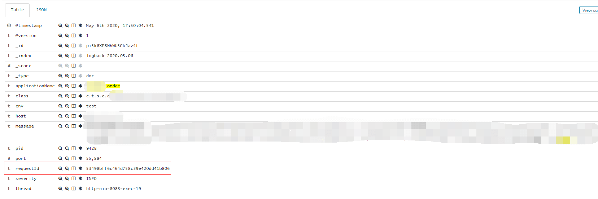
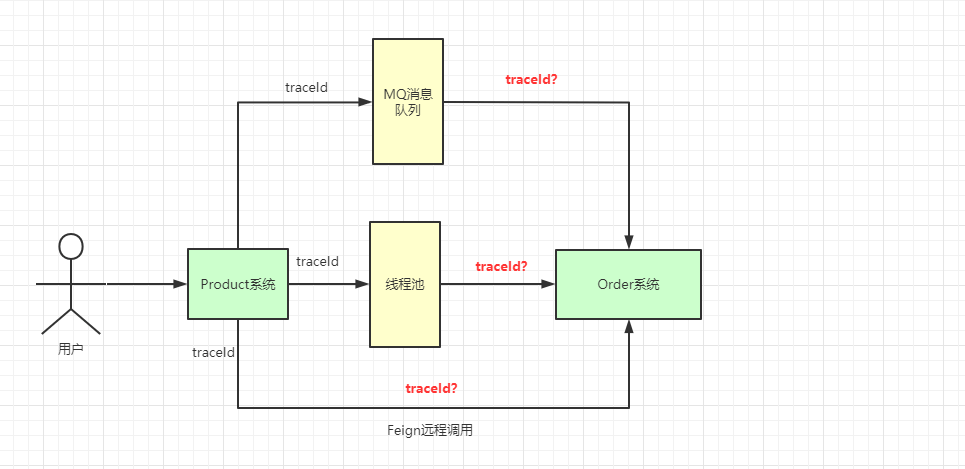

# ThreadLocal详解

# ThreadLocal 详解
### 前言


对于ThreadLocal，大家的第一反应可能是很简单呀，线程的变量副本，每个线程隔离。那这里有几个问题大家可以思考一下：

1. **ThreadLocal的 key 是弱引用，GC之后 key 是否为null？** 
    - 当一个ThreadLocal实例被设置为ThreadLocalMap的键时，由于这个键是弱引用，所以当没有其他强引用指向这个ThreadLocal实例时，它会在垃圾回收时被回收。一旦key被回收，其对应的value在ThreadLocalMap中将无法通过正常的get()方法访问到，但由于Java对象的生命周期管理，key不会自动设为null，而是变为“可清理”的状态。
2. **ThreadLocal中ThreadLocalMap的数据结构？** 
    - ThreadLocalMap是一种定制化的哈希表，它的键是ThreadLocal对象（作为弱引用），值是线程本地变量的实际值。每个Thread对象内部都有一个与之关联的ThreadLocalMap实例。
3. **ThreadLocalMap的Hash 算法？** 
    - ThreadLocalMap使用的是简单的基于ThreadLocal实例的hashCode计算哈希值，并通过数组索引的方式快速定位存储位置。具体实现细节可能会涉及到开放寻址法或者链地址法处理冲突。
4. **ThreadLocalMap中Hash 冲突如何解决？** 
    - 在实际的ThreadLocalMap实现中，如果出现哈希冲突，则采用开放寻址的方式来解决冲突，即通过线性探测法进行重新散列。
5. **ThreadLocalMap的扩容机制？** 
    - ThreadLocalMap并没有像HashMap那样设计有固定的扩容机制。随着元素增多，若遇到哈希冲突会在线性探测过程中寻找下一个可用槽位来存放数据，而不是增加容量。
6. **ThreadLocalMap中过期 key 的清理机制？探测式清理和启发式清理流程？** 
    - ThreadLocalMap本身并不会主动清理过期或已经不再使用的key-value对。但是，在调用`ThreadLocal.get()`、`set()`等方法时，如果检测到key为null（即key已经被GC回收），则会尝试清理entry。 
    - 探测式清理：在一些旧版本的JDK中，当ThreadLocalMap的大小达到阈值且满足清理条件时，会遍历整个map，移除所有已经失效的entry（key为null）。这种方法效率较低，因为需要定期全量扫描。 
    - 启发式清理：从Java 8开始引入了更高效的清理策略。在进行`ThreadLocal.set()`、`get()`以及`remove()`操作时，都会检查当前线程ThreadLocalMap中的entry，如果发现某个entry的key为null，则清理该entry，从而减少内存泄漏的可能性。
7. **ThreadLocalMap.set()方法实现原理？** 
    - `ThreadLocal.set()`方法首先计算当前ThreadLocal实例的hashCode，然后根据这个hashCode找到ThreadLocalMap中的相应位置，如果存在key相等的entry，则更新value；如果不存在，则创建新的entry并插入到合适的位置。
8. **ThreadLocalMap.get()方法实现原理？** 
    - `ThreadLocal.get()`方法同样基于当前ThreadLocal实例的hashCode查找对应的entry，如果找到并且key非空，则返回对应的value；如果找不到匹配的key或key已为null，则返回初始值或null。
9. **项目中ThreadLocal使用情况？遇到的坑？** 
    - 在项目中，ThreadLocal常用于保存线程局部的状态信息，例如数据库连接、用户上下文、请求ID等，以避免在多线程环境中共享这些数据带来的问题。 
    - 常见的“坑”包括： 
        * 内存泄漏：如果线程持续运行且不再访问ThreadLocal，但未显式地调用`remove()`方法清理ThreadLocalMap中的内容，那么即使ThreadLocal实例本身不再被任何地方引用，其存储在ThreadLocalMap中的值仍然可能无法被垃圾回收，导致内存泄漏。
        * 非线程安全：ThreadLocal对于其内部存储的变量是线程安全的，但如果多个ThreadLocal之间存在依赖关系，而没有正确处理，则可能导致数据不一致的问题。
        * 错误地认为ThreadLocal可以替代同步机制：ThreadLocal并不能替代synchronized或Lock等并发控制手段，因为它解决的是不同线程间数据隔离的问题，而非并发访问控制问题。

上述的一些问题你是否都已经掌握的很清楚了呢？本文将围绕这些问题使用图文方式来剖析ThreadLocal的**点点滴滴**。

### 目录
**注明：**本文源码基于JDK 1.8

### ThreadLocal代码演示
我们先看下ThreadLocal使用示例：

```java
public class ThreadLocalTest {
    private List<String> messages = Lists.newArrayList();

    public static final ThreadLocal<ThreadLocalTest> holder = ThreadLocal.withInitial(ThreadLocalTest::new);

    public static void add(String message) {
        holder.get().messages.add(message);
    }

    public static List<String> clear() {
        List<String> messages = holder.get().messages;
        holder.remove();

        System.out.println("size: " + holder.get().messages.size());
        return messages;
    }

    public static void main(String[] args) {
        ThreadLocalTest.add("一枝花算不算浪漫");
        System.out.println(holder.get().messages);
        ThreadLocalTest.clear();
    }
}
```

打印结果：

```java
[一枝花算不算浪漫]
size: 0
```

ThreadLocal对象可以提供线程局部变量，每个线程Thread拥有一份自己的**副本变量**，多个线程互不干扰。

### ThreadLocal的数据结构


Thread类有一个类型为ThreadLocal.ThreadLocalMap的实例变量threadLocals，也就是说每个线程有一个自己的ThreadLocalMap。

ThreadLocalMap有自己的独立实现，可以简单地将它的key视作ThreadLocal，value为代码中放入的值（实际上key并不是ThreadLocal本身，而是它的一个**弱引用**）。

每个线程在往ThreadLocal里放值的时候，都会往自己的ThreadLocalMap里存，读也是以ThreadLocal作为引用，在自己的map里找对应的key，从而实现了**线程隔离**。

ThreadLocalMap有点类似HashMap的结构，只是HashMap是由**数组+链表**实现的，而ThreadLocalMap中并没有**链表**结构。

我们还要注意Entry， 它的key是ThreadLocal<?> k，继承自WeakReference， 也就是我们常说的弱引用类型。

### GC 之后 key 是否为 null？
回应开头的那个问题，ThreadLocal的key是弱引用，那么在ThreadLocal.get()的时候，发生GC之后，key是否是null？

为了搞清楚这个问题，我们需要搞清楚Java的**四种引用类型**：

+ **强引用**：我们常常 new 出来的对象就是强引用类型，只要强引用存在，垃圾回收器将永远不会回收被引用的对象，哪怕内存不足的时候
+ **软引用**：使用 SoftReference 修饰的对象被称为软引用，软引用指向的对象在内存要溢出的时候被回收
+ **弱引用**：使用 WeakReference 修饰的对象被称为弱引用，只要发生垃圾回收，若这个对象只被弱引用指向，那么就会被回收
+ **虚引用**：虚引用是最弱的引用，在 Java 中使用 PhantomReference 进行定义。虚引用中唯一的作用就是用队列接收对象即将死亡的通知

接着再来看下代码，我们使用反射的方式来看看GC后ThreadLocal中的数据情况：(下面代码来源自：[https://blog.csdn.net/thewindkee/article/details/103726942](https://blog.csdn.net/thewindkee/article/details/103726942)[](https://blog.csdn.net/thewindkee/article/details/103726942)本地运行演示 GC 回收场景)

```java
public class ThreadLocalDemo {

    public static void main(String[] args) throws NoSuchFieldException, IllegalAccessException, InterruptedException {
        Thread t = new Thread(()->test("abc",false));
        t.start();
        t.join();
        System.out.println("--gc后--");
        Thread t2 = new Thread(() -> test("def", true));
        t2.start();
        t2.join();
    }

    private static void test(String s,boolean isGC)  {
        try {
            new ThreadLocal<>().set(s);
            if (isGC) {
                System.gc();
            }
            Thread t = Thread.currentThread();
            Class<? extends Thread> clz = t.getClass();
            Field field = clz.getDeclaredField("threadLocals");
            field.setAccessible(true);
            Object ThreadLocalMap = field.get(t);
            Class<?> tlmClass = ThreadLocalMap.getClass();
            Field tableField = tlmClass.getDeclaredField("table");
            tableField.setAccessible(true);
            Object[] arr = (Object[]) tableField.get(ThreadLocalMap);
            for (Object o : arr) {
                if (o != null) {
                    Class<?> entryClass = o.getClass();
                    Field valueField = entryClass.getDeclaredField("value");
                    Field referenceField = entryClass.getSuperclass().getSuperclass().getDeclaredField("referent");
                    valueField.setAccessible(true);
                    referenceField.setAccessible(true);
                    System.out.println(String.format("弱引用key:%s,值:%s", referenceField.get(o), valueField.get(o)));
                }
            }
        } catch (Exception e) {
            e.printStackTrace();
        }
    }
}
```

结果如下：

```java
弱引用key:java.lang.ThreadLocal@433619b6,值:abc
弱引用key:java.lang.ThreadLocal@418a15e3,值:java.lang.ref.SoftReference@bf97a12
--gc后--
弱引用key:null,值:def
```



如图所示，因为这里创建的ThreadLocal并没有指向任何值，也就是没有任何引用：

```java
new ThreadLocal<>().set(s);
```

所以这里在GC之后，key就会被回收，我们看到上面debug中的referent=null, 如果**改动一下代码：**


这个问题刚开始看，如果没有过多思考，**弱引用**，还有**垃圾回收**，那么肯定会觉得是null。

其实是不对的，因为题目说的是在做ThreadLocal.get()操作，证明其实还是有**强引用**存在的，所以key并不为null，如下图所示，ThreadLocal的**强引用**仍然是存在的。


如果我们的**强引用**不存在的话，那么key就会被回收，也就是会出现我们value没被回收，key被回收，导致value永远存在，出现内存泄漏。

### ThreadLocal.set()方法源码详解


ThreadLocal中的set方法原理如上图所示，很简单，主要是判断ThreadLocalMap是否存在，然后使用ThreadLocal中的set方法进行数据处理。

代码如下：

```java
public void set(T value) {
    Thread t = Thread.currentThread();
    ThreadLocalMap map = getMap(t);
    if (map != null)
        map.set(this, value);
    else
        createMap(t, value);
}

void createMap(Thread t, T firstValue) {
    t.threadLocals = new ThreadLocalMap(this, firstValue);
}
```

主要的核心逻辑还是在ThreadLocalMap中的，一步步往下看，后面还有更详细的剖析。

### ThreadLocalMapHash 算法
既然是Map结构，那么ThreadLocalMap当然也要实现自己的hash算法来解决散列表数组冲突问题。

```java
int i = key.threadLocalHashCode & (len-1);
```

ThreadLocalMap中hash算法很简单，这里i就是当前 key 在散列表中对应的数组下标位置。

这里最关键的就是threadLocalHashCode值的计算，ThreadLocal中有一个属性为HASH_INCREMENT = 0x61c88647

```java
public class ThreadLocal<T> {
    private final int threadLocalHashCode = nextHashCode();

    private static AtomicInteger nextHashCode = new AtomicInteger();

    private static final int HASH_INCREMENT = 0x61c88647;

    private static int nextHashCode() {
        return nextHashCode.getAndAdd(HASH_INCREMENT);
    }

    static class ThreadLocalMap {
        ThreadLocalMap(ThreadLocal<?> firstKey, Object firstValue) {
            table = new Entry[INITIAL_CAPACITY];
            int i = firstKey.threadLocalHashCode & (INITIAL_CAPACITY - 1);

            table[i] = new Entry(firstKey, firstValue);
            size = 1;
            setThreshold(INITIAL_CAPACITY);
        }
    }
}
```

每当创建一个ThreadLocal对象，这个ThreadLocal.nextHashCode这个值就会增长0x61c88647。

这个值很特殊，它是**斐波那契数**也叫**黄金分割数**。hash增量为 这个数字，带来的好处就是hash**分布非常均匀**。

我们自己可以尝试下：



可以看到产生的哈希码分布很均匀，这里不去细纠**斐波那契**具体算法，感兴趣的可以自行查阅相关资料。

### ThreadLocalMapHash 冲突
**注明：****下面所有示例图中，****绿色块****Entry代表****正常数据**，**灰色块**代表Entry的key值为null，**已被垃圾回收**。**白色块**表示Entry为null。

虽然ThreadLocalMap中使用了**黄金分割数**来作为hash计算因子，大大减少了Hash冲突的概率，但是仍然会存在冲突。

HashMap中解决冲突的方法是在数组上构造一个**链表**结构，冲突的数据挂载到链表上，如果链表长度超过一定数量则会转化成**红黑树**。

而ThreadLocalMap中并没有链表结构，所以这里不能使用HashMap解决冲突的方式了。


如上图所示，如果我们插入一个value=27的数据，通过hash计算后应该落入槽位 4 中，而槽位 4 已经有了Entry数据。

此时就会线性向后查找，一直找到Entry为null的槽位才会停止查找，将当前元素放入此槽位中。当然迭代过程中还有其他的情况，比如遇到了Entry不为null且key值相等的情况，还有Entry中的key值为null的情况等等都会有不同的处理，后面会一一详细讲解。

这里还画了一个Entry中的key为null的数据（**Entry=2 的灰色块数据**），因为key值是**弱引用**类型，所以会有这种数据存在。在set过程中，如果遇到了key过期的Entry数据，实际上是会进行一轮**探测式清理**操作的，具体操作方式后面会讲到。

### ThreadLocalMap.set()详解
#### ThreadLocalMap.set()原理图解
看完了ThreadLocal**hash 算法**后，我们再来看set是如何实现的。

往ThreadLocalMap中set数据（**新增**或者**更新**数据）分为好几种情况，针对不同的情况我们画图来说明。

**第一种情况：**通过hash计算后的槽位对应的Entry数据为空：


这里直接将数据放到该槽位即可。

**第二种情况：**槽位数据不为空，key值与当前ThreadLocal通过hash计算获取的key值一致：


这里直接更新该槽位的数据。

**第三种情况：**槽位数据不为空，往后遍历过程中，在找到Entry为null的槽位之前，没有遇到key过期的Entry：


遍历散列数组，线性往后查找，如果找到Entry为null的槽位，则将数据放入该槽位中，或者往后遍历过程中，遇到了**key 值相等**的数据，直接更新即可。

**第四种情况：**槽位数据不为空，往后遍历过程中，在找到Entry为null的槽位之前，遇到key过期的Entry，如下图，往后遍历过程中，遇到了index=7的槽位数据Entry的key=null：


散列数组下标为 7 位置对应的Entry数据key为null，表明此数据key值已经被垃圾回收掉了，此时就会执行replaceStaleEntry()方法，该方法含义是**替换过期数据的逻辑**，以**index=7**位起点开始遍历，进行探测式数据清理工作。

初始化探测式清理过期数据扫描的开始位置：slotToExpunge = staleSlot = 7

以当前staleSlot开始 向前迭代查找，找其他过期的数据，然后更新过期数据起始扫描下标slotToExpunge。for循环迭代，直到碰到Entry为null结束。

如果找到了过期的数据，继续向前迭代，直到遇到Entry=null的槽位才停止迭代，如下图所示，**slotToExpunge 被更新为 0**：


以当前节点(index=7)向前迭代，检测是否有过期的Entry数据，如果有则更新slotToExpunge值。碰到null则结束探测。以上图为例slotToExpunge被更新为 0。

上面向前迭代的操作是为了更新探测清理过期数据的起始下标slotToExpunge的值，这个值在后面会讲解，它是用来判断当前过期槽位staleSlot之前是否还有过期元素。

接着开始以staleSlot位置(index=7)向后迭代，**如果找到了相同 key 值的 Entry 数据：**


从当前节点staleSlot向后查找key值相等的Entry元素，找到后更新Entry的值并交换staleSlot元素的位置(staleSlot位置为过期元素)，更新Entry数据，然后开始进行过期Entry的清理工作，如下图所示：


向后遍历过程中，如果没有找到相同 key 值的 Entry 数据：


从当前节点staleSlot向后查找key值相等的Entry元素，直到Entry为null则停止寻找。通过上图可知，此时table中没有key值相同的Entry。

创建新的Entry，替换table[stableSlot]位置：


替换完成后也是进行过期元素清理工作，清理工作主要是有两个方法：expungeStaleEntry()和cleanSomeSlots()，具体细节后面会讲到，请继续往后看。

#### ThreadLocalMap.set()源码详解
上面已经用图的方式解析了set()实现的原理，其实已经很清晰了，我们接着再看下源码：

java.lang.ThreadLocal.ThreadLocalMap.set():

```java
private void set(ThreadLocal<?> key, Object value) {
    Entry[] tab = table;
    int len = tab.length;
    int i = key.threadLocalHashCode & (len-1);

    for (Entry e = tab[i];
         e != null;
         e = tab[i = nextIndex(i, len)]) {
        ThreadLocal<?> k = e.get();

        if (k == key) {
            e.value = value;
            return;
        }

        if (k == null) {
            replaceStaleEntry(key, value, i);
            return;
        }
    }

    tab[i] = new Entry(key, value);
    int sz = ++size;
    if (!cleanSomeSlots(i, sz) && sz >= threshold)
        rehash();
}
```

这里会通过key来计算在散列表中的对应位置，然后以当前key对应的桶的位置向后查找，找到可以使用的桶。

```java
Entry[] tab = table;
int len = tab.length;
int i = key.threadLocalHashCode & (len-1);
```

什么情况下桶才是可以使用的呢？

1. k = key说明是替换操作，可以使用
2. 碰到一个过期的桶，执行替换逻辑，占用过期桶
3. 查找过程中，碰到桶中Entry=null的情况，直接使用

接着就是执行for循环遍历，向后查找，我们先看下nextIndex()、prevIndex()方法实现：



```java
private static int nextIndex(int i, int len) {
    return ((i + 1 < len) ? i + 1 : 0);
}

private static int prevIndex(int i, int len) {
    return ((i - 1 >= 0) ? i - 1 : len - 1);
}
```

接着看剩下for循环中的逻辑：

1. 遍历当前key值对应的桶中Entry数据为空，这说明散列数组这里没有数据冲突，跳出for循环，直接set数据到对应的桶中
2. 如果key值对应的桶中Entry数据不为空2.1 如果k = key，说明当前set操作是一个替换操作，做替换逻辑，直接返回2.2 如果key = null，说明当前桶位置的Entry是过期数据，执行replaceStaleEntry()方法(核心方法)，然后返回
3. for循环执行完毕，继续往下执行说明向后迭代的过程中遇到了entry为null的情况3.1 在Entry为null的桶中创建一个新的Entry对象3.2 执行++size操作
4. 调用cleanSomeSlots()做一次启发式清理工作，清理散列数组中Entry的key过期的数据4.1 如果清理工作完成后，未清理到任何数据，且size超过了阈值(数组长度的 2/3)，进行rehash()操作4.2rehash()中会先进行一轮探测式清理，清理过期key，清理完成后如果**size >= threshold - threshold / 4**，就会执行真正的扩容逻辑(扩容逻辑往后看)

接着重点看下replaceStaleEntry()方法，replaceStaleEntry()方法提供替换过期数据的功能，我们可以对应上面**第四种情况**的原理图来再回顾下，具体代码如下：

java.lang.ThreadLocal.ThreadLocalMap.replaceStaleEntry():

```java
private void replaceStaleEntry(ThreadLocal<?> key, Object value,
                                       int staleSlot) {
    Entry[] tab = table;
    int len = tab.length;
    Entry e;

    int slotToExpunge = staleSlot;
    for (int i = prevIndex(staleSlot, len);
         (e = tab[i]) != null;
         i = prevIndex(i, len))

        if (e.get() == null)
            slotToExpunge = i;

    for (int i = nextIndex(staleSlot, len);
         (e = tab[i]) != null;
         i = nextIndex(i, len)) {

        ThreadLocal<?> k = e.get();

        if (k == key) {
            e.value = value;

            tab[i] = tab[staleSlot];
            tab[staleSlot] = e;

            if (slotToExpunge == staleSlot)
                slotToExpunge = i;
            cleanSomeSlots(expungeStaleEntry(slotToExpunge), len);
            return;
        }

        if (k == null && slotToExpunge == staleSlot)
            slotToExpunge = i;
    }

    tab[staleSlot].value = null;
    tab[staleSlot] = new Entry(key, value);

    if (slotToExpunge != staleSlot)
        cleanSomeSlots(expungeStaleEntry(slotToExpunge), len);
}
```

slotToExpunge表示开始探测式清理过期数据的开始下标，默认从当前的staleSlot开始。以当前的staleSlot开始，向前迭代查找，找到没有过期的数据，for循环一直碰到Entry为null才会结束。如果向前找到了过期数据，更新探测清理过期数据的开始下标为 i，即slotToExpunge=i

```java
for (int i = prevIndex(staleSlot, len);
     (e = tab[i]) != null;
     i = prevIndex(i, len)){

    if (e.get() == null){
        slotToExpunge = i;
    }
}
```

接着开始从staleSlot向后查找，也是碰到Entry为null的桶结束。

如果迭代过程中，**碰到 k == key**，这说明这里是替换逻辑，替换新数据并且交换当前staleSlot位置。如果slotToExpunge == staleSlot，这说明replaceStaleEntry()一开始向前查找过期数据时并未找到过期的Entry数据，接着向后查找过程中也未发现过期数据，修改开始探测式清理过期数据的下标为当前循环的 index，即slotToExpunge = i。最后调用cleanSomeSlots(expungeStaleEntry(slotToExpunge), len);进行启发式过期数据清理。

```java
if (k == key) {
    e.value = value;

    tab[i] = tab[staleSlot];
    tab[staleSlot] = e;

    if (slotToExpunge == staleSlot)
        slotToExpunge = i;

    cleanSomeSlots(expungeStaleEntry(slotToExpunge), len);
    return;
}
```

cleanSomeSlots()和expungeStaleEntry()方法后面都会细讲，这两个是和清理相关的方法，一个是过期key相关Entry的启发式清理(Heuristically scan)，另一个是过期key相关Entry的探测式清理。

**如果 k != key**则会接着往下走，k == null说明当前遍历的Entry是一个过期数据，slotToExpunge == staleSlot说明，一开始的向前查找数据并未找到过期的Entry。如果条件成立，则更新slotToExpunge为当前位置，这个前提是前驱节点扫描时未发现过期数据。

```java
if (k == null && slotToExpunge == staleSlot)
    slotToExpunge = i;
```

往后迭代的过程中如果没有找到k == key的数据，且碰到Entry为null的数据，则结束当前的迭代操作。此时说明这里是一个添加的逻辑，将新的数据添加到table[staleSlot]对应的slot中。

```java
tab[staleSlot].value = null;
tab[staleSlot] = new Entry(key, value);
```

最后判断除了staleSlot以外，还发现了其他过期的slot数据，就要开启清理数据的逻辑：

```java
if (slotToExpunge != staleSlot)
    cleanSomeSlots(expungeStaleEntry(slotToExpunge), len);
```

### ThreadLocalMap过期 key 的探测式清理流程
上面我们有提及ThreadLocalMap的两种过期key数据清理方式：**探测式清理**和**启发式清理**。

我们先讲下探测式清理，也就是expungeStaleEntry方法，遍历散列数组，从开始位置向后探测清理过期数据，将过期数据的Entry设置为null，沿途中碰到未过期的数据则将此数据rehash后重新在table数组中定位，如果定位的位置已经有了数据，则会将未过期的数据放到最靠近此位置的Entry=null的桶中，使rehash后的Entry数据距离正确的桶的位置更近一些。操作逻辑如下：


如上图，set(27)经过 hash 计算后应该落到index=4的桶中，由于index=4桶已经有了数据，所以往后迭代最终数据放入到index=7的桶中，放入后一段时间后index=5中的Entry数据key变为了null


如果再有其他数据set到map中，就会触发**探测式清理**操作。

如上图，执行**探测式清理**后，index=5的数据被清理掉，继续往后迭代，到index=7的元素时，经过rehash后发现该元素正确的index=4，而此位置已经有了数据，往后查找离index=4最近的Entry=null的节点(刚被探测式清理掉的数据：index=5)，找到后移动index= 7的数据到index=5中，此时桶的位置离正确的位置index=4更近了。

经过一轮探测式清理后，key过期的数据会被清理掉，没过期的数据经过rehash重定位后所处的桶位置理论上更接近i= key.hashCode & (tab.len - 1)的位置。这种优化会提高整个散列表查询性能。

接着看下expungeStaleEntry()具体流程，我们还是以先原理图后源码讲解的方式来一步步梳理：



我们假设expungeStaleEntry(3)来调用此方法，如上图所示，我们可以看到ThreadLocalMap中table的数据情况，接着执行清理操作：


第一步是清空当前staleSlot位置的数据，index=3位置的Entry变成了null。然后接着往后探测：


执行完第二步后，index=4 的元素挪到 index=3 的槽位中。

继续往后迭代检查，碰到正常数据，计算该数据位置是否偏移，如果被偏移，则重新计算slot位置，目的是让正常数据尽可能存放在正确位置或离正确位置更近的位置


在往后迭代的过程中碰到空的槽位，终止探测，这样一轮探测式清理工作就完成了，接着我们继续看看具体**实现源代码**：

```java
private int expungeStaleEntry(int staleSlot) {
    Entry[] tab = table;
    int len = tab.length;

    tab[staleSlot].value = null;
    tab[staleSlot] = null;
    size--;

    Entry e;
    int i;
    for (i = nextIndex(staleSlot, len);
         (e = tab[i]) != null;
         i = nextIndex(i, len)) {
        ThreadLocal<?> k = e.get();
        if (k == null) {
            e.value = null;
            tab[i] = null;
            size--;
        } else {
            int h = k.threadLocalHashCode & (len - 1);
            if (h != i) {
                tab[i] = null;

                while (tab[h] != null)
                    h = nextIndex(h, len);
                tab[h] = e;
            }
        }
    }
    return i;
}
```

这里我们还是以staleSlot=3来做示例说明，首先是将tab[staleSlot]槽位的数据清空，然后设置size--

接着以staleSlot位置往后迭代，如果遇到k==null的过期数据，也是清空该槽位数据，然后size--

```java
ThreadLocal<?> k = e.get();

if (k == null) {
    e.value = null;
    tab[i] = null;
    size--;
}
```

如果key没有过期，重新计算当前key的下标位置是不是当前槽位下标位置，如果不是，那么说明产生了hash冲突，此时以新计算出来正确的槽位位置往后迭代，找到最近一个可以存放entry的位置。

```java
int h = k.threadLocalHashCode & (len - 1);
if (h != i) {
    tab[i] = null;

    while (tab[h] != null)
        h = nextIndex(h, len);

    tab[h] = e;
}
```

这里是处理正常的产生Hash冲突的数据，经过迭代后，有过Hash冲突数据的Entry位置会更靠近正确位置，这样的话，查询的时候 效率才会更高。

### ThreadLocalMap扩容机制
在ThreadLocalMap.set()方法的最后，如果执行完启发式清理工作后，未清理到任何数据，且当前散列数组中Entry的数量已经达到了列表的扩容阈值(len*2/3)，就开始执行rehash()逻辑：

```java
if (!cleanSomeSlots(i, sz) && sz >= threshold)
    rehash();
```

接着看下rehash()具体实现：

```java
private void rehash() {
    expungeStaleEntries();

    if (size >= threshold - threshold / 4)
        resize();
}

private void expungeStaleEntries() {
    Entry[] tab = table;
    int len = tab.length;
    for (int j = 0; j < len; j++) {
        Entry e = tab[j];
        if (e != null && e.get() == null)
            expungeStaleEntry(j);
    }
}
```

这里首先是会进行探测式清理工作，从table的起始位置往后清理，上面有分析清理的详细流程。清理完成之后，table中可能有一些key为null的Entry数据被清理掉，所以此时通过判断size >= threshold - threshold / 4也就是size >= threshold * 3/4来决定是否扩容。

我们还记得上面进行rehash()的阈值是size >= threshold，所以当面试官套路我们ThreadLocalMap扩容机制的时候 我们一定要说清楚这两个步骤：



接着看看具体的resize()方法，为了方便演示，我们以oldTab.len=8来举例：


扩容后的tab的大小为oldLen * 2，然后遍历老的散列表，重新计算hash位置，然后放到新的tab数组中，如果出现hash冲突则往后寻找最近的entry为null的槽位，遍历完成之后，oldTab中所有的entry数据都已经放入到新的tab中了。重新计算tab下次扩容的**阈值**，具体代码如下：

```java
private void resize() {
    Entry[] oldTab = table;
    int oldLen = oldTab.length;
    int newLen = oldLen * 2;
    Entry[] newTab = new Entry[newLen];
    int count = 0;

    for (int j = 0; j < oldLen; ++j) {
        Entry e = oldTab[j];
        if (e != null) {
            ThreadLocal<?> k = e.get();
            if (k == null) {
                e.value = null;
            } else {
                int h = k.threadLocalHashCode & (newLen - 1);
                while (newTab[h] != null)
                    h = nextIndex(h, newLen);
                newTab[h] = e;
                count++;
            }
        }
    }

    setThreshold(newLen);
    size = count;
    table = newTab;
}
```

### ThreadLocalMap.get()详解
上面已经看完了set()方法的源码，其中包括set数据、清理数据、优化数据桶的位置等操作，接着看看get()操作的原理。

#### ThreadLocalMap.get()图解
**第一种情况：**通过查找key值计算出散列表中slot位置，然后该slot位置中的Entry.key和查找的key一致，则直接返回：


**第二种情况：**slot位置中的Entry.key和要查找的key不一致：


我们以get(ThreadLocal1)为例，通过hash计算后，正确的slot位置应该是 4，而index=4的槽位已经有了数据，且key值不等于ThreadLocal1，所以需要继续往后迭代查找。

迭代到index=5的数据时，此时Entry.key=null，触发一次探测式数据回收操作，执行expungeStaleEntry()方法，执行完后，index 5,8的数据都会被回收，而index 6,7的数据都会前移。index 6,7前移之后，继续从index=5往后迭代，于是就在index=5找到了key值相等的Entry数据，如下图所示：


#### ThreadLocalMap.get()源码详解
java.lang.ThreadLocal.ThreadLocalMap.getEntry():

```java
private Entry getEntry(ThreadLocal<?> key) {
    int i = key.threadLocalHashCode & (table.length - 1);
    Entry e = table[i];
    if (e != null && e.get() == key)
        return e;
    else
        return getEntryAfterMiss(key, i, e);
}

private Entry getEntryAfterMiss(ThreadLocal<?> key, int i, Entry e) {
    Entry[] tab = table;
    int len = tab.length;

    while (e != null) {
        ThreadLocal<?> k = e.get();
        if (k == key)
            return e;
        if (k == null)
            expungeStaleEntry(i);
        else
            i = nextIndex(i, len);
        e = tab[i];
    }
    return null;
}
```

### ThreadLocalMap过期 key 的启发式清理流程
上面多次提及到ThreadLocalMap过期 key 的两种清理方式：**探测式清理(expungeStaleEntry())**、**启发式清理(cleanSomeSlots())**

探测式清理是以当前Entry往后清理，遇到值为null则结束清理，属于**线性探测清理**。

而启发式清理被作者定义为：**Heuristically scan some cells looking for stale entries**.



具体代码如下：

```java
private boolean cleanSomeSlots(int i, int n) {
    boolean removed = false;
    Entry[] tab = table;
    int len = tab.length;
    do {
        i = nextIndex(i, len);
        Entry e = tab[i];
        if (e != null && e.get() == null) {
            n = len;
            removed = true;
            i = expungeStaleEntry(i);
        }
    } while ( (n >>>= 1) != 0);
    return removed;
}
```

### InheritableThreadLocal
我们使用ThreadLocal的时候，在异步场景下是无法给子线程共享父线程中创建的线程副本数据的。

为了解决这个问题，JDK 中还有一个InheritableThreadLocal类，我们来看一个例子：

```java
public class InheritableThreadLocalDemo {
    public static void main(String[] args) {
        ThreadLocal<String> ThreadLocal = new ThreadLocal<>();
        ThreadLocal<String> inheritableThreadLocal = new InheritableThreadLocal<>();
        ThreadLocal.set("父类数据:threadLocal");
        inheritableThreadLocal.set("父类数据:inheritableThreadLocal");

        new Thread(new Runnable() {
            @Override
            public void run() {
                System.out.println("子线程获取父类ThreadLocal数据：" + ThreadLocal.get());
                System.out.println("子线程获取父类inheritableThreadLocal数据：" + inheritableThreadLocal.get());
            }
        }).start();
    }
}
```

打印结果：

```java
子线程获取父类ThreadLocal数据：null
子线程获取父类inheritableThreadLocal数据：父类数据:inheritableThreadLocal
```

实现原理是子线程是通过在父线程中通过调用new Thread()方法来创建子线程，Thread#init方法在Thread的构造方法中被调用。在init方法中拷贝父线程数据到子线程中：

```java
private void init(ThreadGroup g, Runnable target, String name,
                      long stackSize, AccessControlContext acc,
                      boolean inheritThreadLocals) {
    if (name == null) {
        throw new NullPointerException("name cannot be null");
    }

    if (inheritThreadLocals && parent.inheritableThreadLocals != null)
        this.inheritableThreadLocals =
            ThreadLocal.createInheritedMap(parent.inheritableThreadLocals);
    this.stackSize = stackSize;
    tid = nextThreadID();
}
```

但InheritableThreadLocal仍然有缺陷，一般我们做异步化处理都是使用的线程池，而InheritableThreadLocal是在new Thread中的init()方法给赋值的，而线程池是线程复用的逻辑，所以这里会存在问题。

当然，有问题出现就会有解决问题的方案，阿里巴巴开源了一个TransmittableThreadLocal组件就可以解决这个问题，这里就不再延伸，感兴趣的可自行查阅资料。

### ThreadLocal项目中使用实战
#### ThreadLocal使用场景
我们现在项目中日志记录用的是ELK+Logstash，最后在Kibana中进行展示和检索。

现在都是分布式系统统一对外提供服务，项目间调用的关系可以通过traceId来关联，但是不同项目之间如何传递traceId呢？

这里我们使用org.slf4j.MDC来实现此功能，内部就是通过ThreadLocal来实现的，具体实现如下：

当前端发送请求到**服务 A**时，**服务 A**会生成一个类似UUID的traceId字符串，将此字符串放入当前线程的ThreadLocal中，在调用**服务 B**的时候，将traceId写入到请求的Header中，**服务 B**在接收请求时会先判断请求的Header中是否有traceId，如果存在则写入自己线程的ThreadLocal中。



图中的requestId即为我们各个系统链路关联的traceId，系统间互相调用，通过这个requestId即可找到对应链路，这里还有会有一些其他场景：



针对于这些场景，我们都可以有相应的解决方案，如下所示

#### Feign 远程调用解决方案
**服务发送请求：**

```java
@Component
@Slf4j
public class FeignInvokeInterceptor implements RequestInterceptor {

    @Override
    public void apply(RequestTemplate template) {
        String requestId = MDC.get("requestId");
        if (StringUtils.isNotBlank(requestId)) {
            template.header("requestId", requestId);
        }
    }
}
```

**服务接收请求：**

```java
@Slf4j
@Component
public class LogInterceptor extends HandlerInterceptorAdapter {

    @Override
    public void afterCompletion(HttpServletRequest arg0, HttpServletResponse arg1, Object arg2, Exception arg3) {
        MDC.remove("requestId");
    }

    @Override
    public void postHandle(HttpServletRequest arg0, HttpServletResponse arg1, Object arg2, ModelAndView arg3) {
    }

    @Override
    public boolean preHandle(HttpServletRequest request, HttpServletResponse response, Object handler) throws Exception {

        String requestId = request.getHeader(BaseConstant.REQUEST_ID_KEY);
        if (StringUtils.isBlank(requestId)) {
            requestId = UUID.randomUUID().toString().replace("-", "");
        }
        MDC.put("requestId", requestId);
        return true;
    }
}
```

#### 线程池异步调用，requestId 传递
因为MDC是基于ThreadLocal去实现的，异步过程中，子线程并没有办法获取到父线程ThreadLocal存储的数据，所以这里可以自定义线程池执行器，修改其中的run()方法：

```java
public class MyThreadPoolTaskExecutor extends ThreadPoolTaskExecutor {

    @Override
    public void execute(Runnable runnable) {
        Map<String, String> context = MDC.getCopyOfContextMap();
        super.execute(() -> run(runnable, context));
    }

    @Override
    private void run(Runnable runnable, Map<String, String> context) {
        if (context != null) {
            MDC.setContextMap(context);
        }
        try {
            runnable.run();
        } finally {
            MDC.remove();
        }
    }
}
```

#### 使用 MQ 发送消息给第三方系统
在 MQ 发送的消息体中自定义属性requestId，接收方消费消息后，自己解析requestId使用即可。


> 更新: 2024-01-27 01:00:58  
原文: [https://www.yuque.com/vip6688/neho4x/fgdo1izxudnczftq](https://www.yuque.com/vip6688/neho4x/fgdo1izxudnczftq)
>


> 更新: 2024-11-25 09:18:20  
> 原文: <https://www.yuque.com/neumx/laxg2e/dae08acbeb6e29c00af0bbf2256e3beb>