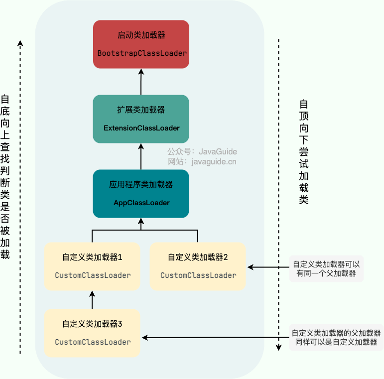
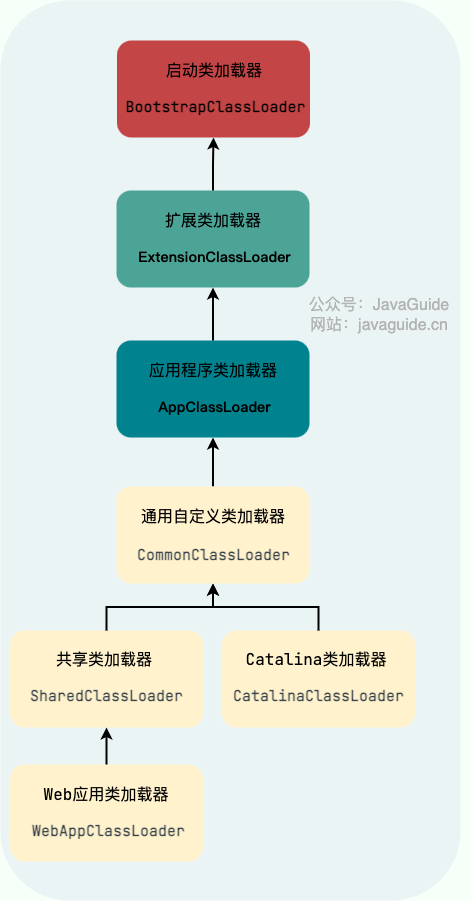

# 类加载器详解（重点）

# 类加载器详解（重点）
## 回顾一下类加载过程
开始介绍类加载器和双亲委派模型之前，简单回顾一下类加载过程。

+ 类加载过程：**加载->连接->初始化**。
+ 连接过程又可分为三步：**验证->准备->解析**。


类加载过程

加载是类加载过程的第一步，主要完成下面 3 件事情：

1. 通过全类名获取定义此类的二进制字节流
2. 将字节流所代表的静态存储结构转换为方法区的运行时数据结构
3. 在内存中生成一个代表该类的Class对象，作为方法区这些数据的访问入口

## 类加载器
### 类加载器介绍
类加载器从 JDK 1.0 就出现了，最初只是为了满足 Java Applet（已经被淘汰） 的需要。后来，慢慢成为 Java 程序中的一个重要组成部分，赋予了 Java 类可以被动态加载到 JVM 中并执行的能力。

根据官方 API 文档的介绍：

A class loader is an object that is responsible for loading classes. The class ClassLoader is an abstract class. Given the binary name of a class, a class loader should attempt to locate or generate data that constitutes a definition for the class. A typical strategy is to transform the name into a file name and then read a "class file" of that name from a file system.Every Class object contains a reference to the ClassLoader that defined it.Class objects for array classes are not created by class loaders, but are created automatically as required by the Java runtime. The class loader for an array class, as returned by Class.getClassLoader() is the same as the class loader for its element type; if the element type is a primitive type, then the array class has no class loader.

翻译过来大概的意思是：

类加载器是一个负责加载类的对象。ClassLoader是一个抽象类。给定类的二进制名称，类加载器应尝试定位或生成构成类定义的数据。典型的策略是将名称转换为文件名，然后从文件系统中读取该名称的“类文件”。每个 Java 类都有一个引用指向加载它的ClassLoader。不过，数组类不是通过ClassLoader创建的，而是 JVM 在需要的时候自动创建的，数组类通过getClassLoader()方法获取ClassLoader的时候和该数组的元素类型的ClassLoader是一致的。

从上面的介绍可以看出:

+ 类加载器是一个负责加载类的对象，用于实现类加载过程中的加载这一步。
+ 每个 Java 类都有一个引用指向加载它的ClassLoader。
+ 数组类不是通过ClassLoader创建的（数组类没有对应的二进制字节流），是由 JVM 直接生成的。

```java
class Class<T> {
    ...
    private final ClassLoader classLoader;
    @CallerSensitive
    public ClassLoader getClassLoader() {
        //...
    }
    ...
}
```

简单来说，*_类加载器的主要作用就是加载 Java 类的字节码（__**.class**__文件）到 JVM 中（在内存中生成一个代表该类的__**Class**_*对象）。**字节码可以是 Java 源程序（.java文件）经过javac编译得来，也可以是通过工具动态生成或者通过网络下载得来。

其实除了加载类之外，类加载器还可以加载 Java 应用所需的资源如文本、图像、配置文件、视频等等文件资源。本文只讨论其核心功能：加载类。

### 类加载器加载规则
JVM 启动的时候，并不会一次性加载所有的类，而是根据需要去动态加载。也就是说，大部分类在具体用到的时候才会去加载，这样对内存更加友好。

对于已经加载的类会被放在ClassLoader中。在类加载的时候，系统会首先判断当前类是否被加载过。已经被加载的类会直接返回，否则才会尝试加载。也就是说，对于一个类加载器来说，相同二进制名称的类只会被加载一次。

```java
public abstract class ClassLoader {
    ...
    private final ClassLoader parent;
    // 由这个类加载器加载的类。
    private final Vector<Class<?>> classes = new Vector<>();
    // 由VM调用，用此类加载器记录每个已加载类。
    void addClass(Class<?> c) {
        classes.addElement(c);
    }
    ...
}
```

### 类加载器总结
JVM 中内置了三个重要的ClassLoader：

1. **BootstrapClassLoader****(启动类加载器)**：最顶层的加载类，由 C++实现，通常表示为 null，并且没有父级，主要用来加载 JDK 内部的核心类库（%JAVA_HOME%/lib目录下的rt.jar、resources.jar、charsets.jar等 jar 包和类）以及被-Xbootclasspath参数指定的路径下的所有类。
2. **ExtensionClassLoader****(扩展类加载器)**：主要负责加载%JRE_HOME%/lib/ext目录下的 jar 包和类以及被java.ext.dirs系统变量所指定的路径下的所有类。
3. **AppClassLoader****(应用程序类加载器)**：面向我们用户的加载器，负责加载当前应用 classpath 下的所有 jar 包和类。

🌈 拓展一下：

+ **rt.jar**：rt 代表“RunTime”，rt.jar是 Java 基础类库，包含 Java doc 里面看到的所有的类的类文件。也就是说，我们常用内置库java.xxx._都在里面，比如java.util._、java.io._、java.nio._、java.lang._、java.sql._、java.math.*。
+ Java 9 引入了模块系统，并且略微更改了上述的类加载器。扩展类加载器被改名为平台类加载器（platform class loader）。Java SE 中除了少数几个关键模块，比如说java.base是由启动类加载器加载之外，其他的模块均由平台类加载器所加载。

除了这三种类加载器之外，用户还可以加入自定义的类加载器来进行拓展，以满足自己的特殊需求。就比如说，我们可以对 Java 类的字节码（.class文件）进行加密，加载时再利用自定义的类加载器对其解密。


类加载器层次关系图

除了BootstrapClassLoader是 JVM 自身的一部分之外，其他所有的类加载器都是在 JVM 外部实现的，并且全都继承自ClassLoader抽象类。这样做的好处是用户可以自定义类加载器，以便让应用程序自己决定如何去获取所需的类。

每个ClassLoader可以通过getParent()获取其父ClassLoader，如果获取到ClassLoader为null的话，那么该类是通过BootstrapClassLoader加载的。

```java
public abstract class ClassLoader {
    ...
    // 父加载器
    private final ClassLoader parent;
    @CallerSensitive
    public final ClassLoader getParent() {
        //...
    }
    ...
}
```

*_为什么 获取到__**ClassLoader**__为__**null**__就是__**BootstrapClassLoader**_*加载的呢？**这是因为BootstrapClassLoader由 C++ 实现，由于这个 C++ 实现的类加载器在 Java 中是没有与之对应的类的，所以拿到的结果是 null。

下面我们来看一个获取ClassLoader的小案例：

```java
public class PrintClassLoaderTree {

    public static void main(String[] args) {

        ClassLoader classLoader = PrintClassLoaderTree.class.getClassLoader();

        StringBuilder split = new StringBuilder("|--");
        boolean needContinue = true;
        while (needContinue){
            System.out.println(split.toString() + classLoader);
            if(classLoader == null){
                needContinue = false;
            }else{
                classLoader = classLoader.getParent();
                split.insert(0, "\t");
            }
        }
    }

}
```

输出结果(JDK 8 )：

```java
|--sun.misc.Launcher$AppClassLoader@18b4aac2
|--sun.misc.Launcher$ExtClassLoader@53bd815b
|--null
```

从输出结果可以看出：

+ 我们编写的 Java 类PrintClassLoaderTree的ClassLoader是AppClassLoader；
+ AppClassLoader的父ClassLoader是ExtClassLoader；
+ ExtClassLoader的父ClassLoader是Bootstrap ClassLoader，因此输出结果为 null。

### 自定义类加载器
我们前面也说说了，除了BootstrapClassLoader其他类加载器均由 Java 实现且全部继承自java.lang.ClassLoader。如果我们要自定义自己的类加载器，很明显需要继承ClassLoader抽象类。

ClassLoader类有两个关键的方法：

+ protected Class loadClass(String name, boolean resolve)：加载指定二进制名称的类，实现了双亲委派机制 。name为类的二进制名称，resolve如果为 true，在加载时调用resolveClass(Class<?> c)方法解析该类。
+ protected Class findClass(String name)：根据类的二进制名称来查找类，默认实现是空方法。

官方 API 文档中写到：

Subclasses ofClassLoaderare encouraged to overridefindClass(String name), rather than this method.建议ClassLoader的子类重写findClass(String name)方法而不是loadClass(String name, boolean resolve)方法。

如果我们不想打破双亲委派模型，就重写ClassLoader类中的findClass()方法即可，无法被父类加载器加载的类最终会通过这个方法被加载。但是，如果想打破双亲委派模型则需要重写loadClass()方法。

## 双亲委派模型
### 双亲委派模型介绍
类加载器有很多种，当我们想要加载一个类的时候，具体是哪个类加载器加载呢？这就需要提到双亲委派模型了。

根据官网介绍：

The ClassLoader class uses a delegation model to search for classes and resources. Each instance of ClassLoader has an associated parent class loader. When requested to find a class or resource, a ClassLoader instance will delegate the search for the class or resource to its parent class loader before attempting to find the class or resource itself. The virtual machine's built-in class loader, called the "bootstrap class loader", does not itself have a parent but may serve as the parent of a ClassLoader instance.

翻译过来大概的意思是：

ClassLoader类使用委托模型来搜索类和资源。每个ClassLoader实例都有一个相关的父类加载器。需要查找类或资源时，ClassLoader实例会在试图亲自查找类或资源之前，将搜索类或资源的任务委托给其父类加载器。虚拟机中被称为 "bootstrap class loader"的内置类加载器本身没有父类加载器，但是可以作为ClassLoader实例的父类加载器。

从上面的介绍可以看出：

+ ClassLoader类使用委托模型来搜索类和资源。
+ 双亲委派模型要求除了顶层的启动类加载器外，其余的类加载器都应有自己的父类加载器。
+ ClassLoader实例会在试图亲自查找类或资源之前，将搜索类或资源的任务委托给其父类加载器。

下图展示的各种类加载器之间的层次关系被称为类加载器的“**双亲委派模型(Parents Delegation Model)**”。



类加载器层次关系图

注意 ⚠️：双亲委派模型并不是一种强制性的约束，只是 JDK 官方推荐的一种方式。如果我们因为某些特殊需求想要打破双亲委派模型，也是可以的，后文会介绍具体的方法。

其实这个双亲翻译的容易让别人误解，我们一般理解的双亲都是父母，这里的双亲更多地表达的是“父母这一辈”的人而已，并不是说真的有一个MotherClassLoader和一个FatherClassLoader。个人觉得翻译成单亲委派模型更好一些，不过，国内既然翻译成了双亲委派模型并流传了，按照这个来也没问题，不要被误解了就好。

另外，类加载器之间的父子关系一般不是以继承的关系来实现的，而是通常使用组合关系来复用父加载器的代码。

```java
public abstract class ClassLoader {
    ...
    // 组合
    private final ClassLoader parent;
    protected ClassLoader(ClassLoader parent) {
        this(checkCreateClassLoader(), parent);
    }
    ...
}
```

在面向对象编程中，有一条非常经典的设计原则：**组合优于继承，多用组合少用继承。**

### 双亲委派模型的执行流程
双亲委派模型的实现代码非常简单，逻辑非常清晰，都集中在java.lang.ClassLoader的loadClass()中，相关代码如下所示。

```java
protected Class<?> loadClass(String name, boolean resolve)
throws ClassNotFoundException
{
    synchronized (getClassLoadingLock(name)) {
        //首先，检查该类是否已经加载过
        Class c = findLoadedClass(name);
        if (c == null) {
            //如果 c 为 null，则说明该类没有被加载过
            long t0 = System.nanoTime();
            try {
                if (parent != null) {
                    //当父类的加载器不为空，则通过父类的loadClass来加载该类
                    c = parent.loadClass(name, false);
                } else {
                    //当父类的加载器为空，则调用启动类加载器来加载该类
                    c = findBootstrapClassOrNull(name);
                }
            } catch (ClassNotFoundException e) {
                //非空父类的类加载器无法找到相应的类，则抛出异常
            }

            if (c == null) {
                //当父类加载器无法加载时，则调用findClass方法来加载该类
                //用户可通过覆写该方法，来自定义类加载器
                long t1 = System.nanoTime();
                c = findClass(name);

                //用于统计类加载器相关的信息
                sun.misc.PerfCounter.getParentDelegationTime().addTime(t1 - t0);
                sun.misc.PerfCounter.getFindClassTime().addElapsedTimeFrom(t1);
                sun.misc.PerfCounter.getFindClasses().increment();
            }
        }
        if (resolve) {
            //对类进行link操作
            resolveClass(c);
        }
        return c;
    }
}
```

**<font style="background-color:#d9eafc;">每当一个类加载器接收到加载请求时，它会先将请求转发给父类加载器。在父类加载器没有找到所请求的类的情况下，该类加载器才会尝试去加载</font>**。

结合上面的源码，简单总结一下双亲委派模型的执行流程：

+ 在类加载的时候，系统会首先判断当前类是否被加载过。已经被加载的类会直接返回，否则才会尝试加载（每个父类加载器都会走一遍这个流程）。
+ 类加载器在进行类加载的时候，它首先不会自己去尝试加载这个类，而是把这个请求委派给父类加载器去完成（调用父加载器loadClass()方法来加载类）。这样的话，所有的请求最终都会传送到顶层的启动类加载器BootstrapClassLoader中。
+ 只有当父加载器反馈自己无法完成这个加载请求（它的搜索范围中没有找到所需的类）时，子加载器才会尝试自己去加载（调用自己的findClass()方法来加载类）。
+ 如果子类加载器也无法加载这个类，那么它会抛出一个ClassNotFoundException异常。

🌈 拓展一下：

**JVM 判定两个 Java 类是否相同的具体规则**：JVM 不仅要看类的全名是否相同，还要看加载此类的类加载器是否一样。只有两者都相同的情况，才认为两个类是相同的。即使两个类来源于同一个Class文件，被同一个虚拟机加载，只要加载它们的类加载器不同，那这两个类就必定不相同。

### 双亲委派模型的好处
**<font style="background-color:#d9eafc;">双亲委派模型保证了 Java 程序的稳定运行，可以避免类的重复加载（JVM 区分不同类的方式不仅仅根据类名，相同的类文件被不同的类加载器加载产生的是两个不同的类），也保证了 Java 的核心 API 不被篡改</font>**。

如果没有使用双亲委派模型，而是每个类加载器加载自己的话就会出现一些问题，比如我们编写一个称为java.lang.Object类的话，那么程序运行的时候，系统就会出现两个不同的Object类。**<font style="background-color:#d9eafc;">双亲委派模型可以保证加载的是 JRE 里的那个Object类，而不是你写的Object类</font>**。这是因为AppClassLoader在加载你的Object类时，会委托给ExtClassLoader去加载，而ExtClassLoader又会委托给BootstrapClassLoader，BootstrapClassLoader发现自己已经加载过了Object类，会直接返回，不会去加载你写的Object类。

### 打破双亲委派模型方法
~~为了避免双亲委托机制，我们可以自己定义一个类加载器，然后重写~~~~loadClass()~~~~即可。~~

_**�**_* 修正（参见：[issue871](https://github.com/Snailclimb/JavaGuide/issues/871)[open in new window](https://github.com/Snailclimb/JavaGuide/issues/871)）**：**<font style="background-color:#d9eafc;">自定义加载器的话，需要继承ClassLoader。如果我们不想打破双亲委派模型，就重写ClassLoader类中的findClass()方法即可，无法被父类加载器加载的类最终会通过这个方法被加载。但是，如果想打破双亲委派模型则需要重写loadClass()方法。</font>**

为什么是重写loadClass()方法打破双亲委派模型呢？双亲委派模型的执行流程已经解释了：

类加载器在进行类加载的时候，它首先不会自己去尝试加载这个类，而是把这个请求委派给父类加载器去完成（调用父加载器loadClass()方法来加载类）。

重写loadClass()方法之后，我们就可以改变传统双亲委派模型的执行流程。例如，子类加载器可以在委派给父类加载器之前，先自己尝试加载这个类，或者在父类加载器返回之后，再尝试从其他地方加载这个类。具体的规则由我们自己实现，根据项目需求定制化。

我们比较熟悉的 Tomcat 服务器为了能够优先加载 Web 应用目录下的类，然后再加载其他目录下的类，就自定义了类加载器WebAppClassLoader来打破双亲委托机制。这也是 Tomcat 下 Web 应用之间的类实现隔离的具体原理。

Tomcat 的类加载器的层次结构如下：



Tomcat 的类加载器的层次结构

Tomcat 这四个自定义的类加载器对应的目录如下：

+ CommonClassLoader对应/common/*
+ CatalinaClassLoader对应/server/*
+ SharedClassLoader对应/shared/*
+ WebAppClassloader对应/webapps//WEB-INF/*

从图中的委派关系中可以看出：

+ CommonClassLoader作为CatalinaClassLoader和SharedClassLoader的父加载器。CommonClassLoader能加载的类都可以被CatalinaClassLoader和SharedClassLoader使用。因此，CommonClassLoader是为了实现公共类库（可以被所有 Web 应用和 Tomcat 内部组件使用的类库）的共享和隔离。
+ CatalinaClassLoader和SharedClassLoader能加载的类则与对方相互隔离。CatalinaClassLoader用于加载 Tomcat 自身的类，为了隔离 Tomcat 本身的类和 Web 应用的类。SharedClassLoader作为WebAppClassLoader的父加载器，专门来加载 Web 应用之间共享的类比如 Spring、Mybatis。
+ 每个 Web 应用都会创建一个单独的WebAppClassLoader，并在启动 Web 应用的线程里设置线程线程上下文类加载器为WebAppClassLoader。各个WebAppClassLoader实例之间相互隔离，进而实现 Web 应用之间的类隔。

单纯依靠自定义类加载器没办法满足某些场景的要求，例如，有些情况下，高层的类加载器需要加载低层的加载器才能加载的类。

比如，SPI 中，SPI 的接口（如java.sql.Driver）是由 Java 核心库提供的，由BootstrapClassLoader加载。而 SPI 的实现（如com.mysql.cj.jdbc.Driver）是由第三方供应商提供的，它们是由应用程序类加载器或者自定义类加载器来加载的。默认情况下，一个类及其依赖类由同一个类加载器加载。所以，加载 SPI 的接口的类加载器（BootstrapClassLoader）也会用来加载 SPI 的实现。按照双亲委派模型，BootstrapClassLoader是无法找到 SPI 的实现类的，因为它无法委托给子类加载器去尝试加载。

再比如，假设我们的项目中有 Spring 的 jar 包，由于其是 Web 应用之间共享的，因此会由SharedClassLoader加载（Web 服务器是 Tomcat）。我们项目中有一些用到了 Spring 的业务类，比如实现了 Spring 提供的接口、用到了 Spring 提供的注解。所以，加载 Spring 的类加载器（也就是SharedClassLoader）也会用来加载这些业务类。但是业务类在 Web 应用目录下，不在SharedClassLoader的加载路径下，所以SharedClassLoader无法找到业务类，也就无法加载它们。

如何解决这个问题呢？ 这个时候就需要用到**线程上下文类加载器（**ThreadContextClassLoader**）**了。

拿 Spring 这个例子来说，当 Spring 需要加载业务类的时候，它不是用自己的类加载器，而是用当前线程的上下文类加载器。还记得我上面说的吗？每个 Web 应用都会创建一个单独的WebAppClassLoader，并在启动 Web 应用的线程里设置线程线程上下文类加载器为WebAppClassLoader。这样就可以让高层的类加载器（SharedClassLoader）借助子类加载器（WebAppClassLoader）来加载业务类，破坏了 Java 的类加载委托机制，让应用逆向使用类加载器。

线程线程上下文类加载器的原理是将一个类加载器保存在线程私有数据里，跟线程绑定，然后在需要的时候取出来使用。这个类加载器通常是由应用程序或者容器（如 Tomcat）设置的。

Java.lang.Thread中的getContextClassLoader()和setContextClassLoader(ClassLoader cl)分别用来获取和设置线程的上下文类加载器。如果没有通过setContextClassLoader(ClassLoader cl)进行设置的话，线程将继承其父线程的上下文类加载器。

Spring 获取线程线程上下文类加载器的代码如下：

```java
cl = Thread.currentThread().getContextClassLoader();
```

感兴趣的小伙伴可以自行深入研究一下 Tomcat 打破双亲委派模型的原理，推荐资料：[《深入拆解 Tomcat & Jetty》](http://gk.link/a/10Egr)[open in new window](http://gk.link/a/10Egr)。

## 推荐阅读
+ 《深入拆解 Java 虚拟机》
+ 深入分析 Java ClassLoader 原理：[https://blog.csdn.net/xyang81/article/details/7292380](https://blog.csdn.net/xyang81/article/details/7292380)[open in new window](https://blog.csdn.net/xyang81/article/details/7292380)
+ Java 类加载器(ClassLoader)：[http://gityuan.com/2016/01/24/java-classloader/](http://gityuan.com/2016/01/24/java-classloader/)[open in new window](http://gityuan.com/2016/01/24/java-classloader/)
+ Class Loaders in Java：[https://www.baeldung.com/java-classloaders](https://www.baeldung.com/java-classloaders)[open in new window](https://www.baeldung.com/java-classloaders)
+ Class ClassLoader - Oracle 官方文档：[https://docs.oracle.com/javase/8/docs/api/java/lang/ClassLoader.html](https://docs.oracle.com/javase/8/docs/api/java/lang/ClassLoader.html)[open in new window](https://docs.oracle.com/javase/8/docs/api/java/lang/ClassLoader.html)
+ 老大难的 Java ClassLoader 再不理解就老了：[https://zhuanlan.zhihu.com/p/51374915](https://zhuanlan.zhihu.com/p/51374915)[open in new window](https://zhuanlan.zhihu.com/p/51374915)


> 更新: 2024-01-08 23:04:39  
原文: [https://www.yuque.com/vip6688/neho4x/kv2pxl2xxyh9a4i7](https://www.yuque.com/vip6688/neho4x/kv2pxl2xxyh9a4i7)
>


> 更新: 2024-11-25 09:19:03  
> 原文: <https://www.yuque.com/neumx/laxg2e/f231de848d107ba9fdb67fc493fcc2b7>