# MySQL死锁了，怎么办？

# MySQL 死锁了，怎么办？
<font style="color:rgb(44, 62, 80);">说个很早之前自己遇到过数据库死锁问题。</font>

<font style="color:rgb(44, 62, 80);">有个业务主要逻辑就是新增订单、修改订单、查询订单等操作。然后因为订单是不能重复的，所以当时在新增订单的时候做了幂等性校验，做法就是在新增订单记录之前，先通过</font><font style="color:rgb(44, 62, 80);"> </font><font style="color:rgb(71, 101, 130);">select ... for update</font><font style="color:rgb(44, 62, 80);"> </font><font style="color:rgb(44, 62, 80);">语句查询订单是否存在，如果不存在才插入订单记录。</font>

<font style="color:rgb(44, 62, 80);">而正是因为这样的操作，当业务量很大的时候，就可能会出现死锁。</font>

<font style="color:rgb(44, 62, 80);">接下来跟大家聊下</font>**<font style="color:rgb(48, 79, 254);">为什么会发生死锁，以及怎么避免死锁</font>**<font style="color:rgb(44, 62, 80);">。</font>

## [](https://xiaolincoding.com/mysql/lock/deadlock.html#%E6%AD%BB%E9%94%81%E7%9A%84%E5%8F%91%E7%94%9F)<font style="color:rgb(44, 62, 80);">死锁的发生</font>
<font style="color:rgb(44, 62, 80);">本次案例使用存储引擎 Innodb，隔离级别为可重复读（RR）。</font>

<font style="color:rgb(44, 62, 80);">接下来，我用实战的方式来带大家看看死锁是怎么发生的。</font>

<font style="color:rgb(44, 62, 80);">我建了一张订单表，其中 id 字段为主键索引，order_no 字段普通索引，也就是非唯一索引：</font>


```sql
CREATE TABLE `t_order` (
  `id` int NOT NULL AUTO_INCREMENT,
  `order_no` int DEFAULT NULL,
  `create_date` datetime DEFAULT NULL,
  PRIMARY KEY (`id`),
  KEY `index_order` (`order_no`) USING BTREE
) ENGINE=InnoDB ;
```

<font style="color:rgb(44, 62, 80);">然后，先</font><font style="color:rgb(44, 62, 80);"> </font><font style="color:rgb(71, 101, 130);">t_order</font><font style="color:rgb(44, 62, 80);"> </font><font style="color:rgb(44, 62, 80);">表里现在已经有了 6 条记录：</font>


<font style="color:rgb(44, 62, 80);">假设这时有两事务，一个事务要插入订单 1007 ，另外一个事务要插入订单 1008，因为需要对订单做幂等性校验，所以两个事务先要查询该订单是否存在，不存在才插入记录，过程如下：</font>


<font style="color:rgb(44, 62, 80);">可以看到，两个事务都陷入了等待状态（前提没有打开死锁检测），也就是发生了死锁，因为都在相互等待对方释放锁。</font>

<font style="color:rgb(44, 62, 80);">这里在查询记录是否存在的时候，使用了</font><font style="color:rgb(44, 62, 80);"> </font><font style="color:rgb(71, 101, 130);">select ... for update</font><font style="color:rgb(44, 62, 80);"> </font><font style="color:rgb(44, 62, 80);">语句，目的为了防止事务执行的过程中，有其他事务插入了记录，而出现幻读的问题。</font>

<font style="color:rgb(44, 62, 80);">如果没有使用</font><font style="color:rgb(44, 62, 80);"> </font><font style="color:rgb(71, 101, 130);">select ... for update</font><font style="color:rgb(44, 62, 80);"> </font><font style="color:rgb(44, 62, 80);">语句，而使用了单纯的 select 语句，如果是两个订单号一样的请求同时进来，就会出现两个重复的订单，有可能出现幻读，如下图：</font>

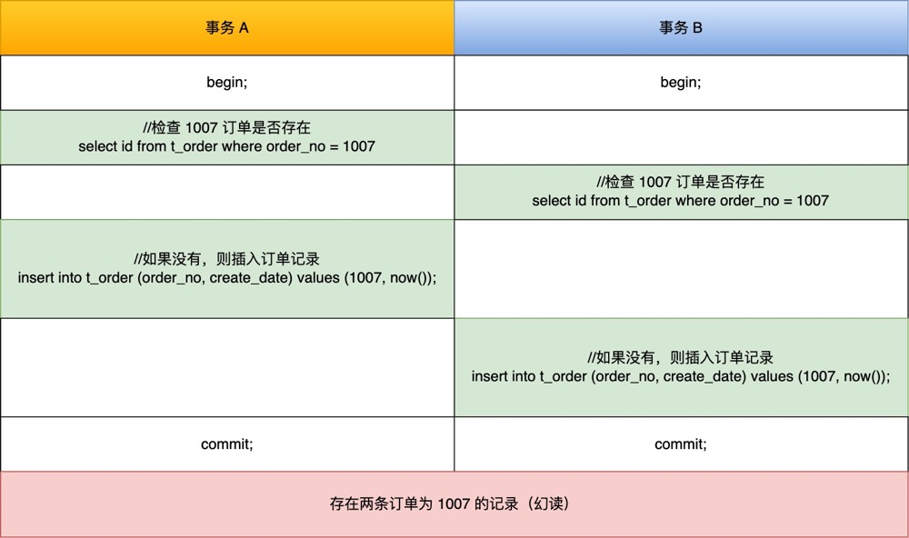

## [](https://xiaolincoding.com/mysql/lock/deadlock.html#%E4%B8%BA%E4%BB%80%E4%B9%88%E4%BC%9A%E4%BA%A7%E7%94%9F%E6%AD%BB%E9%94%81)<font style="color:rgb(44, 62, 80);">为什么会产生死锁？</font>
<font style="color:rgb(44, 62, 80);">可重复读隔离级别下，是存在幻读的问题。</font>

**<font style="color:rgb(48, 79, 254);">Innodb 引擎为了解决「可重复读」隔离级别下的幻读问题，就引出了 next-key 锁</font>**<font style="color:rgb(44, 62, 80);">，它是记录锁和间隙锁的组合。</font>

+ <font style="color:rgb(44, 62, 80);">Record Lock，记录锁，锁的是记录本身；</font>
+ <font style="color:rgb(44, 62, 80);">Gap Lock，间隙锁，锁的就是两个值之间的空隙，以防止其他事务在这个空隙间插入新的数据，从而避免幻读现象。</font>

<font style="color:rgb(44, 62, 80);">普通的 select 语句是不会对记录加锁的，因为它是通过 MVCC 的机制实现的快照读，如果要在查询时对记录加行锁，可以使用下面这两个方式：</font>


```sql
begin;
//对读取的记录加共享锁
select ... lock in share mode;
commit; //锁释放

begin;
//对读取的记录加排他锁
select ... for update;
commit; //锁释放
```

<font style="color:rgb(44, 62, 80);">行锁的释放时机是在事务提交（commit）后，锁就会被释放，并不是一条语句执行完就释放行锁。</font>

<font style="color:rgb(44, 62, 80);">比如，下面事务 A 查询语句会锁住</font><font style="color:rgb(44, 62, 80);"> </font><font style="color:rgb(71, 101, 130);">(2, +∞]</font><font style="color:rgb(44, 62, 80);"> </font><font style="color:rgb(44, 62, 80);">范围的记录，然后期间如果有其他事务在这个锁住的范围插入数据就会被阻塞。</font>


<font style="color:rgb(44, 62, 80);">next-key 锁的加锁规则其实挺复杂的，在一些场景下会退化成记录锁或间隙锁，我之前也写一篇加锁规则，详细可以看这篇：</font>[MySQL 是怎么加锁的？](https://xiaolincoding.com/mysql/lock/how_to_lock.html)

<font style="color:rgb(44, 62, 80);">需要注意的是，如果 update 语句的 where 条件没有用到索引列，那么就会全表扫描，在一行行扫描的过程中，不仅给行记录加上了行锁，还给行记录两边的空隙也加上了间隙锁，相当于锁住整个表，然后直到事务结束才会释放锁。</font>

<font style="color:rgb(44, 62, 80);">所以在线上千万不要执行没有带索引条件的 update 语句，不然会造成业务停滞，我有个读者就因为干了这个事情，然后被老板教育了一波，详细可以看这篇：</font>[update 没加索引会锁全表？](https://xiaolincoding.com/mysql/lock/update_index.html)

<font style="color:rgb(44, 62, 80);">回到前面死锁的例子。</font>

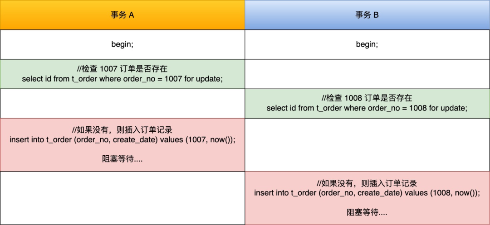

<font style="color:rgb(44, 62, 80);">事务 A 在执行下面这条语句的时候：</font>


```sql
select id from t_order where order_no = 1007 for update;
```

<font style="color:rgb(44, 62, 80);">我们可以通过</font><font style="color:rgb(44, 62, 80);"> </font><font style="color:rgb(71, 101, 130);">select * from performance_schema.data_locks\G;</font><font style="color:rgb(44, 62, 80);"> </font><font style="color:rgb(44, 62, 80);">这条语句，查看事务执行 SQL 过程中加了什么锁。</font>

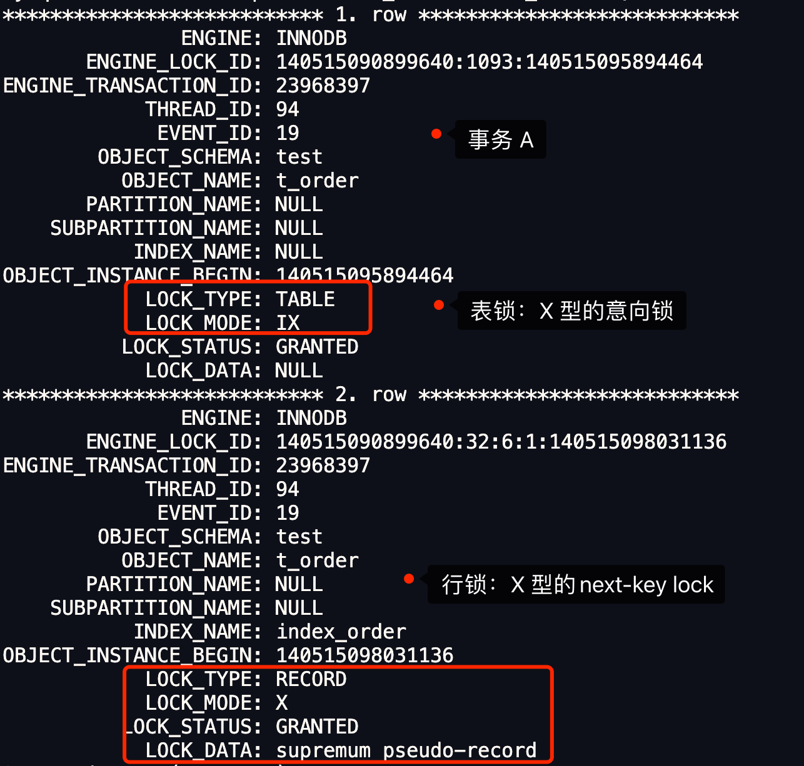

<font style="color:rgb(44, 62, 80);">从上图可以看到，共加了两个锁，分别是：</font>

+ <font style="color:rgb(44, 62, 80);">表锁：X 类型的意向锁；</font>
+ <font style="color:rgb(44, 62, 80);">行锁：X 类型的间隙锁；</font>

<font style="color:rgb(44, 62, 80);">这里我们重点关注行锁，图中 LOCK_TYPE 中的 RECORD 表示行级锁，而不是记录锁的意思，通过 LOCK_MODE 可以确认是 next-key 锁，还是间隙锁，还是记录锁：</font>

+ <font style="color:rgb(44, 62, 80);">如果 LOCK_MODE 为</font><font style="color:rgb(44, 62, 80);"> </font><font style="color:rgb(71, 101, 130);">X</font><font style="color:rgb(44, 62, 80);">，说明是 X 型的 next-key 锁；</font>
+ <font style="color:rgb(44, 62, 80);">如果 LOCK_MODE 为</font><font style="color:rgb(44, 62, 80);"> </font><font style="color:rgb(71, 101, 130);">X, REC_NOT_GAP</font><font style="color:rgb(44, 62, 80);">，说明是 X 型的记录锁；</font>
+ <font style="color:rgb(44, 62, 80);">如果 LOCK_MODE 为</font><font style="color:rgb(44, 62, 80);"> </font><font style="color:rgb(71, 101, 130);">X, GAP</font><font style="color:rgb(44, 62, 80);">，说明是 X 型的间隙锁；</font>

**<font style="color:rgb(48, 79, 254);">因此，此时事务 A 在二级索引（INDEX_NAME : index_order）上加的是 X 型的 next-key 锁，锁范围是</font>************<font style="color:rgb(71, 101, 130);">(1006, +∞]</font>**<font style="color:rgb(44, 62, 80);">。</font>

<font style="color:rgb(44, 62, 80);">next-key 锁的范围 (1006, +∞]，是怎么确定的？</font>

<font style="color:rgb(44, 62, 80);">根据我的经验，如果 LOCK_MODE 是 next-key 锁或者间隙锁，那么 LOCK_DATA 就表示锁的范围最右值，此次的事务 A 的 LOCK_DATA 是 supremum pseudo-record，表示的是 +∞。然后锁范围的最左值是 t_order 表中最后一个记录的 index_order 的值，也就是 1006。因此，next-key 锁的范围 (1006, +∞]。</font>

**<font style="color:rgb(44, 62, 80);background-color:rgb(243, 245, 247);">TIP</font>**

<font style="color:rgb(44, 62, 80);background-color:rgb(243, 245, 247);">有的读者问，</font>[MySQL 是怎么加锁的？](https://xiaolincoding.com/mysql/lock/how_to_lock.html)<font style="color:rgb(44, 62, 80);background-color:rgb(243, 245, 247);">这篇文章讲非唯一索引等值查询时，说「当查询的记录不存在时，加 next-key lock，然后会退化为间隙锁」。为什么上面事务 A 的 next-key lock 并没有退化为间隙锁？</font>

<font style="color:rgb(44, 62, 80);background-color:rgb(243, 245, 247);">如果表中最后一个记录的 order_no 为 1005，那么等值查询 order_no = 1006（不存在），就是 next key lock，如上面事务 A 的情况。</font>

<font style="color:rgb(44, 62, 80);background-color:rgb(243, 245, 247);">如果表中最后一个记录的 order_no 为 1010，那么等值查询 order_no = 1006（不存在），就是间隙锁，比如下图：</font>

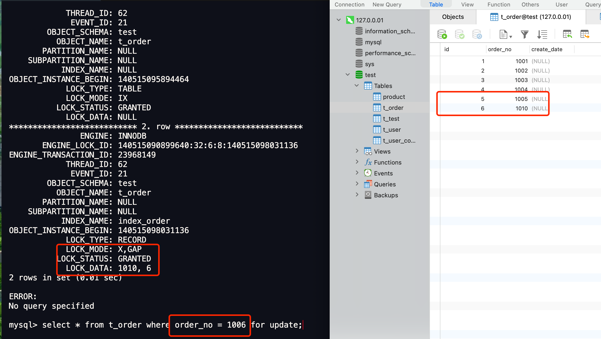

<font style="color:rgb(44, 62, 80);">当事务 B 往事务 A next-key 锁的范围 (1006, +∞] 里插入 id = 1008 的记录就会被锁住：</font>


```sql
Insert into t_order (order_no, create_date) values (1008, now());
```

<font style="color:rgb(44, 62, 80);">因为当我们执行以下插入语句时，会在插入间隙上获取插入意向锁，</font>**<font style="color:rgb(48, 79, 254);">而插入意向锁与间隙锁是冲突的，所以当其它事务持有该间隙的间隙锁时，需要等待其它事务释放间隙锁之后，才能获取到插入意向锁。而间隙锁与间隙锁之间是兼容的，所以所以两个事务中</font>****<font style="color:rgb(48, 79, 254);"> </font>****<font style="color:rgb(71, 101, 130);">select ... for update</font>****<font style="color:rgb(48, 79, 254);"> </font>****<font style="color:rgb(48, 79, 254);">语句并不会相互影响</font>**<font style="color:rgb(44, 62, 80);">。</font>

<font style="color:rgb(44, 62, 80);">案例中的事务 A 和事务 B 在执行完后</font><font style="color:rgb(44, 62, 80);"> </font><font style="color:rgb(71, 101, 130);">select ... for update</font><font style="color:rgb(44, 62, 80);"> </font><font style="color:rgb(44, 62, 80);">语句后都持有范围为</font><font style="color:rgb(71, 101, 130);">(1006,+∞]</font><font style="color:rgb(44, 62, 80);">的next-key 锁，而接下来的插入操作为了获取到插入意向锁，都在等待对方事务的间隙锁释放，于是就造成了循环等待，导致死锁。</font>

<font style="color:rgb(44, 62, 80);background-color:rgb(227, 242, 253);">为什么间隙锁与间隙锁之间是兼容的？</font>

<font style="color:rgb(44, 62, 80);">在MySQL官网上还有一段非常关键的描述：</font>

_<font style="color:rgb(200, 73, 255);">Gap locks in InnoDB are “purely inhibitive”, which means that their only purpose is to prevent other transactions from Inserting to the gap. Gap locks can co-exist. A gap lock taken by one transaction does not prevent another transaction from taking a gap lock on the same gap. There is no difference between shared and exclusive gap locks. They do not conflict with each other, and they perform the same function.</font>_

**<font style="color:rgb(48, 79, 254);">间隙锁的意义只在于阻止区间被插入</font>**<font style="color:rgb(44, 62, 80);">，因此是可以共存的。</font>**<font style="color:rgb(48, 79, 254);">一个事务获取的间隙锁不会阻止另一个事务获取同一个间隙范围的间隙锁</font>**<font style="color:rgb(44, 62, 80);">，共享和排他的间隙锁是没有区别的，他们相互不冲突，且功能相同，即两个事务可以同时持有包含共同间隙的间隙锁。</font>

<font style="color:rgb(44, 62, 80);">这里的共同间隙包括两种场景：</font>

+ <font style="color:rgb(44, 62, 80);">其一是两个间隙锁的间隙区间完全一样；</font>
+ <font style="color:rgb(44, 62, 80);">其二是一个间隙锁包含的间隙区间是另一个间隙锁包含间隙区间的子集。</font>

<font style="color:rgb(44, 62, 80);">但是有一点要注意，</font>**<font style="color:rgb(48, 79, 254);">next-key lock 是包含间隙锁+记录锁的，如果一个事务获取了 X 型的 next-key lock，那么另外一个事务在获取相同范围的 X 型的 next-key lock 时，是会被阻塞的</font>**<font style="color:rgb(44, 62, 80);">。</font>

<font style="color:rgb(44, 62, 80);">比如，一个事务持有了范围为 (1, 10] 的 X 型的 next-key lock，那么另外一个事务在获取相同范围的 X 型的 next-key lock 时，就会被阻塞。</font>

<font style="color:rgb(44, 62, 80);">虽然相同范围的间隙锁是多个事务相互兼容的，但对于记录锁，我们是要考虑 X 型与 S 型关系。X 型的记录锁与 X 型的记录锁是冲突的，比如一个事务执行了 select ... where id = 1 for update，后一个事务在执行这条语句的时候，就会被阻塞的。</font>

<font style="color:rgb(44, 62, 80);">但是还要注意！对于这种范围为 (1006, +∞] 的 next-key lock，两个事务是可以同时持有的，不会冲突。因为 +∞ 并不是一个真实的记录，自然就不需要考虑 X 型与 S 型关系。</font>

<font style="color:rgb(44, 62, 80);background-color:rgb(227, 242, 253);">插入意向锁是什么？</font>

<font style="color:rgb(44, 62, 80);">注意！插入意向锁名字虽然有意向锁，但是它并不是意向锁，它是一种特殊的间隙锁。</font>

<font style="color:rgb(44, 62, 80);">在MySQL的官方文档中有以下重要描述：</font>

_<font style="color:rgb(200, 73, 255);">An Insert intention lock is a type of gap lock set by Insert operations prior to row Insertion. This lock signals the intent to Insert in such a way that multiple transactions Inserting into the same index gap need not wait for each other if they are not Inserting at the same position within the gap. Suppose that there are index records with values of 4 and 7. Separate transactions that attempt to Insert values of 5 and 6, respectively, each lock the gap between 4 and 7 with Insert intention locks prior to obtaining the exclusive lock on the Inserted row, but do not block each other because the rows are nonconflicting.</font>_

<font style="color:rgb(44, 62, 80);">这段话表明尽管</font>**<font style="color:rgb(48, 79, 254);">插入意向锁是一种特殊的间隙锁，但不同于间隙锁的是，该锁只用于并发插入操作</font>**<font style="color:rgb(44, 62, 80);">。</font>

<font style="color:rgb(44, 62, 80);">如果说间隙锁锁住的是一个区间，那么「插入意向锁」锁住的就是一个点。因而从这个角度来说，插入意向锁确实是一种特殊的间隙锁。</font>

<font style="color:rgb(44, 62, 80);">插入意向锁与间隙锁的另一个非常重要的差别是：尽管「插入意向锁」也属于间隙锁，但两个事务却不能在同一时间内，一个拥有间隙锁，另一个拥有该间隙区间内的插入意向锁（当然，插入意向锁如果不在间隙锁区间内则是可以的）。</font>

<font style="color:rgb(44, 62, 80);">另外，我补充一点，插入意向锁的生成时机：</font>

+ <font style="color:rgb(44, 62, 80);">每插入一条新记录，都需要看一下待插入记录的下一条记录上是否已经被加了间隙锁，如果已加间隙锁，此时会生成一个插入意向锁，然后锁的状态设置为等待状态（</font>_<font style="color:rgb(200, 73, 255);">PS：MySQL 加锁时，是先生成锁结构，然后设置锁的状态，如果锁状态是等待状态，并不是意味着事务成功获取到了锁，只有当锁状态为正常状态时，才代表事务成功获取到了锁</font>_<font style="color:rgb(44, 62, 80);">），现象就是 Insert 语句会被阻塞。</font>

## [](https://xiaolincoding.com/mysql/lock/deadlock.html#insert-%E8%AF%AD%E5%8F%A5%E6%98%AF%E6%80%8E%E4%B9%88%E5%8A%A0%E8%A1%8C%E7%BA%A7%E9%94%81%E7%9A%84)<font style="color:rgb(44, 62, 80);">Insert 语句是怎么加行级锁的？</font>
<font style="color:rgb(44, 62, 80);">Insert 语句在正常执行时是不会生成锁结构的，它是靠聚簇索引记录自带的 trx_id 隐藏列来作为</font>**<font style="color:rgb(48, 79, 254);">隐式锁</font>**<font style="color:rgb(44, 62, 80);">来保护记录的。</font>

<font style="color:rgb(44, 62, 80);background-color:rgb(227, 242, 253);">什么是隐式锁？</font>

<font style="color:rgb(44, 62, 80);">当事务需要加锁的时，如果这个锁不可能发生冲突，InnoDB会跳过加锁环节，这种机制称为隐式锁。隐式锁是 InnoDB 实现的一种延迟加锁机制，其特点是只有在可能发生冲突时才加锁，从而减少了锁的数量，提高了系统整体性能。</font>

<font style="color:rgb(44, 62, 80);">隐式锁就是在 Insert 过程中不加锁，只有在特殊情况下，才会将隐式锁转换为显示锁，这里我们列举两个场景。</font>

+ <font style="color:rgb(44, 62, 80);">如果记录之间加有间隙锁，为了避免幻读，此时是不能插入记录的；</font>
+ <font style="color:rgb(44, 62, 80);">如果 Insert 的记录和已有记录存在唯一键冲突，此时也不能插入记录；</font>

### [](https://xiaolincoding.com/mysql/lock/deadlock.html#_1%E3%80%81%E8%AE%B0%E5%BD%95%E4%B9%8B%E9%97%B4%E5%8A%A0%E6%9C%89%E9%97%B4%E9%9A%99%E9%94%81)<font style="color:rgb(44, 62, 80);">1、记录之间加有间隙锁</font>
<font style="color:rgb(44, 62, 80);">每插入一条新记录，都需要看一下待插入记录的下一条记录上是否已经被加了间隙锁，如果已加间隙锁，此时会生成一个插入意向锁，然后锁的状态设置为等待状态（</font>_<font style="color:rgb(200, 73, 255);">PS：MySQL 加锁时，是先生成锁结构，然后设置锁的状态，如果锁状态是等待状态，并不是意味着事务成功获取到了锁，只有当锁状态为正常状态时，才代表事务成功获取到了锁</font>_<font style="color:rgb(44, 62, 80);">），现象就是 Insert 语句会被阻塞。</font>

<font style="color:rgb(44, 62, 80);">举个例子，现在 t_order 表中，只有这些数据，</font>**<font style="color:rgb(48, 79, 254);">order_no 是二级索引</font>**<font style="color:rgb(44, 62, 80);">。</font>

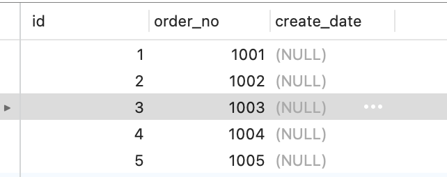

<font style="color:rgb(44, 62, 80);">现在，事务 A 执行了下面这条语句。</font>


```sql
 事务 A
mysql> begin;
Query OK, 0 rows affected (0.01 sec)

mysql> select * from t_order where order_no = 1006 for update;
Empty set (0.01 sec)
```

<font style="color:rgb(44, 62, 80);">接着，我们执行</font><font style="color:rgb(44, 62, 80);"> </font><font style="color:rgb(71, 101, 130);">select * from performance_schema.data_locks\G;</font><font style="color:rgb(44, 62, 80);"> </font><font style="color:rgb(44, 62, 80);">语句 ，确定事务 A 加了什么类型的锁，这里只关注在记录上加锁的类型。</font>

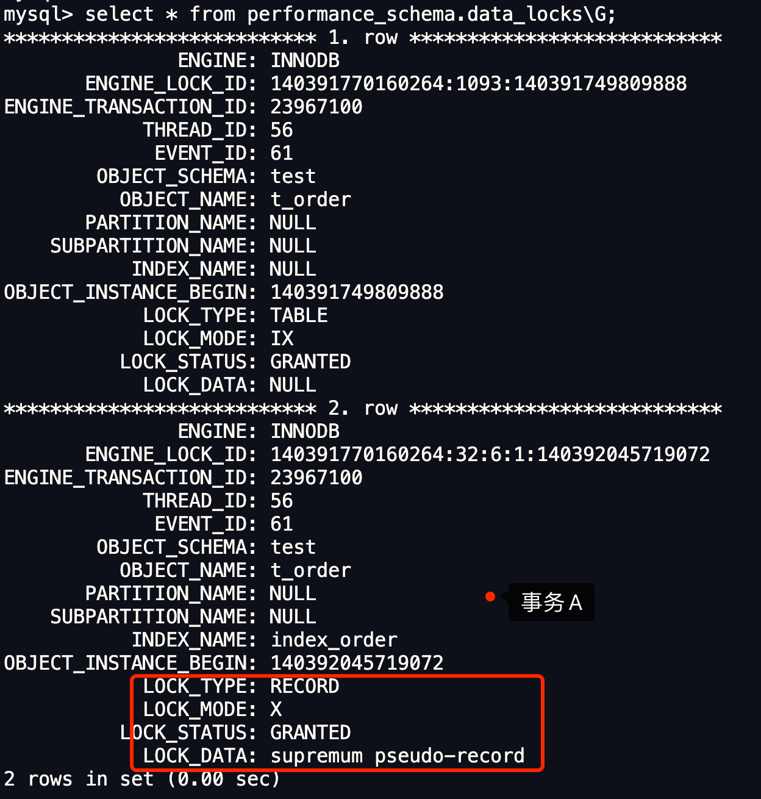

<font style="color:rgb(44, 62, 80);">本次的例子加的是 next-key 锁（记录锁+间隙锁），锁范围是</font><font style="color:rgb(71, 101, 130);">（1005, +∞]</font><font style="color:rgb(44, 62, 80);">。</font>

<font style="color:rgb(44, 62, 80);">然后，有个事务 B 在这个间隙锁中，插入了一个记录，那么此时该事务 B 就会被阻塞：</font>


```sql
 事务 B 插入一条记录
mysql> begin;
Query OK, 0 rows affected (0.01 sec)

mysql> insert into t_order(order_no, create_date) values(1010,now());
 阻塞状态。。。。
```

<font style="color:rgb(44, 62, 80);">接着，我们执行</font><font style="color:rgb(44, 62, 80);"> </font><font style="color:rgb(71, 101, 130);">select * from performance_schema.data_locks\G;</font><font style="color:rgb(44, 62, 80);"> </font><font style="color:rgb(44, 62, 80);">语句 ，确定事务 B 加了什么类型的锁，这里只关注在记录上加锁的类型。</font>

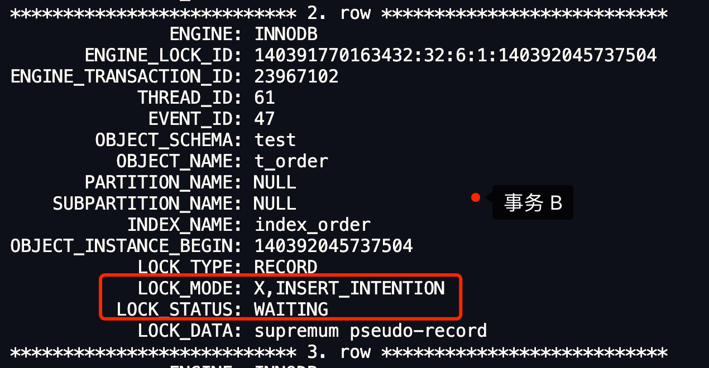

<font style="color:rgb(44, 62, 80);">可以看到，事务 B 的状态为等待状态（LOCK_STATUS: WAITING），因为向事务 A 生成的 next-key 锁（记录锁+间隙锁）范围</font><font style="color:rgb(71, 101, 130);">（1005, +∞]</font><font style="color:rgb(44, 62, 80);"> </font><font style="color:rgb(44, 62, 80);">中插入了一条记录，所以事务 B 的插入操作生成了一个插入意向锁（</font><font style="color:rgb(71, 101, 130);">LOCK_MODE: X,INSERT_INTENTION</font><font style="color:rgb(44, 62, 80);">），锁的状态是等待状态，意味着事务 B 并没有成功获取到插入意向锁，因此事务 B 发生阻塞。</font>

### [](https://xiaolincoding.com/mysql/lock/deadlock.html#_2%E3%80%81%E9%81%87%E5%88%B0%E5%94%AF%E4%B8%80%E9%94%AE%E5%86%B2%E7%AA%81)<font style="color:rgb(44, 62, 80);">2、遇到唯一键冲突</font>
<font style="color:rgb(44, 62, 80);">如果在插入新记录时，插入了一个与「已有的记录的主键或者唯一二级索引列值相同」的记录（不过可以有多条记录的唯一二级索引列的值同时为NULL，这里不考虑这种情况），此时插入就会失败，然后对于这条记录加上了</font><font style="color:rgb(44, 62, 80);"> </font>**<font style="color:rgb(48, 79, 254);">S 型的锁</font>**<font style="color:rgb(44, 62, 80);">。</font>

+ <font style="color:rgb(44, 62, 80);">如果主键索引重复，插入新记录的事务会给已存在的主键值重复的聚簇索引记录</font>**<font style="color:rgb(48, 79, 254);">添加 S 型记录锁</font>**<font style="color:rgb(44, 62, 80);">。</font>
+ <font style="color:rgb(44, 62, 80);">如果唯一二级索引重复，插入新记录的事务都会给已存在的二级索引列值重复的二级索引记录</font>**<font style="color:rgb(48, 79, 254);">添加 S 型 next-key 锁</font>**<font style="color:rgb(44, 62, 80);">。</font>

#### [](https://xiaolincoding.com/mysql/lock/deadlock.html#%E4%B8%BB%E9%94%AE%E7%B4%A2%E5%BC%95%E5%86%B2%E7%AA%81)<font style="color:rgb(44, 62, 80);">主键索引冲突</font>
<font style="color:rgb(44, 62, 80);">下面举个「主键冲突」的例子，MySQL 8.0 版本，事务隔离级别为可重复读（默认隔离级别）。</font>

<font style="color:rgb(44, 62, 80);">t_order 表中的 id 字段为主键索引，并且已经存在 id 值为 5 的记录，此时有个事务，插入了一条 id 为 5 的记录，就会报主键索引冲突的错误。</font>


<font style="color:rgb(44, 62, 80);">但是除了报错之外，还做一个很重要的事情，就是对 id 为 5 的这条记录加上了</font><font style="color:rgb(44, 62, 80);"> </font>**<font style="color:rgb(48, 79, 254);">S 型的记录锁</font>**<font style="color:rgb(44, 62, 80);">。</font>

<font style="color:rgb(44, 62, 80);">可以执行</font><font style="color:rgb(44, 62, 80);"> </font><font style="color:rgb(71, 101, 130);">select * from performance_schema.data_locks\G;</font><font style="color:rgb(44, 62, 80);"> </font><font style="color:rgb(44, 62, 80);">语句，确定事务加了什么锁。</font>


<font style="color:rgb(44, 62, 80);">可以看到，主键索引为 5 （LOCK_DATA）的这条记录中加了锁类型为 S 型的记录锁。注意，这里 LOCK_TYPE 中的 RECORD 表示行级锁，而不是记录锁的意思。如果是 S 型记录锁的话，LOCK_MODE 会显示</font><font style="color:rgb(44, 62, 80);"> </font><font style="color:rgb(71, 101, 130);">S, REC_NOT_GAP</font><font style="color:rgb(44, 62, 80);">。</font>

<font style="color:rgb(44, 62, 80);">所以，在隔离级别是「可重复读」的情况下，如果在插入数据的时候，发生了主键索引冲突，插入新记录的事务会给已存在的主键值重复的聚簇索引记录</font>**<font style="color:rgb(48, 79, 254);">添加 S 型记录锁</font>**<font style="color:rgb(44, 62, 80);">。</font>

#### [](https://xiaolincoding.com/mysql/lock/deadlock.html#%E5%94%AF%E4%B8%80%E4%BA%8C%E7%BA%A7%E7%B4%A2%E5%BC%95%E5%86%B2%E7%AA%81)<font style="color:rgb(44, 62, 80);">唯一二级索引冲突</font>
<font style="color:rgb(44, 62, 80);">下面举个「唯一二级索引冲突」的例子，MySQL 8.0 版本，事务隔离级别为可重复读（默认隔离级别）。</font>

<font style="color:rgb(44, 62, 80);">t_order 表中的 order_no 字段为唯一二级索引，并且已经存在 order_no 值为 1001 的记录，此时事务 A，插入了 order_no 为 1001 的记录，就出现了报错。</font>


<font style="color:rgb(44, 62, 80);">但是除了报错之外，还做一个很重要的事情，就是对 order_no 值为 1001 这条记录加上了</font><font style="color:rgb(44, 62, 80);"> </font>**<font style="color:rgb(48, 79, 254);">S 型的 next-key 锁</font>**<font style="color:rgb(44, 62, 80);">。</font>

<font style="color:rgb(44, 62, 80);">我们可以执行</font><font style="color:rgb(44, 62, 80);"> </font><font style="color:rgb(71, 101, 130);">select * from performance_schema.data_locks\G;</font><font style="color:rgb(44, 62, 80);"> </font><font style="color:rgb(44, 62, 80);">语句 ，确定事务加了什么类型的锁，这里只关注在记录上加锁的类型。</font>

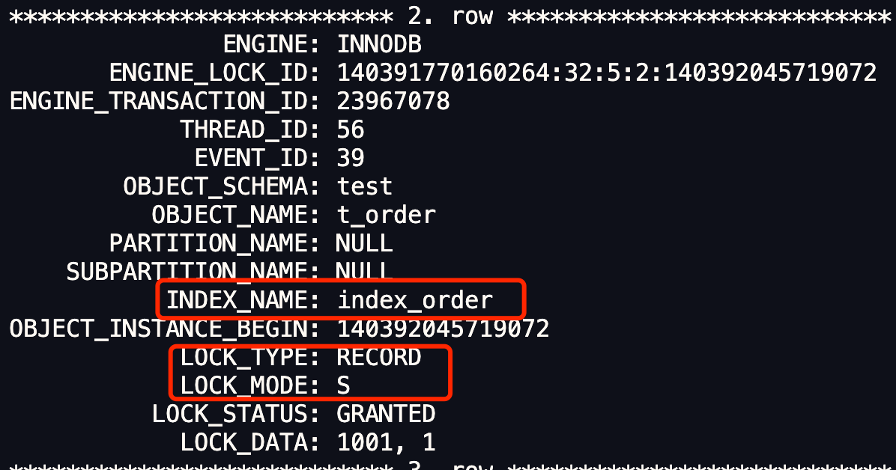

<font style="color:rgb(44, 62, 80);">可以看到，</font>**<font style="color:rgb(48, 79, 254);">index_order 二级索引加了 S 型的 next-key 锁，范围是(-∞, 1001]</font>**<font style="color:rgb(44, 62, 80);">。注意，这里 LOCK_TYPE 中的 RECORD 表示行级锁，而不是记录锁的意思。如果是记录锁的话，LOCK_MODE 会显示</font><font style="color:rgb(44, 62, 80);"> </font><font style="color:rgb(71, 101, 130);">S, REC_NOT_GAP</font><font style="color:rgb(44, 62, 80);">。</font>

<font style="color:rgb(44, 62, 80);">此时，事务 B 执行了 select * from t_order where order_no = 1001 for update; 就会阻塞，因为这条语句想加 X 型的锁，是与 S 型的锁是冲突的，所以就会被阻塞。</font>


<font style="color:rgb(44, 62, 80);">我们也可以从 performance_schema.data_locks 这个表中看到，事务 B 的状态（LOCK_STATUS）是等待状态，加锁的类型 X 型的记录锁（LOCK_MODE: X,REC_NOT_GAP ）。</font>

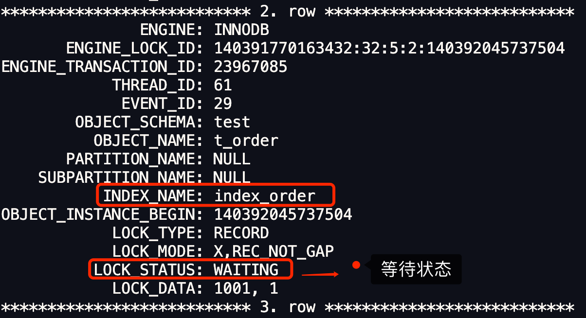

<font style="color:rgb(44, 62, 80);">上面的案例是针对唯一二级索引重复而插入失败的场景。</font>

<font style="color:rgb(44, 62, 80);background-color:rgb(227, 242, 253);">接下来，分析两个事务执行过程中，执行了相同的 insert 语句的场景。</font>

<font style="color:rgb(44, 62, 80);">现在 t_order 表中，只有这些数据，</font>**<font style="color:rgb(48, 79, 254);">order_no 为唯一二级索引</font>**<font style="color:rgb(44, 62, 80);">。</font>


<font style="color:rgb(44, 62, 80);">在隔离级别可重复读的情况下，开启两个事务，前后执行相同的 Insert 语句，此时</font>**<font style="color:rgb(48, 79, 254);">事务 B 的 Insert 语句会发生阻塞</font>**<font style="color:rgb(44, 62, 80);">。</font>

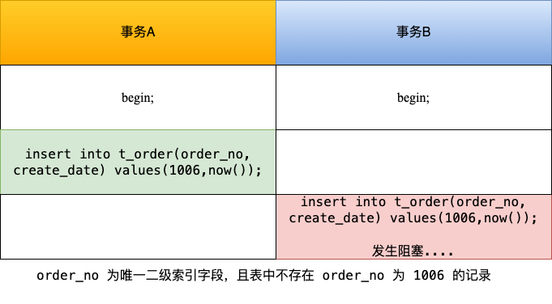

<font style="color:rgb(44, 62, 80);">两个事务的加锁过程：</font>

+ <font style="color:rgb(44, 62, 80);">事务 A 先插入 order_no 为 1006 的记录，可以插入成功，此时对应的唯一二级索引记录被「隐式锁」保护，此时还没有实际的锁结构（执行完这里的时候，你可以看查 performance_schema.data_locks 信息，可以看到这条记录是没有加任何锁的）；</font>
+ <font style="color:rgb(44, 62, 80);">接着，事务 B 也插入 order_no 为 1006 的记录，由于事务 A 已经插入 order_no 值为 1006 的记录，所以事务 B 在插入二级索引记录时会遇到重复的唯一二级索引列值，此时事务 B 想获取一个 S 型 next-key 锁，但是事务 A 并未提交，</font>**<font style="color:rgb(48, 79, 254);">事务 A 插入的 order_no 值为 1006 的记录上的「隐式锁」会变「显示锁」且锁类型为 X 型的记录锁，所以事务 B 向获取 S 型 next-key 锁时会遇到锁冲突，事务 B 进入阻塞状态</font>**<font style="color:rgb(44, 62, 80);">。</font>

<font style="color:rgb(44, 62, 80);">我们可以执行</font><font style="color:rgb(44, 62, 80);"> </font><font style="color:rgb(71, 101, 130);">select * from performance_schema.data_locks\G;</font><font style="color:rgb(44, 62, 80);"> </font><font style="color:rgb(44, 62, 80);">语句 ，确定事务加了什么类型的锁，这里只关注在记录上加锁的类型。</font>

<font style="color:rgb(44, 62, 80);">先看事务 A 对 order_no 为 1006 的记录加了什么锁？</font>

<font style="color:rgb(44, 62, 80);">从下图可以看到，</font>**<font style="color:rgb(48, 79, 254);">事务 A 对 order_no 为 1006 记录加上了类型为 X 型的记录锁</font>**<font style="color:rgb(44, 62, 80);">（</font>_<font style="color:rgb(200, 73, 255);">注意，这个是在执行事务 B 之后才产生的锁，没执行事务 B 之前，该记录还是隐式锁</font>_<font style="color:rgb(44, 62, 80);">）。</font>

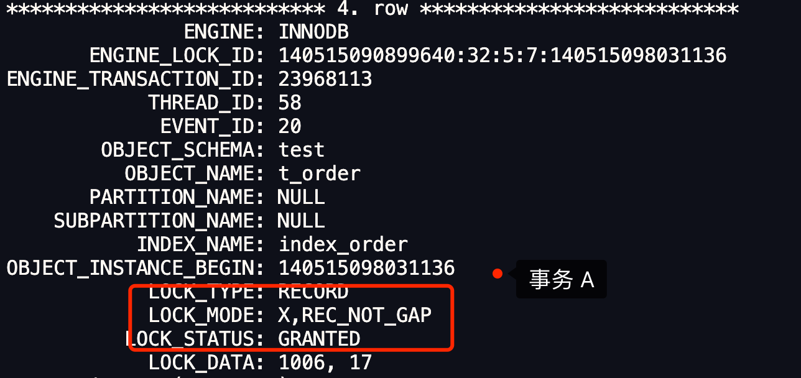

<font style="color:rgb(44, 62, 80);">然后看事务 B 想对 order_no 为 1006 的记录加什么锁？</font>

<font style="color:rgb(44, 62, 80);">从下图可以看到，</font>**<font style="color:rgb(48, 79, 254);">事务 B 想对 order_no 为 1006 的记录加 S 型的 next-key 锁，但是由于事务 A 在该记录上持有了 X 型的记录锁，这两个锁是冲突的，所以导致事务 B 处于等待状态</font>**<font style="color:rgb(44, 62, 80);">。</font>


<font style="color:rgb(44, 62, 80);">从这个实验可以得知，并发多个事务的时候，第一个事务插入的记录，并不会加锁，而是会用隐式锁保护唯一二级索引的记录。</font>

<font style="color:rgb(44, 62, 80);">但是当第一个事务还未提交的时候，有其他事务插入了与第一个事务相同的记录，第二个事务就会</font>**<font style="color:rgb(48, 79, 254);">被阻塞</font>**<font style="color:rgb(44, 62, 80);">，</font>**<font style="color:rgb(48, 79, 254);">因为此时第一事务插入的记录中的隐式锁会变为显示锁且类型是 X 型的记录锁，而第二个事务是想对该记录加上 S 型的 next-key 锁，X 型与 S 型的锁是冲突的</font>**<font style="color:rgb(44, 62, 80);">，所以导致第二个事务会等待，直到第一个事务提交后，释放了锁。</font>

<font style="color:rgb(44, 62, 80);">如果 order_no 不是唯一二级索引，那么两个事务，前后执行相同的 Insert 语句，是不会发生阻塞的，就如前面的这个例子。</font>


## [](https://xiaolincoding.com/mysql/lock/deadlock.html#%E5%A6%82%E4%BD%95%E9%81%BF%E5%85%8D%E6%AD%BB%E9%94%81)<font style="color:rgb(44, 62, 80);">如何避免死锁？</font>
<font style="color:rgb(44, 62, 80);">死锁的四个必要条件：</font>**<font style="color:rgb(48, 79, 254);">互斥、占有且等待、不可强占用、循环等待</font>**<font style="color:rgb(44, 62, 80);">。只要系统发生死锁，这些条件必然成立，但是只要破坏任意一个条件就死锁就不会成立。</font>

<font style="color:rgb(44, 62, 80);">在数据库层面，有两种策略通过「打破循环等待条件」来解除死锁状态：</font>

+ **<font style="color:rgb(48, 79, 254);">设置事务等待锁的超时时间</font>**<font style="color:rgb(44, 62, 80);">。当一个事务的等待时间超过该值后，就对这个事务进行回滚，于是锁就释放了，另一个事务就可以继续执行了。在 InnoDB 中，参数</font><font style="color:rgb(44, 62, 80);"> </font><font style="color:rgb(71, 101, 130);">innodb_lock_wait_timeout</font><font style="color:rgb(44, 62, 80);"> </font><font style="color:rgb(44, 62, 80);">是用来设置超时时间的，默认值时 50 秒。</font><font style="color:rgb(44, 62, 80);">当发生超时后，就出现下面这个提示：</font>


+ **<font style="color:rgb(48, 79, 254);">开启主动死锁检测</font>**<font style="color:rgb(44, 62, 80);">。主动死锁检测在发现死锁后，主动回滚死锁链条中的某一个事务，让其他事务得以继续执行。将参数</font><font style="color:rgb(44, 62, 80);"> </font><font style="color:rgb(71, 101, 130);">innodb_deadlock_detect</font><font style="color:rgb(44, 62, 80);"> </font><font style="color:rgb(44, 62, 80);">设置为 on，表示开启这个逻辑，默认就开启。</font><font style="color:rgb(44, 62, 80);">当检测到死锁后，就会出现下面这个提示：</font>


<font style="color:rgb(44, 62, 80);">上面这个两种策略是「当有死锁发生时」的避免方式。</font>

<font style="color:rgb(44, 62, 80);">我们可以回归业务的角度来预防死锁，对订单做幂等性校验的目的是为了保证不会出现重复的订单，那我们可以直接将 order_no 字段设置为唯一索引列，利用它的唯一性来保证订单表不会出现重复的订单，不过有一点不好的地方就是在我们插入一个已经存在的订单记录时就会抛出异常。</font>

---

<font style="color:rgb(44, 62, 80);">最后说个段子：</font>

<font style="color:rgb(44, 62, 80);">面试官: 解释下什么是死锁?</font>

<font style="color:rgb(44, 62, 80);">应聘者: 你录用我,我就告诉你</font>

<font style="color:rgb(44, 62, 80);">面试官: 你告诉我,我就录用你</font>

<font style="color:rgb(44, 62, 80);">应聘者: 你录用我,我就告诉你</font>

<font style="color:rgb(44, 62, 80);">面试官: 卧槽滚！</font>

**<font style="color:rgb(48, 79, 254);">...........</font>**

---

<font style="color:rgb(44, 62, 80);">参考资料：</font>

+ <font style="color:rgb(44, 62, 80);">《MySQL 是怎样运行的？》</font>
+ [<font style="color:rgb(44, 62, 80);">http://mysql.taobao.org/monthly/2020/09/06/</font>](http://mysql.taobao.org/monthly/2020/09/06/)


> 更新: 2024-04-06 21:45:02  
原文: [https://www.yuque.com/vip6688/neho4x/udfqo7gev7kgh50i](https://www.yuque.com/vip6688/neho4x/udfqo7gev7kgh50i)
>


> 更新: 2024-11-25 09:21:06  
> 原文: <https://www.yuque.com/neumx/laxg2e/ea948218b35678615eacd181b1166fe1>