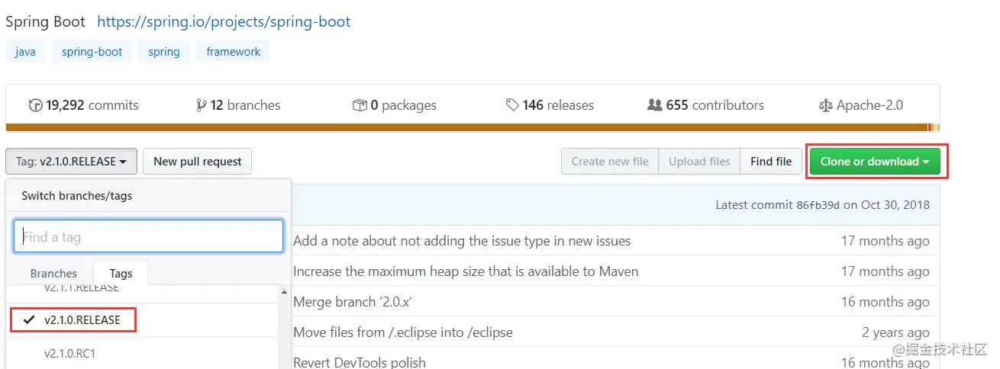
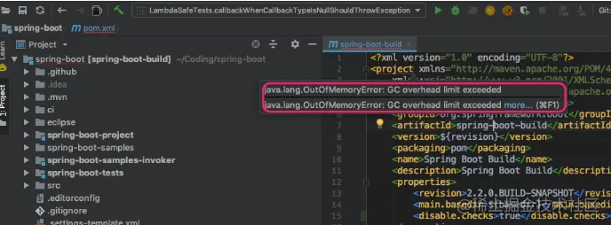
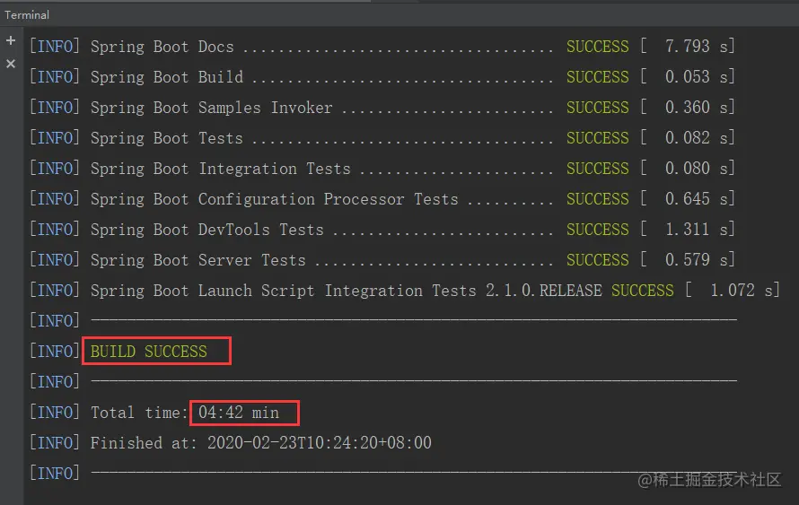
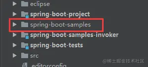
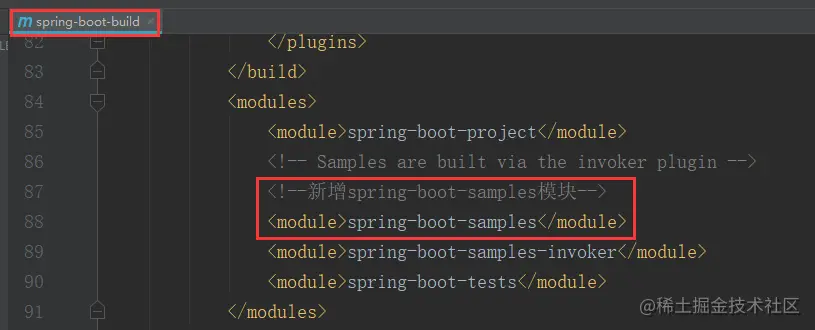
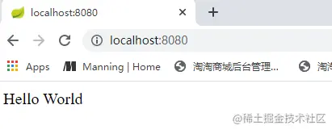

# 1如何搭建自己的SpringBoot源码调试环境？

# 1 如何搭建自己的SpringBoot源码调试环境？
## 1 前言
这是 SpringBoot2.1 源码分析专题的第一篇文章，主要讲如何来搭建我们的源码阅读调试环境。如果有经验的小伙伴们可以略过此篇文章。


## 2 环境安装要求
+ IntelliJ IDEA
+ JDK1.8
+ Maven3.5 以上


## 3 从 Github 上将 SpringBoot 源码项目下载下来
首先提供**SpringBoot2.1.0**的 github 地址： [github.com/spring-proj…](https://link.juejin.cn?target=https%3A%2F%2Fgithub.com%2Fspring-projects%2Fspring-boot%2Ftree%2Fv2.1.0.RELEASE)


因为要进行阅读源码和分析源码项目，我们是不是要在里面写一些注释帮助我们阅读理解源码，因此需要将 SpringBoot 源码项目 fork 到自己的 github 仓库中，然后再利用**git clone url**命令将已经 fork 到自己 github 仓库的 SpringBoot 源码拉取下来即可。 但由于以上方式往往很慢，通常会超时，所以笔者直接将 SpringBoot 项目直接下载下来，然后再导入 IDEA 中。





## 4 将 SpringBoot 源码项目导入到 IDEA 中
将刚才下载的 `spring-boot2.1.0.RELEASE` 项目选择 maven 方式导入到 IDEA 中，然后一直 next 即可导入完成，注意选择 JDK 版本是 1.8，maven 版本是 3.5+。


此时下载 maven 依赖是一个漫长的等待过程，建议 maven 没有配置（阿-里-云）仓库的小伙伴们配置一下，这样下载速度会快很多。参考[配置 maven 使用（阿-里-云）仓库](https://link.juejin.cn?target=https%3A%2F%2Fblog.csdn.net%2Fzhuzj12345%2Farticle%2Fdetails%2F93200211)进行配置即可。


## 5 编译构建 SpringBoot 源码项目
此时导入项目后，我们进行编译构建 SpringBoot 源码项目了，在构建之前做两个配置：


1、我们要禁用 maven 的代码检查，在根 `pom.xml` 中增加一下配置即可，如下图：


2、可能有的小伙伴们的 `pom.xml` 文件的 project 标签上显示`java.lang.OutOfMemoryError`错误，这是因为 IDEA 里的 Maven 的 importer 设置的 JVM 最大堆内存过小而导致的，如下图,此时可参考[Maven 依赖包导入错误（IntelliJ IDEA）](https://blog.csdn.net/w605283073/article/details/85107497)解决即可。





进行了上面的两点配置后，此时我们就可以直接执行以下 maven 命令来编译构建源码项目了。


```bash
mvn clean install -DskipTests -Pfast
```


 此时又是漫长的等待，我这里等待 5 分钟左右就显示构建成功了，如下图：





## 6 运行 SpringBoot 自带的 sample
因为 SpringBoot 源码中的 `spring-boot-samples` 模块自带了很多 DEMO 样例，我们可以利用其中的一个 sample 来测试运行刚刚构建的 springboot 源码项目即可。但此时发现 `spring-boot-samples` 模块是灰色的，如下图：





这是因为 `spring-boot-samples` 模块没有被添加到根 `pom.xml` 中，此时将其添加到根 `pom.xml` 中即可，增加如下配置，如下图：


 此时我们挑选 `spring-boot-samples` 模块下的 `spring-boot-sample-tomcat` 样例项目来测试好了，此时启动`SampleTomcatApplication`的`main`函数，启动成功界面如下：


 然后我们再在浏览器发送一个 HTTP 请求，此时可以看到服务端成功返回响应，说明此时 SpringBoot 源码环境就已经构建成功了，接下来我们就可以进行调试了，如下图：





## 7 动手实践环节
前面已经成功构建了 SpringBoot 的源码阅读环境，小伙伴们记得自己动手搭建一套属于自己的 SpringBoot 源码调试环境哦，阅读源码动手调试很重要，嘿嘿。


> 更新: 2024-01-15 01:00:42  
原文: [https://www.yuque.com/vip6688/neho4x/yycgt04np3kgvhq5](https://www.yuque.com/vip6688/neho4x/yycgt04np3kgvhq5)
>


> 更新: 2024-11-25 09:22:40  
> 原文: <https://www.yuque.com/neumx/laxg2e/b9e787ed2475e825b66c7a9208e4b184>