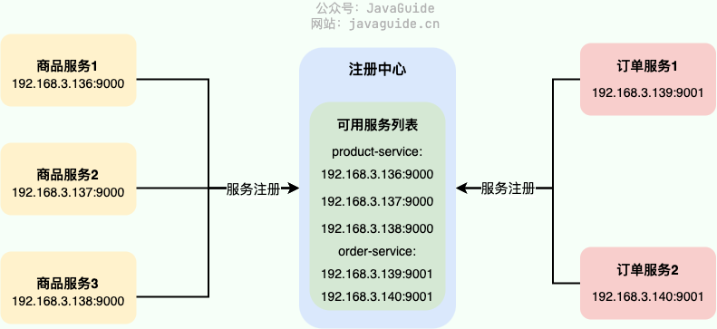
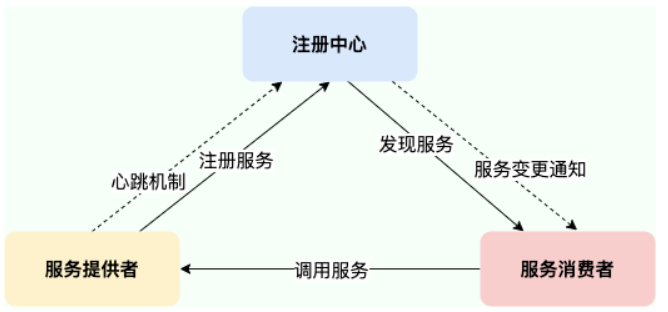

# 服务治理：为什么需要服务注册与发现？

# 服务治理：为什么需要服务注册与发现？
服务注册与发现是分布式以及微服务系统的基石，搞懂它的作用和基本原理对于我们来说非常重要！

## 为什么需要服务注册与发现？
微服务架构下，一个系统通常由多个微服务组成（比如电商系统可能分为用户服务、商品服务、订单服务等服务），一个用户请求可能会需要多个服务参与，这些服务之间互相配合以维持系统的正常运行。

在没有服务注册与发现机制之前，每个服务会将其依赖的其他服务的地址信息写死在配置文件里（参考单体架构）。假设我们系统中的订单服务访问量突然变大，我们需要对订单服务进行扩容，也就是多部署一些订单服务来分担处理请求的压力。这个时候，我们需要手动更新所有依赖订单服务的服务节点的地址配置信息。同理，假设某个订单服务节点突然宕机，我们又要手动更新对应的服务节点信息。更新完成之后，还要手动重启这些服务，整个过程非常麻烦且容易出错。

有了服务注册与发现机制之后，就不需要这么麻烦了，由注册中心负责维护可用服务的列表，通过注册中心动态获取可用服务的地址信息。如果服务信息发生变更，注册中心会将变更推送给相关联的服务，更新服务地址信息，无需手动更新，也不需要重启服务，这些对开发者来说完全是无感的。

服务注册与发现可以帮助我们实现服务的优雅上下线，从而实现服务的弹性扩缩容。

除此之外，服务注册与发现机制还有一个非常重要的功能：不可用服务剔除。简单来说，注册中心会通过心跳机制来检测服务是否可用，如果服务不可用的话，注册中心会主动剔除该服务并将变更推送给相关联的服务，更新服务地址信息。

最后，我们再来总结补充一下，一个完备的服务注册与发现应该具备的功能：

+ 服务注册以及服务查询（最基本的）
+ 服务状态变更通知、服务健康检查、不可用服务剔除
+ 服务权重配置（权重越高被访问的频率越高）

## 服务注册与发现的基本流程是怎样的？
> 这个问题等价于问服务注册与发现的原理。
>

每个服务节点在启动运行的时候，会向注册中心注册服务，也就是将自己的地址信息（ip、端口以及服务名字等信息的组合）上报给注册中心，注册中心负责将地址信息保存起来，这就是**服务注册**。

一个服务节点如果要调用另外一个服务节点，会直接拿着服务的信息找注册中心要对方的地址信息，这就是**服务发现**。通常情况下，服务节点拿到地址信息之后，还会在本地缓存一份，保证在注册中心宕机时仍然可以正常调用服务。

如果服务信息发生变更，注册中心会将变更推送给相关联的服务，更新服务地址信息。

为了保证服务地址列表中都是可用服务的地址信息，注册中心通常会通过心跳机制来检测服务是否可用，如果服务不可用的话，注册中心会主动剔除该服务并将变更推送给相关联的服务，更新服务地址信息。

最后，再来一张图简单总结一下服务注册与发现（一个服务既可能是服务提供者也可能是服务消费者）。

## 常见的注册中心有哪些？
> 我这里更多的是从面试角度来说，各类注册中心的详细对比，可以看这篇文章：[5 种注册中心如何选型？从原理给你解读！ - 楼仔 - 2022](https://mp.weixin.qq.com/s?__biz=Mzg3OTU5NzQ1Mw==&mid=2247486918&idx=1&sn=5651cd0b4b9c8e68bcfa55c00c0950d6&chksm=cf034f24f874c632511684057337a744c54702543ec3690aa06dbf4bbaf980b2828f52276c9b&scene=21#wechat_redirect)，非常详细。
>

比较常用的注册中心有 ZooKeeper、Eureka、Nacos，这三个都是使用 Java 语言开发，相对来说，更适合 Java 技术栈一些。其他的还有像 ETCD、Consul，这里就不做介绍了。

首先，咱们来看 ZooKeeper，大部分同学应该对它不陌生。严格意义上来说，ZooKeeper 设计之初并不是未来做注册中心的，只是前几年国内使用 Dubbo 的场景下比较喜欢使用它来做注册中心。

对于 CAP 理论来说，ZooKeeper 保证的是 CP。任何时刻对 ZooKeeper 的读请求都能得到一致性的结果，但是， ZooKeeper 不保证每次请求的可用性比如在 Leader 选举过程中或者半数以上的机器不可用的时候服务就是不可用的。

针对注册中心这个场景来说，重要的是可用性，AP 会更合适一些。ZooKeeper 更适合做分布式协调服，注册中心就交给专业的来做吧！

其次，我们再来看看 Eureka，一款非常值得研究的注册中心。Eureka 是 Netflix 公司开源的一个注册中心，配套的还有 Feign、Ribbon、Zuul、Hystrix 等知名的微服务系统构建所必须的组件。

对于 CAP 理论来说，Eureka 保证的是 AP。Eureka 集群只要有一台 Eureka 正常服务，整个注册中心就是可用的，只是查询到的数据可能是过期的（集群中的各个节点异步方式同步数据，不保证强一致性）。

不过，可惜的是，Spring Cloud 2020.0.0 版本移除了 Netflix 除 Eureka 外的所有组件。

**那为什么 Spring Cloud 这么急着移除 Netflix 的组件呢？**主要是因为在 2018 年的时候，Netflix 宣布其开源的核心组件 Hystrix、Ribbon、Zuul、Eureka 等进入维护状态，不再进行新特性开发，只修 BUG。于是，Spring 官方不得不考虑移除 Netflix 的组件。

我这里也不推荐使用 Eureka 作为注册中心，阿里开源的 Nacos 或许是更好的选择。

最后，我们再来看看 Nacos，一款即可以用来做注册中心，又可以用来做配置中心的优秀项目。

Nacos 属实是后起之秀，借鉴吸收了其他注册中心的优点，与 Spring Boot 、Dubbo、Spring Cloud、Kubernetes 无缝对接，兼容性很好。并且，**Nacos 不仅支持 CP 也支持 AP。**

---

Nacos 性能强悍（比 Eureka 能支持更多的服务实例），易用性较强（文档丰富、数据模型简单且自带后台管理界面），支持 99.9% 高可用。

对于 Java 技术栈来说，个人是比较推荐使用 Nacos 来做注册中心。

> 更新: 2024-01-03 19:41:17  
原文: [https://www.yuque.com/vip6688/neho4x/llpodgxagrvyp86b](https://www.yuque.com/vip6688/neho4x/llpodgxagrvyp86b)
>

> 更新: 2024-11-25 09:23:22  
> 原文: <https://www.yuque.com/neumx/laxg2e/4da12e0737713c0f80f8298b0d129339>