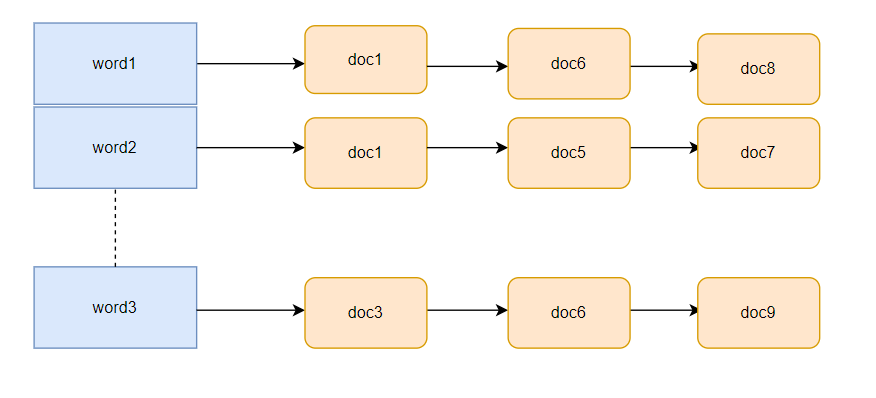
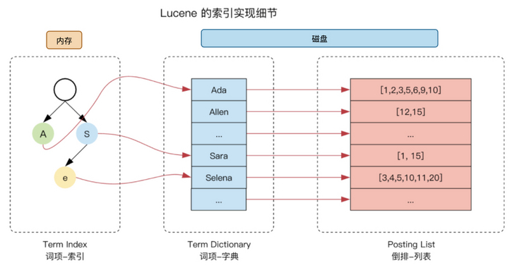
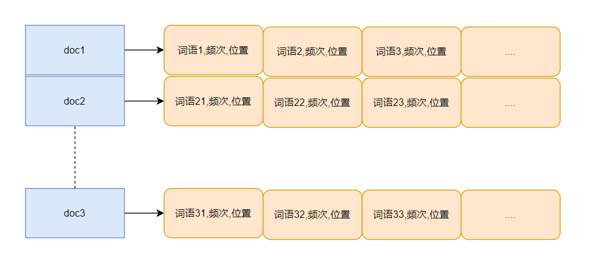
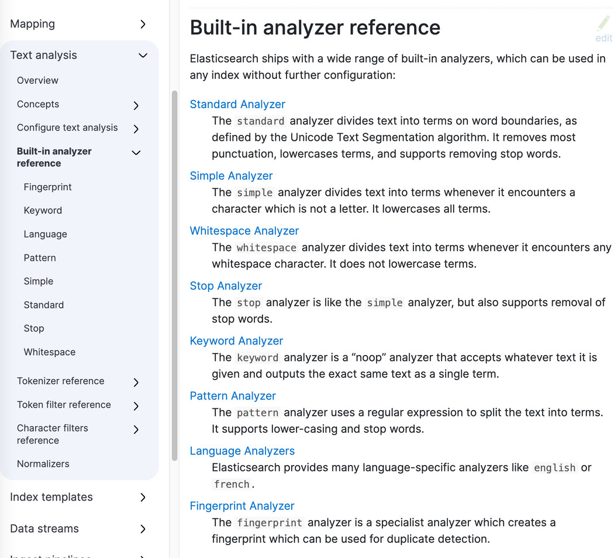
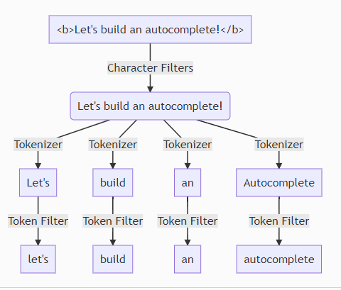
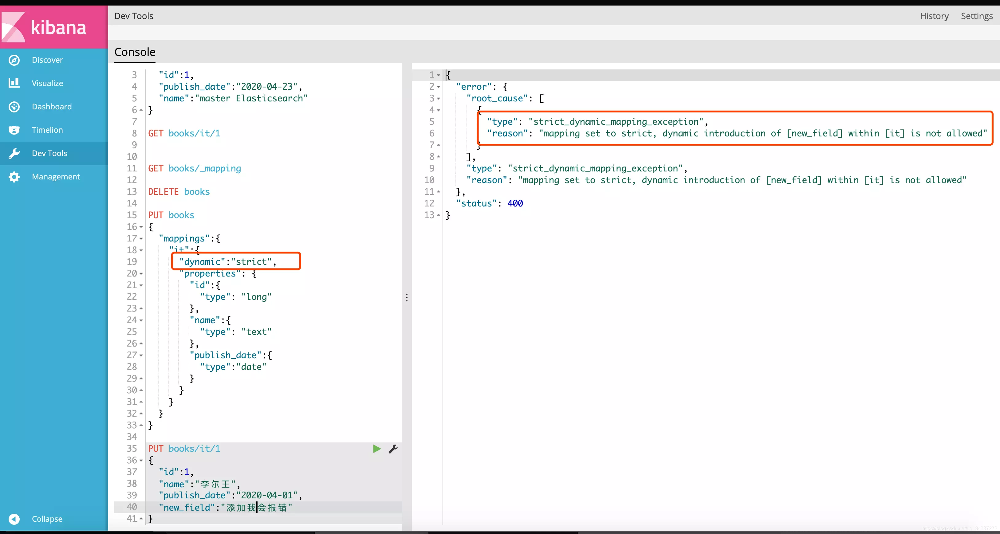
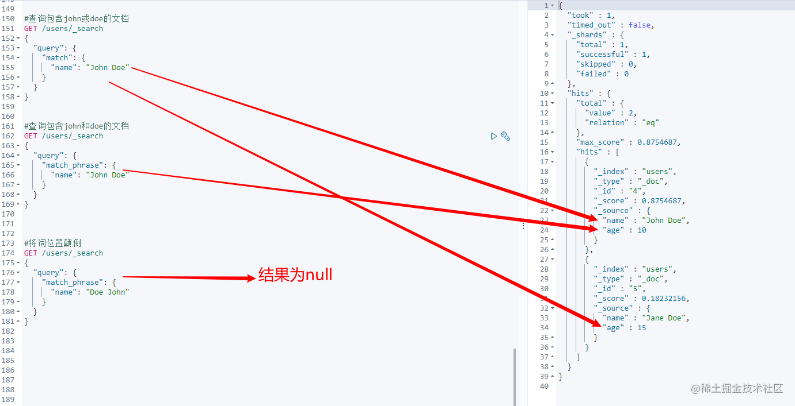

# Elasticsearch常见面试题总结

# Elasticsearch 常见面试题总结
大部分项目都会用到 Elasticsearch ，面试难免会被问到。于是，利用春节时间简单总结了一下 Elasticsearch 常见问题，希望对球友们有帮助。

少部分内容参考了 Elasticsearch 官方文档的描述，在此说明一下。

## Elasticsearch 基础


### Elasticsearch 是什么？
ElasticSearch 是一个开源的**分布式、RESTful 搜索和分析引擎**，可以用来解决使用数据库进行模糊搜索时存在的性能问题，适用于所有类型的数据，包括文本、数字、地理空间、结构化和非结构化数据。

ElasticSearch 使用**Java**语言开发，基于**Lucence**。ES 早期版本需要 JDK，在 7.X 版本后已经集成了 JDK，已无需第三方依赖。

Github 地址：[https://github.com/elastic/elasticsearch](https://github.com/elastic/elasticsearch)。

### Lucene 是什么？
**Lucene**是一个 Java 语言编写的高性能、全功能的文本搜索引擎库，提供强大的索引和搜索功能，以及拼写检查、高亮显示和高级分析功能。

如果我们直接基于 Lucene 开发，会非常复杂。并且，Lucene 并没有分布式以及高可用的解决方案。像 ElasticSearch 就是基于 Lucene 开发的，封装了许多 Lucene 底层功能，提供了简单易用的**RestFul API**接口和多种语言的客户端，开箱即用，自带分布式以及高可用的解决方案。

Github 地址：[https://github.com/apache/lucene](https://github.com/apache/lucene)

### Elasticsearch 可以帮助我们做什么？
举几个常见的例子：

+ 实现各种网站的关键词检索功能，比如电商网站的商品检索、维基百科的词条搜索、Github 的项目检索；
+ 本地生活类 APP 比如美团基于你的定位实现附近的一些美食或者娱乐项目的推荐；
+ 结合 Elasticsearch、Kibana、Beats 和 Logstash 这些 Elastic Stack 的组件实现一个功能完善的日志系统。
+ 使用 Elasticsearch 作为地理信息系统 (GIS) 管理、集成和分析空间信息。
+ ......

电商网站检索：


ELK 日志采集系统架构（负责日志的搜索）：


### 为什么需要 Elasticsearch？MySQL 不行吗？
正是谓术业有专攻！Elasticsearch 主要为系统提供搜索功能， MySQL 这类传统关系型数据库主要为系统提供数据存储功能。

MySQL 虽然也能提供简单的搜索功能，但是搜索并不是它擅长的领域。

我们可以从下面两个方面来看：

**1)传统关系型数据库的痛点：**

+ 传统关系型数据库(如 MySQL )在大数据量下查询效率低下， 模糊匹配有可能导致全表扫描。
+ MySQL 全文索引只支持`CHAR`，`VARCHAR`或者`TEXT`字段类型，不支持分词器。

**2)Elasticsearch 的优势：**

+ 支持多种数据类型，非结构化，数值，地理信息。
+ 简单的 RESTful API，天生的兼容多语言开发。
+ 提供更丰富的分词器，支持热点词汇查询。
+ 近实时查询，Elasticsearch 每隔 1s 把数据存储至系统缓存中，且使用倒排索引提高检索效率。
+ 支持相关性搜索，可以根据条件对结果进行打分。
+ 天然分布式存储，使用分片支持更大的数据量。

### Elasticsearch 中的基本概念
+ **Index（索引）**： 作为名词理解的话，索引是一类拥有相似特征的文档的集合比如商品索引、商家索引、订单索引，有点类似于 MySQL 中的数据库表。作为动词理解的话，索引就是将一份文档保存在一个索引中。
+ **Document（文档）**：可搜索最小单位，用于存储数据，一般为 JSON 格式。文档由一个或者多个字段(Field)组成，字段类型可以是布尔，数值，字符串、二进制、日期等数据类型。
+ **Type（字段类型）**: 每个文档在 ES 中都必须设定它的类型。ES 7.0 之前，一个 Index 可以有多个 Type。6.0 开始，Type 已经被 Deprecated。7.0 开始，一个索引只能创建一个 Type ：_doc。8.0 之后，Type 被完全删除，删除的原因看这里：[https://www.elastic.co/guide/en/elasticsearch/reference/7.17/removal-of-types.html](https://www.elastic.co/guide/en/elasticsearch/reference/7.17/removal-of-types.html)。
+ **Mapping（映射）**：定义字段名称、数据类型、优化信息（比如是否索引)、分词器，有点类似于数据库中的表结构定义。一个 Index 对应一个 Mapping。
+ **Node（节点）**: 相当于一个 ES 实例，多个节点构成一个集群。
+ **Cluster（集群）**：多个 ES 节点的集合，用于解决单个节点无法处理的搜索需求和数据存储需求。
+ **Shard（分片）**: Index（索引）被分为多个碎片存储在不同的 Node 节点上的分片中，以提高性能和吞吐量。
+ **Replica（副本）**：Index 副本，每个 Index 有一个或多个副本，以提高拓展功能和吞吐量。
+ **DSL(查询语言)**：基于 JSON 的查询语言，类似于 SQL 语句。

MySQL 与 Elasticsearch 的概念简单类比：

| **MySQL** | **Elasticsearch** |
| :--- | :--- |
| Table（表） | Index |
| Row（行） | Document |
| Column（列） | Field |
| Schema（约束） | Mapping |
| SQL（查询语言） | DSL |


## 倒排索引和正排索引
### 倒排索引是什么？
**倒排索引**也被称作反向索引（inverted index），是用于提高数据检索速度的一种数据结构，空间消耗比较大。倒排索引首先将检索文档进行分词得到多个词语/词条，然后将词语和文档 ID 建立关联，从而提高检索效率。

> 分词就是对一段文本，通过规则或者算法分出多个词，每个词作为搜索的最细粒度一个个单字或者单词。分词的目的主要是为了搜索，尤其在数据量大的情况下，分词的实现可以快速、高效的筛选出相关性高的文档内容。
>

如下图所示，倒排索引使用**词语/词条（Term）**来作为索引关键字，并同时记录了哪些**文档（Document）**中有这个词语。



+ **文档（Document）**：用来搜索的数据，其中的每一条数据就是一个文档。例如一个商品信息、商家信息、一页网页的内容。
+ **词语/词条（Term）**：对文档数据或用户搜索数据，利用某种算法分词，得到的具备含义的词语就是词条。例如**''数据库索引可以大幅提高查询速度"**这段话被中文分词器 IK Analyzer 细粒度分词后得到**[数据库,索引,可以,大幅,提高,查询,速度]。**
+ **词典（Term Dictionary）**：Term 的集合。

**Lucene 就是基于倒排索引来做的全文检索，并且 ElasticSearch 还对倒排索引做了进一步优化。**

### 倒排索引的创建和检索流程了解么？
这里只是简单介绍一下倒排索引的创建和检索流程，实际应用中，远比下面介绍的复杂，不过，大体原理还是一样的。

**倒排索引创建流程：**

+ 建立文档列表，每个文档都有一个唯一的文档 ID 与之对应。
+ 通过分词器对文档进行分词，生成类似于**<词语，文档ID>**的一组组数据。
+ 将词语作为索引关键字，记录下词语和文档的对应关系，也就是哪些文档中包含了该词语。

这里可以记录更多信息比如词语的位置、词语出现的频率，这样可以方便高亮显示以及对搜索结果进行排序（后文会介绍到）。

Lucene 的倒排索引大致是下面这样的（图源：[https://segmentfault.com/a/1190000037658997）：](https://segmentfault.com/a/1190000037658997）：)



**倒排索引检索流程：**

+ 根据分词查找对应文档 ID
+ 根据文档 ID 找到文档

### 倒排索引由什么组成？
+ **单词字典**：用于存储单词列表。一般用 B+Tree 或 Hash 拉链法存储，提高查询效率。
+ **倒排列表**：记录单词对应的文档集合。分为：
    - `DocID`：即**文档 id**
    - `TF`: 单词出现频率，简称**词频**
    - `Position`：单词在文档中出现的**位置**，用于检索
    - `Offset`：**偏移量**，记录单词开始结束位置，用于高亮显示

### 正排索引呢？
不同于倒排索引，正排索引将文档 ID 和分词建立关联。



根据词语查询时，必须先逐条获取每个文档，然后判断文档中是否包含所需要的词语，查询效率较低。

### 倒排索引和正排索引的区别是什么？
**正排索引**：

+ 优点：维护成本低，新增数据的时候，只要在末尾新增一个 ID
+ 缺点：以`DocID`为索引，查询时需要扫描所有词语，一个一个比较，直至查到关键词，查询效率较低。

**倒排索引**：

+ 优点：建立分词和`DocID`关系，大大提高查询效率
+ 缺点：建立倒排索引的成本高。并且，维护起来也比较麻烦，因为文档的每次更新都意味着倒排索引的重建。还有一些搜索精度的问题，比如搜索`dogs`和`dog`想要相同匹配结果，这时就需要合适的分词器了

### Elasticsearch 可以针对某些字段不做索引吗？
文档会被序列化为字段组成的 JSON 格式保存在 ES 中。我们可以针对某些字段不做索引。

这样可以节省存储空间，但是，同时也会让字段无法被搜索。

## 分词器(Analyzer)
Analyzer 翻译成中文叫做分析器，不过，很多人一般习惯称呼其为分词器。

### 分词器有什么用？
分词器是搜索引擎的一个核心组件，负责对文档内容进行分词(在 ES 里面被称为**Analysis**)，也就是将一个文档转换成**单词词典（Term Dictionary）**。单词词典是由文档中出现过的所有单词构成的字符串集合。为了满足不同的分词需求，分词器有很多种，不同的分词器分词逻辑可能会不一样。

### 常用分词器有哪些?
非中文分词器：

+ **Standard Analyzer**：标准分词器，也是默认分词器， 英文转换成小写， 中文只支持单字切分。
+ **Simple Analyzer**：简单分词器，通过非字母字符来分割文本信息，英文大写转小写，非英文不进行分词。
+ **Stop Analyzer**：在`SimpleAnalyzer`基础上去除 the，a，is 等词，也就是加入了停用词。
+ **Whitespace** **Analyzer**: 空格分词器，通过空格来分割文本信息，非英文不进行分词。

上面这些也都是 ES 内置的分词器，详细介绍请看官方文档：[https://www.elastic.co/guide/en/elasticsearch/reference/current/analysis-analyzers.html。](https://www.elastic.co/guide/en/elasticsearch/reference/current/analysis-analyzers.html。)



这个官方文档为每一个分词器都列举了对应的例子帮助理解，比如 Standard Analyzer 的例子是下面这样的。

+ 输入文本内容：`"The 2 QUICK Brown-Foxes jumped over the lazy dog's bone."`
+ 分词结果：`[ the, 2, quick, brown, foxes, jumped, over, the, lazy, dog's, bone ]`

**中文分词器**：

+ **IK Analyzer（推荐）**： 最常用的开源中文分词器，Github 地址：[https://github.com/medcl/elasticsearch-analysis-ik，包括两种分词模式：](https://github.com/medcl/elasticsearch-analysis-ik，包括两种分词模式：)
    - **ik_max_word**：细粒度切分模式，会将文本做最细粒度的拆分，尽可能多的拆分出词语 。
    - **ik_smart**：智能模式，会做最粗粒度的拆分，已被分出的词语将不会再次被其它词语占有。
+ **Ansj**：基于 n-Gram+CRF+HMM 的中文分词的 Java 实现，分词速度达到每秒钟大约 200 万字左右（mac air 下测试），准确率能达到 96%以上。实现了中文分词、中文姓名识别、用户自定义词典、关键字提取、自动摘要、关键字标记等功能。Github 地址：[https://github.com/NLPchina/ansj_seg](https://github.com/NLPchina/ansj_seg)。
+ **ICU Analyzer**：提供 Unicode 支持，更好地支持亚洲语言。
+ **THULAC（THU Lexical Analyzer for Chinese）**： 清华大学推出的一套中文词法分析工具包，具有中文分词和词性标注功能。Github 地址：[https://github.com/thunlp/THULAC-Python](https://github.com/thunlp/THULAC-Python)。
+ **Jcseg**：基于 mmseg 算法的一个轻量级中文分词器，同时集成了关键字提取，关键短语提取，关键句子提取和文章自动摘要等功能。Gitee 地址：[https://gitee.com/lionsoul/jcseg](https://gitee.com/lionsoul/jcseg)。

IK Analyzer 分词示例：

+ 输入文本内容：`"数据库索引可以大幅提高查询速度"`
+ 分词结果：
    - 细粒度切分模式：`[数据库,索引,可以,大幅,提高,查询,速度]`
    - 智能模式：`[数据库,数据,索引,可以,大幅,提高,查询,速度]`

**其他分词器**：

+ **Keyword Analyzer**：关键词分词器，输入文本等于输出文本。
+ **Fingerprint Analyzer**：指纹分析仪分词器，通过创建标记进行检测。

上面这两个也是 ES 内置的分词器。

Keyword Analyzer 分词示例：

+ 输入文本内容：`"The 2 QUICK Brown-Foxes jumped over the lazy dog's bone."`
+ 分词结果：`[ The 2 QUICK Brown-Foxes jumped over the lazy dog's bone. ]`

### 分词器由什么组成？
分析器由三种组件组成：

+ **Charater Filters**：处理原始文本，例如去除 HTMl 标签。
+ **Tokenizer**：按分词器规则切分单词。
+ **Token Filters**：对切分后的单词加工，包括转小写，切除停用词，添加近义词

三者顺序：Character Filters —> Tokenizer —> Token Filter

三者个数：CharFilters（0 个或多个） + Tokenizer(一个) + TokenFilters(0 个或多个)

下图是默认分词器 Standard Analyzer 的分词流程。



### Elasticsearch 如何基于拼音搜索？
对于中文内容来说，我们经常需要基于拼音来进行搜索。

**在 Elasticsearch 中如何来实现基于拼音来搜索的呢？****我们可以使用****拼音分词器**，拼音分词器用于汉字和拼音之间的转换，集成了 NLP 工具（[https://github.com/NLPchina/nlp-lang），Github](https://github.com/NLPchina/nlp-lang），Github) 地址：[https://github.com/medcl/elasticsearch-analysis-pinyin。](https://github.com/medcl/elasticsearch-analysis-pinyin。)

## 数据类型
### Elasticsearch 常见的数据类型有哪些？
**常见类型：**

+ 关键词：`keyword`、`constant_keyword`，和`wildcard`
+ 数值型：`long`,`integer`,`short`,`byte`,`double`,`float`,`half_float`,`scaled_float`
+ 布尔型：`boolean`
+ 日期型：`date`,`date_nanos`
+ 二进制：`binary`

**结构化数据类型：**

+ 范围型：`integer_range`,`float_range`,`long_range`,`double_range`,`date_range`
+ ip 地址类型 ：`ip`
+ 软件版本 ：`version`

**文字搜索类型**：

+ 非结构化文本 ：`text`
+ 包含特殊标记的文本：`annotated-text`
+ 自动完成建议：`completion`

**对象和关系类型**：

+ 嵌套类型：`nested`、`join`
+ 对象类型 ：`object`、`flattened`

**空间类型**：

+ 地理坐标类型 ：`geo_point`
+ 地理形状类型 ：`geo_shape`

Elasticsearch 官方文档中有详细介绍到各个数据类型的使用：[https://www.elastic.co/guide/en/elasticsearch/reference/current/mapping-types.html](https://www.elastic.co/guide/en/elasticsearch/reference/current/mapping-types.html)。

### keyword 和 text 有什么区别？
`keyword`不走分词器，而`text`会走分词器，使用`keyword`关键字查询效率更高，一般在`fields`中定义`keyword`类型字段

```json
"name" : {
  "type" : "text",
  "fields" : {
    "keyword" : {
      "type" : "keyword"
    }
  }
}
```

### Elasticsearch 是否有数组类型？
在 Elasticsearch 中，没有专门的数组数据类型。默认情况下，任何字段都可以包含零个或多个值，但是，数组中的所有值必须具有相同的数据类型。

Elasticsearch 怎么修改索引字段类型？

### 可以在 Mapping 中直接修改字段类型吗？
不可以！Elasticsearch 中的 Mapping 有点类似于数据库中的表结构定义，Mapping 中的字段类型只能增加不能修改，否则只能`reindex`重新索引或者重新进行数据建模并导入数据。

### 什么是 Nested 数据类型？有什么用？
Elasticsearch 官方文档是这样介绍 Nested 数据类型的：

> Thenestedtype is a specialised version of the[object](https://www.elastic.co/guide/en/elasticsearch/reference/current/object.html)data type that allows arrays of objects to be indexed in a way that they can be queried independently of each other.
>
> Nested （嵌套）类型是对象数据类型的特殊版本，它允许对象数组以一种可以相互独立查询的方式进行索引。
>

Nested 数据类型可以避免**数组扁平化处理**，多个数组的字段会做一个笛卡尔积，导致查询出不存在的数据。

```json
// 会导致查询John White也会匹配，将类型改为nested问题解决
PUT my_index/_doc/1
{
  "group" : "fans",
  "user" : [
    {
      "first" : "John",
      "last" :  "Smith"
    },
    {
      "first" : "Alice",
      "last" :  "White"
    }
  ]
}
```

如果您需要索引对象数组并保持数组中每个对象的独立性，请使用 Nested 数据类型而不是对象数据类型。

### 将多个字段值合并为一个字段怎么做？
使用`copy_to`，比如将 first_name 和 last_name 合并为 full_name ，但 full_name 不在查询结果中展示

```json
PUT my_index
{
  "mappings": {
    "properties": {
      "first_name": {
        "type": "text",
        "copy_to": "full_name"
      },
      "last_name": {
        "type": "text",
        "copy_to": "full_name"
      },
      "full_name": {
        "type": "text"
      }
    }
  }
}
```

## Mapping
### 什么是 Mapping?
Mapping（映射）定义字段名称、数据类型、优化信息（比如是否索引)、分词器，有点类似于数据库中的表结构定义。一个 Index 对应一个 Mapping。

Mapping 分为动态 Mapping 和显示 Mapping 两种：

+ 动态 Mapping：根据待索引数据自动建立索引、自动定义映射类型。
+ 显示 Mapping：手动控制字段的存储和索引方式比如哪些字符串字段应被视为全文字段。

```json
// 显示映射创建索引
PUT /my-index-000001
{
  "mappings": {
    "properties": {
      "age":    { "type": "integer" },
      "email":  { "type": "keyword"  },
      "name":   { "type": "text"  }
    }
  }
}
```

动态 Mapping 使用起来比较简单，在初学 Elasticsearch 的时候可以使用。实际项目中，应该尽量手动定义映射关系。

### 为什么插入数据不用指定 Mapping？
因为在写入文档时，如果索引不存在，Elasticsearch 会自动根据数据类型自动推断 Mapping 信息（Dynamic Mapping），但有时候不是很准确。

### 有自定义过 Mapping 吗？你是怎么做的？
如果纯手写的话，工作量太大，还容易写错，所以可以参考以下步骤：

+ 创建临时 Index，插入一些临时数据；
+ 访问 Mapping API ,获取相关 Mapping 定义；
+ 在此基础上进行修改，如添加`keyword`，`nested`类型；
+ 删除临时 Index。

### 动态 Mapping 有几种属性配置？
4 种，可在`Mapping`中配置`dynamic = true/runtime/false/strict（默认为true）`。

+ `dynamic = true`: 新字段被添加到映射中（默认）
+ `dynamic = runtime`新字段作为运行时字段添加到映射中，这些字段未编入索引，并_source 在查询时加载。
+ `dynamic = false`：新字段将被忽略，这些字段不会被索引或可搜索
+ `dynamic = strict`： 如果检测到新字段，则会抛出异常并拒绝文档，新字段必须显式添加到映射中。



### 动态 Mapping 如何防止字段无限增加？
> 摘自官方文档：[Mapping limit settings](https://www.elastic.co/guide/en/elasticsearch/reference/current/mapping-settings-limit.html)。
>

如果使用了动态映射，插入的每个新文档都可能引入新字段。在索引中定义太多字段会导致**映射爆炸**，从而导致内存不足的错误和难以恢复的情况。使用**映射限制**设置来限制字段映射的数量（手动或动态创建）并防止映射爆炸。

+ `index.mapping.total_fields.limit`：限制了索引中的字段最大数量。字段、对象映射以及字段别名计入此限制，默认值为**1000**。限制的目的是为了防止映射和搜索变得太大。较高的值会导致性能下降和内存问题，尤其是在负载高或资源很少的集群中。
+ `index.mapping.depth.limit`：字段的最大深度，以内部对象的数量来衡量。如果所有字段都在根对象级别定义，则深度为 1。如果有一个对象映射，则深度为 2 ，默认为**20**。
+ `index.mapping.nested_fields.limit`：nested索引中不同映射的最大数量，`nested`类型只应在需要相互独立地查询对象数组时使用，默认为**50**。
+ `index.mapping.nested_objects.limit`：单个文档可以包含的嵌套 JSON 对象（`nested`类型）的最大数量，默认为**10000**。
+ `index.mapping.field_name_length.limit`：设置字段名称的最大长度，默认为`Long.MAX_VALUE（无限制）`。
+ `index.mapping.dimension_fields.limit`：仅供 Elastic 内部使用，索引的最大时间序列维度数；默认为**16**。

### 想要某个字段不被索引怎么做？
在`Mapping`中设置属性`index = false`，则该字段不可作为检索条件，但结果中还是包含该字段

与此相关的属性还有`index_options`可以**控制倒排索引记录内容**，属性有：

+ `docs`: 只包括 docID
+ `freqs`: 包括 docID/词频
+ `options`：默认属性，docID/词频/位置
+ `offsets`: docID/词频/位置/字符偏移量

记录内容越多，占用空间越大，但是检索越精确

## 查询语句
### 查询语句的分类？
**1、请求体查询（最常用）**

将相关查询条件放在请求体中。

```json
GET /shirts/_search
{
  "query": {
    "bool": {
      "filter": [
        { "term": { "color": "red"   }},
        { "term": { "brand": "gucci" }}
      ]
    }
  }
}
```

请求体查询又称为`Query DSL (Domain Specific Language)`领域特定语言，包括：

+ 叶子查询：指定条件指定字段查询，包括`term`**分词查询和全文检索**（`match`，`match_phrase`)
+ 复合查询：可包含叶子查询语句和复合查询，主要包括`bool`和`dis_max`

**2、请求 URI**

将相关查询条件放在 URI 中，这种方式不常用，了解即可

```json
GET /users/\_search?q=\*&sort=age:asc&pretty
```

**3、类 SQL 检索**

```json
POST /_sql?format=txt
{
  "query": "SELECT * FROM uint-2020-08-17 ORDER BY itemid DESC LIMIT 5"
}
```

功能还不完备，不推荐使用。

### Term 查询和全文检索区别？
term 查询条件不做分词处理，只有查询词和文档中的词精确匹配才会被搜索到，一般用于**非文本字段查询。**

```json
# 查询用户名中含有关键词 “张寒” 的人
GET users/_search
{
  "query": {
    "term": {
      "name": "张寒"
    }
  }
}
```

全文检索一般用于**文本查询**，会使用对应分词器，步骤为：分词->词项逐个查询->汇总多个词项得分。

### 如何实现范围查询？
range 查询用于匹配在某一范围内的数值型、日期类型或者字符串型字段的文档，比如出生日期在 1996-01-01 到 2000-01-01 的人。使用 range 查询只能查询一个字段，不能作用在多个字段上。

range 查询支持的参数有以下几种：

+ `gt`大于，查询范围的最小值，也就是下界，但是不包含临界值。
+ `gte`大于等于，和`gt`的区别在于包含临界值。
+ `lt`小于，查询范围的最大值，也就是上界，但是不包含临界值。
+ `lte`小于等于，和`lt`的区别在于包含临界值。

```json
# 查询出生日期在 1996-01-01 到 2000-01-01 的人
GET users/_search
{
  "query": {
    "range": {
      "birthday": {
        "gte": "1996-01-01",
        "lte": "2000-01-01",
        "format": "yyyy-MM-dd"
      }
    }
  }
}
```

### Match 和 Match_phrase 区别？
`match`查询多个检索词之间默认是 or 关系，可使用`operator`改为 and 关系

`match_phrase`查询多个检索词之间默认是 and 关系，并且词的位置关系影响搜索结果



### Multi match 有几种匹配策略，都有什么区别？
Multi match 用于**单条件多字段查询**，有以下几种常用的匹配策略：

+ `best_fields`(默认) ：查询结果包含任一查询条件，但最终得分为**最佳匹配字段得分**
+ `most_fields`：查询结果包含任一查询条件，但最终得分**合并所有匹配字段得分**，默认查询条件之间是or连接
+ `cross_fields`：跨字段匹配,解决了`most_fields`查询词无法使用`and`连接的问题，匹配更加精确，`and`相当于整合多个字段为一个字段，但又不像`copy_to`占用存储空间。

```json
# 查询域为 title 和 description
# 匹配策略为 most_fields
GET books/_search
{
  "query": {
    "multi_match": {
      "type": "most_fields",
      "query": "java 编程",
      "fields": ["title", "description"]
    }
  }
}
```

### bool 查询有几种查询子句？
`bool`一般用于多条件多字段查询,可包含`match`，`match_phrase`，`term`等简单查询语句，主要有以下 4 种查询子句

+ `must`: 结果必须匹配`must`查询条件，贡献算分
+ `should`： 结果应该匹配`should`子句查询的一个或多个，贡献算分
+ `must_not`： 结果必须不能匹配该查询条件
+ `filter`： 结果必须匹配该过滤条件，**但不计算得分**，可提高查询效率

比如，你想在北京找一个有房或者有车 ，身高不低于 150 的女朋友，下面这条语句安排上。

```json
GET /users/_search
{
  "query": {
    "bool": {
      "must": [
        {
          "match": {
            "gender": "female" //性别必须为女
          }
        }
      ],
      "should": [
        {
          "match": {
            "hasroom": "true" //有房或者有车
          }
        },
        {
          "match": {
            "hascar": "true"
          }
        }
      ],
      "must_not": [
        {
          "range": {
            "height": {
              "gte": 150 //身高不低于150
            }
          }
        }
      ],
      "filter": [
        {
          "term": {
            "address": "北京" //必须北京，不过不算分
          }
        }
      ]
    }
  }
}
```

## 数据同步
### Elasticsearch 和 MySQL 同步的策略有哪些？
我们可以将同步类型分为**全量同步**和**增量同步**。

全量同步即建好 Elasticsearch 索引后一次性导入 MySQL 所有数据。全量同步有很多现成的工具可以用比如 go-mysql-elasticsearch、Datax。

> go-mysql-elasticsearch 是一项将 MySQL 数据自动同步到 Elasticsearch 的服务，同样支持增量同步。Github 地址：[https://github.com/go-mysql-org/go-mysql-elasticsearch](https://github.com/go-mysql-org/go-mysql-elasticsearch)。
>
> DataX 是阿里云 DataWorks 数据集成 的开源版本，在阿里巴巴集团内被广泛使用的离线数据同步工具/平台。DataX 实现了包括 MySQL、Oracle、OceanBase、SqlServer、Postgre、HDFS、Hive、ADS、HBase、TableStore(OTS)、MaxCompute(ODPS)、Hologres、DRDS 等各种异构数据源之间高效的数据同步功能。Github 地址： [https://github.com/alibaba/DataX。](https://github.com/alibaba/DataX。)
>

另外，除了插件之外，像我们比较熟悉的 Canal 除了支持 binlog 实时增量同步 数据库之外也支持全量同步 。

增量同步即对 MySQL 中新增，修改，删除的数据进行同步:

+ **同步双写**：修改数据时同步到 Elasticsearch。这种方式性能较差、存在丢数据风险且会耦合大量数据同步代码，一般不会使用。
+ **异步双写**：修改数据时，使用 MQ 异步写入 Elasticsearch 提高效率。这种方式引入了新的组件和服务，增加了系统整体复杂性。
+ **定时器**：定时同步数据到 Elasticsearch。这种方式时效性差，通常用于数据实时性不高的场景
+ **binlog 同步组件 Canal(推荐)**： 使用 Canal 可以做到业务代码完全解耦，API 完全解耦，零代码实现准实时同步, Canal 通过解析 MySQL 的 binlog 日志文件进行数据同步。

关于增量同步的详细介绍，可以看这篇回答：[https://www.zhihu.com/question/47600589/answer/2843488695](https://www.zhihu.com/question/47600589/answer/2843488695)。

### Canal 增量数据同步 Elasticsearch 的原理了解吗？
这个在 Canal 官方文档中有详细介绍到，原理非常简单：

+ Canal 模拟 MySQL Slave 节点与 MySQL Master 节点的交互协议，把自己伪装成一个 MySQL Slave 节点，向 MySQL Master 节点请求 binlog；
+ MySQL Master 节点接收到请求之后，根据偏移量将新的 binlog 发送给 MySQL Slave 节点；
+ Canal 接收到 binlog 之后，就可以对这部分日志进行解析，获取主库的结构及数据变更。


## Elasticsearch 集群
### Elasticsearch 集群是什么？有什么用？
单台 Elasticsearch 服务器负载能力和存储能力有限，很多时候通过增加服务器配置也没办法满足我们的要求。并且，单个 Elasticsearch 节点会存在单点风险，没有做到高可用。为此，我们需要搭建 Elasticsearch 集群。

Elasticsearch 集群说白了就是多个 Elasticsearch 节点的集合，这些节点共同协作，一起提供服务，这样就可以解决单台 Elasticsearch 服务器无法处理的搜索需求和数据存储需求。出于高可用方面的考虑，集群中节点数量建议 3 个以上，并且其中至少两个节点不是仅投票主节点（后文会介绍到）。


Elasticsearch 集群可以很方便地实现横向扩展，我们可以动态添加或者删除 Elasticsearch 节点。当有节点加入集群中或者从集群中移除节点时，集群将会重新平均分布所有的数据。

### Elasticsearch 集群中的节点角色有哪些？
Elasticsearch 7.9 之前的版本中的节点类型：数据节点、协调节点、候选主节点、ingest 节点。在 Elasticsearch 7.9 以及之后，节点类型升级为节点角色（Node roles）。节点角色分的很细：数据节点角色、主节点角色、ingest 节点角色、热节点角色等。

节点角色主要是为了解决基于节点类型配置复杂和用户体验差的问题。

Elasticsearch 集群一般是由多个节点共同组成的分布式集群，节点之间互通，彼此配合，共同对外提供搜索和索引服务（节点之间能够将客户端请求转向到合适的节点）。不同的节点会负责不同的角色，有的负责一个，有的可能负责多个。

在 ES 中我们可以通过配置使一个节点有以下一个或多个角色：

+ **主节点（Master-eligible node）**：集群层面的管理，例如创建或删除索引、跟踪哪些节点是集群的一部分，以及决定将哪些分片分配给哪些节点。任何不是仅投票主节点的合格主节点都可以通过主选举过程被选为主节点。
    - **专用备选主节点（Dedicated master-eligible node）**： Elasticsearch 集群中，设置了只能作为主节点的节点。设置专用主节点主要是为了保障集群增大时的稳定性，建议专用主节点个数至少为 3 个。
    - **仅投票主节点（Voting-only master-eligible node）**: 仅参与主节点选举投票，不会被选为主节点，硬件配置可以较低。
+ **数据节点（data node）**：数据存储和数据处理比如 CRUD、搜索、聚合。
+ **预处理节点（ingest node）**：执行由预处理管道组成的预处理任务。
+ **仅协调节点（coordinating only node）**：路由分发请求、聚集搜索或聚合结果。
+ **远程节点（Remote-eligible node）**：跨集群检索或跨集群复制。
+ ......

高可用性 (HA) 集群需要至少三个符合主节点条件的节点，其中至少两个节点不是仅投票主节点。即使其中一个节点发生故障，这样的集群也能够选举出一个主节点。

### 分片是什么？有什么用？
> 类似问题：Elasticsearch 集群中的数据是如何被分配的？
>

**分片（Shard）**是集群数据的容器，Index（索引）被分为多个文档碎片存储在分片中，分片又被分配到集群内的各个节点里。当需要查询一个文档时，需要先找到其位于的分片。也就是说，分片是 Elasticsearch 在集群内分发数据的单位。

每个分片都是一个 Lucene 索引实例，您可以将其视作一个独立的搜索引擎，它能够对 Elasticsearch 集群中的数据子集进行索引并处理相关查询。

**整个 Elasticsearch 集群的核心就是对所有的分片执行分布存储，索引，负载，路由的工作。**

当集群规模扩大或者缩小时， Elasticsearch 会自动的在各节点中迁移分片，使得数据仍然均匀分布在集群里。Elasticsearch 在对数据进行再平衡时移动分片的速度取决于分片的大小和数量，以及网络和磁盘性能。

一个分片可以是**主分片（Primary Shard）****或者****副本分片（Replica Shard）**。一个副本分片只是一个主分片的拷贝。副本分片作为硬件故障时保护数据不丢失的冗余备份，并为搜索和返回文档等读操作提供服务。查询吞吐量可以随着副本分片数量的增加而增长，与此同时，使用分片副本还可以处理查询的发并量。

当我们写索引数据的时候，只能写在主分片上，然后再同步到副本分片。

当主分片出现问题的时候，会从可用的副本分片中选举一个新的主分片。在默认情况下，ElasticSearch 会为主分片创建一个副本分片。由于副本分片同样会占用资源，因此，不建议为一个主分片分配过多的副本分片，应该充分结合业务需求来选定副本分片的数量。

**从 Elasticsearch 版本 7 开始，每个索引的主分片数量的默认值为 1，默认的副本分片数为 0。在早期版本中，默认值为 5 个主分片。在生产环境中，副本分片数至少为 1。**

最后，简单总结一下：

+ 分片是 Elasticsearch 在集群内分发数据的单位。整个 Elasticsearch 集群的核心就是对所有的分片执行分布存储，索引，负载，路由的工作。
+ 副本分片主要是为了提高可用性，由于副本分片同样会占用资源，不建议为一个主分片分配过多的副本分片。
+ 当我们写索引数据的时候，只能写在主分片上，然后再同步到副本分片。
+ 当主分片出现问题的时候，会从可用的副本分片中选举一个新的主分片。

### 查询文档时如何找到对应的分片？
我们需要查询一个文档的时候，需要先找到其位于那一个分片中。那究竟是如何知道一个文档应该存放在哪个分片中呢?

这个过程是根据路由公式来决定的:

```java
shard = hash(routing) % number_of_primary_shards
```

`routing`是一个可以配置的变量,默认是使用文档的 `id`。对`routing`取哈希再除以`number_of_primary_shards`(索引创建时指定的分片总数)得到的余数就是对应的分片。

当一个查询请求到达**仅协调节点（coordinating only node）**后，仅协调节点会根据路由公式计算出目标分片，然后再将请求转发到目标分片的主分片节点上。

上面公式也解释了为什么我们要在创建索引的时候就确定好主分片的数量，并且不允许改变索引分片数。因为如果数量变化了, 那么所有之前路由的计算值都会无效，文档也再也找不到了。

### 自定义路由有什么好处？
默认的路由规则会尽量保证数据会均匀地保存到每一个分片上面。这样做的好处是，一旦某个分片出了故障，ES 集群里的任何索引都不会出现一个文档都查不到的情况，所有索引都只会丢失故障分片上面存储的文档而已，这个给修复故障分片争取了时间。

不过，这种路由规则也有一个弊端，文档均匀分配到多个分片上面了，所以每次查询索引结果都需要向多个分片发送请求，然后再将这些分片返回的结果融合到一起返回到终端。很显然这样一来系统的压力就会增大很多，如果索引数据量不大的情况下，效率会非常差。

如果我们想要让某一类型的文档都被存储到同一分片的话，可以自定义路由规则。所有的文档 API 请求(get,index,delete,bulk,update)都接受一个叫做`routing`的路由参数，通过这个参数我们可以自定义文档到数据分片的映射规则。

### 如何查看 Elasticsearch 集群健康状态？
在 Kibana 控制台执行以下命令可以查看集群的健康状态：

```java
GET /_cluster/health
```

正常情况下，返回如下结果。

```json
{
  "cluster_name" : "es-cn-45xxxxxxxxxxxxk1q",
  "status" : "green",
  "timed_out" : false,
  "number_of_nodes" : 2,
  "number_of_data_nodes" : 2,
  "active_primary_shards" : 18,
  "active_shards" : 36,
  "relocating_shards" : 0,
  "initializing_shards" : 0,
  "unassigned_shards" : 0,
  "delayed_unassigned_shards" : 0,
  "number_of_pending_tasks" : 0,
  "number_of_in_flight_fetch" : 0,
  "task_max_waiting_in_queue_millis" : 0,
  "active_shards_percent_as_number" : 100.0
}
```

接口返回参数解释如下：

| **指标** | **含义** |
| :--- | :--- |
| cluster_name | 集群的名称 |
| status | 集群的运行状况，基于其主要和副本分片的状态。 |
| timed_out | 如果 false 响应在 timeout 参数指定的时间段内返回（30s 默认情况下） |
| number_of_nodes | 集群中的节点数 |
| number_of_data_nodes | 作为专用数据节点的节点数 |
| active_primary_shards | 活动主分区的数量 |
| active_shards | 活动主分区和副本分区的总数 |
| relocating_shards | 正在重定位的分片的数量 |
| initializing_shards | 正在初始化的分片数 |
| unassigned_shards | 未分配的分片数 |
| delayed_unassigned_shards | 其分配因超时设置而延迟的分片数 |
| number_of_pending_tasks | 尚未执行的集群级别更改的数量 |
| number_of_in_flight_fetch | 未完成的访存数量 |
| task_max_waiting_in_queue_millis | 自最早的初始化任务等待执行以来的时间（以毫秒为单位） |
| active_shards_percent_as_number | 群集中活动碎片的比率，以百分比表示 |


### Elasticsearch 集群健康状态有哪几种？
Elasticsearch 集群健康状态分为三种：

+ **GREEN（健康状态）**：最健康的状态，集群中的主分片和副本分片都可用。
+ **YELLOW（预警状态）**：主分片都可用，但存在副本分片不可能。
+ **RED（异常状态）**：存在不可用的主分片，搜索结果可能会不完整。

### 如何分析 Elasticsearch 集群异常问题？
1、找到异常索引

```java
# 查看索引情况并根据返回找到状态异常的索引
GET /_cat/indices?v&health=yellow
GET /_cat/indices?v&health=red
```

2、查看详细的异常信息

```java
GET /_cluster/allocation/explain
或者
GET /_cluster/allocation/explain?pretty
```

通过异常信息进一步分析问题的原因。

## 性能优化
### Elasticsearch 如何选择硬件配置？
+ 部署 Elasticsearch 对于机器的 CPU 要求并不高，通常选择 2 核或者 4 核的就差不多了。
+ Elasticsearch 中的很多操作是比较消耗内存的，如果搜索需求比较大的话，建议选择 16GB 以上的内存。具体如何分配内存呢？通常是 50% 给 ES，50% 留给 Lucene。另外，建议禁止 swap。如果不禁止的话，当内存耗尽时，操作系统就会自动把内存中暂时不使用的数据交换到硬盘中，需要使用的时候再从硬盘交换到内存，频繁硬盘操作对性能影响是致命的。
+ 磁盘的速度相对比较慢，尽量使用固态硬盘（SSD）。

### Elasticsearch 索引优化策略有哪些？
+ ES 提供了 Bulk API 支持批量操作，当我们有大量的写任务时，可以使用 Bulk 来进行批量写入。不过，使用 Bulk 请求时，每个请求尽量不要超过几十 M，因为太大会导致内存使用过大。
+ ES 默认副本数量为 3 个，这样可以提高可用性，但会影响写入索引的效率。某些业务场景下，可以设置副本数量为 1 或者 0，提高写入索引的效率。
+ ES 在写入数据的时候，采用延迟写入的策略，默认 1 秒之后将内存中 segment 数据刷新到磁盘中，此时我们才能将数据搜索出来。这就是为什么 Elasticsearch 提供的是近实时搜索功能。某些业务场景下，可以增加刷新时间间隔比如设置刷新时间间隔为 30s(index.refresh_interval=30s)，减少 segment 合并压力，提高写入索引的效率。
+ 加大index_buffer_size，这个是 ES 活跃分片共享的内存区，官方建议每个分片至少 512MB，且为 JVM 内存的 10%。
+ 使用 ES 的默认 ID 生成策略或使用数字类型 ID 做为主键。
+ 合理的配置使用 index 属性，analyzed和not_analyzed，根据业务需求来控制字段是否分词或不分词。只有groupby需求的字段，配置时就设置成not_analyzed，以提高查询或聚类的效率。
+ 加大 Flush 设置。 Flush 的主要目的是把文件缓存系统中的段持久化到硬盘，当 Translog 的数据量达到 512MB 或者 30 分钟时，会触发一次 Flush，我们可以加大index.translog.flush_threshold_size，但必须为操作系统的文件缓存系统留下足够的空间。
+ ......

### Elasticsearch 查询优化策略有哪些？
+ 建立冷热索引库（可用固态硬盘存放热库数据，普通硬盘存放冷库数据），热库数据可以提前预热加载至内存，提高检索效率。
+ 自定义路由规则，让某一类型的文档都被存储到同一分片。
+ 使用copy_to将多个字段整合为一个。
+ 控制字段的数量，业务中不使用的字段，就不要索引。
+ 不要返回无用的字段，使用_source进行指定。
+ 避免大型文档存储，默认最大长度为 100MB。
+ 使用keyword数据类型，该类型不会走分词器，效率大大提高。
+ 开启慢查询配置定位慢查询。
+ ES 查询的时候，使用 filter 查询会使用 query cache, 如果业务场景中的过滤查询比较多，建议将 querycache 设置大一些，以提高查询速度。
+ 尽量避免分页过深。
+ 增加分片副本提高查询吞吐量，避免使用通配符。
+ 加大堆内存，ES 默认安装后设置的内存是 1GB，可以适当加大但不要超过物理内存的 50%，且最好不要超过 32GB。
+ 分配一半物理内存给文件系统缓存，以便加载热点数据。
+ ......

## 文章推荐
+ [美团外卖搜索基于 Elasticsearch 的优化实践 - 美团技术团队 - 2022](https://tech.meituan.com/2022/11/17/elasicsearch-optimization-practice-based-on-run-length-encoding.html)
+ [Elasticsearch 实战系列 - 腾讯大数据 SRE 工程师 - 2022](https://cloud.tencent.com/developer/inventory/15367/article/1803943)
+ [由浅到深，入门搜索原理 - 掘金 - 2022](https://juejin.cn/post/7073333873492361230)
+ [ElasticSearch 文档分值 score 计算&聚合搜索案例分析 - 政采云技术团队 - 2022](https://juejin.cn/post/7134855425714815012)
+ [Elasticsearch 如何做到快速检索 - 倒排索引的秘密 - 思否 - 2020](https://segmentfault.com/a/1190000037658997)
+ [Elasticsearch 技术分析（九）：全文搜索引擎 Elasticsearch，这篇文章给讲透了！ - 博客园 - 2019](https://www.cnblogs.com/jajian/p/11223992.html)

## 参考
+ Elasticsearch 官方文档：[https://www.elastic.co/guide/en/elasticsearch/reference/current/elasticsearch-intro.html](https://www.elastic.co/guide/en/elasticsearch/reference/current/elasticsearch-intro.html)
+ Elasticsearch 中文指南：[https://endymecy.gitbooks.io/elasticsearch-guide-chinese/content/index.html](https://endymecy.gitbooks.io/elasticsearch-guide-chinese/content/index.html)
+ Mastering Elasticsearch(中文版)：[https://doc.yonyoucloud.com/doc/mastering-elasticsearch/index.html](https://doc.yonyoucloud.com/doc/mastering-elasticsearch/index.html)
+ Elasticsearch Service 相关概念 - 腾讯云：[https://cloud.tencent.com/document/product/845/32086](https://cloud.tencent.com/document/product/845/32086)
+ Node - Elasticsearch 官方文档：[https://www.elastic.co/guide/en/elasticsearch/reference/current/modules-node.html](https://www.elastic.co/guide/en/elasticsearch/reference/current/modules-node.html)
+ 倒排索引和正排索引：[https://www.cnblogs.com/seaspring/p/14158851.html](https://www.cnblogs.com/seaspring/p/14158851.html)
+ Elasticsearch 有没有数组类型？有哪些坑？：[https://mp.weixin.qq.com/s/FCjrn609vYU-URlhVfjD7A](https://mp.weixin.qq.com/s/FCjrn609vYU-URlhVfjD7A)
+ Elasticsearch 实现基于拼音搜索：[https://www.cnblogs.com/huan1993/p/17053317.html](https://www.cnblogs.com/huan1993/p/17053317.html)
+ Elasticsearch 查询语句语法详解 ：[https://www.cnblogs.com/Gaimo/p/16036853.html](https://www.cnblogs.com/Gaimo/p/16036853.html)
+ 《Elasticsearch 权威指南》- 集群内的原理：[https://www.elastic.co/guide/cn/elasticsearch/guide/current/distributed-cluster.html](https://www.elastic.co/guide/cn/elasticsearch/guide/current/distributed-cluster.html)
+ Elasticsearch 分布式路由策略：[https://zhuanlan.zhihu.com/p/386368763](https://zhuanlan.zhihu.com/p/386368763)
+ How to Choose the Correct Number of Shards per Index in Elasticsearch：[https://opster.com/guides/elasticsearch/capacity-planning/elasticsearch-number-of-shards/](https://opster.com/guides/elasticsearch/capacity-planning/elasticsearch-number-of-shards/)
+ Elasticsearch 集群异常状态（RED、YELLOW）原因分析：[https://cloud.tencent.com/developer/article/1803943](https://cloud.tencent.com/developer/article/1803943)
+ 超详细的 Elasticsearch 高性能优化实践 ：[https://cloud.tencent.com/developer/article/1436787](https://cloud.tencent.com/developer/article/1436787)


> 更新: 2024-01-04 13:42:51  
原文: [https://www.yuque.com/vip6688/neho4x/so2k5bmorytmc1vt](https://www.yuque.com/vip6688/neho4x/so2k5bmorytmc1vt)
>


> 更新: 2024-11-25 09:23:48  
> 原文: <https://www.yuque.com/neumx/laxg2e/dd0a2b609b3c8444d3cde5493c0db2bc>