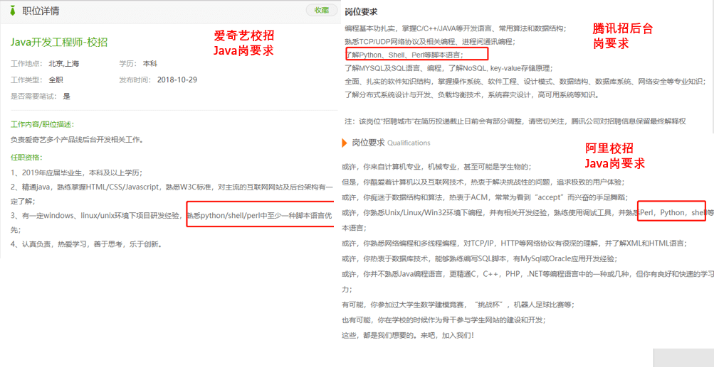
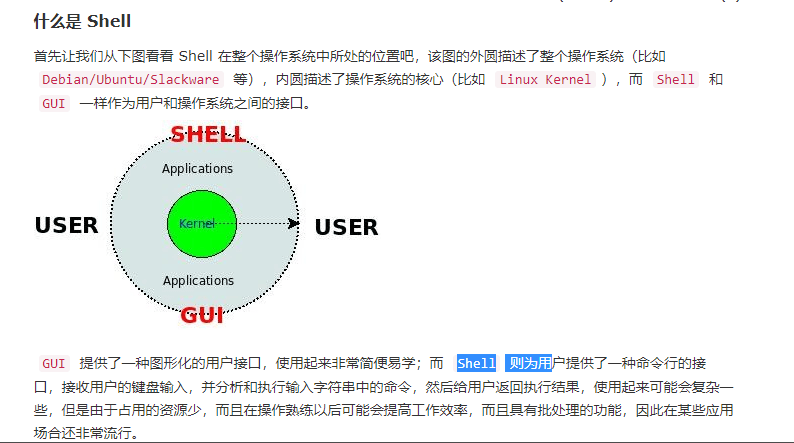
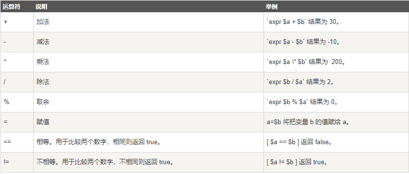
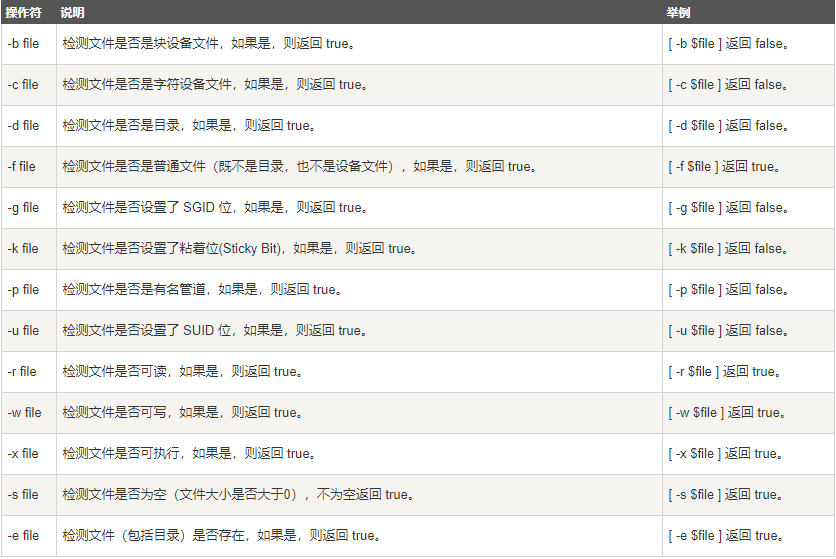

# Shell编程基础知识总结

# Shell 编程基础知识总结
## 走进 Shell 编程的大门
### 为什么要学 Shell？
学一个东西，我们大部分情况都是往实用性方向着想。从工作角度来讲，学习 Shell 是为了提高我们自己工作效率，提高产出，让我们在更少的时间完成更多的事情。

很多人会说 Shell 编程属于运维方面的知识了，应该是运维人员来做，我们做后端开发的没必要学。我觉得这种说法大错特错，相比于专门做 Linux 运维的人员来说，我们对 Shell 编程掌握程度的要求要比他们低，但是 Shell 编程也是我们必须要掌握的！

目前 Linux 系统下最流行的运维自动化语言就是 Shell 和 Python 了。

两者之间，Shell 几乎是 IT 企业必须使用的运维自动化编程语言，特别是在运维工作中的服务监控、业务快速部署、服务启动停止、数据备份及处理、日志分析等环节里，shell 是不可缺的。Python 更适合处理复杂的业务逻辑，以及开发复杂的运维软件工具，实现通过 web 访问等。Shell 是一个命令解释器，解释执行用户所输入的命令和程序。一输入命令，就立即回应的交互的对话方式。

另外，了解 shell 编程也是大部分互联网公司招聘后端开发人员的要求。下图是我截取的一些知名互联网公司对于 Shell 编程的要求。



大型互联网公司对于shell编程技能的要求

### 什么是 Shell？
简单来说“Shell 编程就是对一堆 Linux 命令的逻辑化处理”。

W3Cschool 上的一篇文章是这样介绍 Shell 的，如下图所示。



### Shell 编程的 Hello World
学习任何一门编程语言第一件事就是输出 HelloWorld 了！下面我会从新建文件到 shell 代码编写来说下 Shell 编程如何输出 Hello World。

(1)新建一个文件[helloworld.sh](http://helloworld.sh/)[open in new window](http://helloworld.sh/):touch helloworld.sh，扩展名为 sh（sh 代表 Shell）（扩展名并不影响脚本执行，见名知意就好，如果你用 php 写 shell 脚本，扩展名就用 php 好了）

(2) 使脚本具有执行权限：chmod +x helloworld.sh

(3) 使用 vim 命令修改[helloworld.sh](http://helloworld.sh/)[open in new window](http://helloworld.sh/)文件：vim helloworld.sh(vim 文件------>进入文件----->命令模式------>按 i 进入编辑模式----->编辑文件 ------->按 Esc 进入底行模式----->输入:wq/q! （输入 wq 代表写入内容并退出，即保存；输入 q!代表强制退出不保存。）)

[helloworld.sh](http://helloworld.sh/)[open in new window](http://helloworld.sh/)内容如下：

```plain
#!/bin/bash
#第一个shell小程序,echo 是linux中的输出命令。
echo  "helloworld!"
```

shell 中 # 符号表示注释。**shell 的第一行比较特殊，一般都会以#!开始来指定使用的 shell 类型。在 linux 中，除了 bash shell 以外，还有很多版本的 shell， 例如 zsh、dash 等等...不过 bash shell 还是我们使用最多的。**

(4) 运行脚本:./helloworld.sh。（注意，一定要写成./helloworld.sh，而不是helloworld.sh，运行其它二进制的程序也一样，直接写helloworld.sh，linux 系统会去 PATH 里寻找有没有叫[helloworld.sh](http://helloworld.sh/)[open in new window](http://helloworld.sh/)的，而只有 /bin, /sbin, /usr/bin，/usr/sbin 等在 PATH 里，你的当前目录通常不在 PATH 里，所以写成helloworld.sh是会找不到命令的，要用./helloworld.sh告诉系统说，就在当前目录找。）


shell 编程Hello World

## Shell 变量
### Shell 编程中的变量介绍
**Shell 编程中一般分为三种变量：**

1. **我们自己定义的变量（自定义变量）:**仅在当前 Shell 实例中有效，其他 Shell 启动的程序不能访问局部变量。
2. **Linux 已定义的环境变量**（环境变量， 例如：PATH, HOME等..., 这类变量我们可以直接使用），使用env命令可以查看所有的环境变量，而 set 命令既可以查看环境变量也可以查看自定义变量。
3. **Shell 变量**：Shell 变量是由 Shell 程序设置的特殊变量。Shell 变量中有一部分是环境变量，有一部分是局部变量，这些变量保证了 Shell 的正常运行

**常用的环境变量:**

PATH 决定了 shell 将到哪些目录中寻找命令或程序HOME 当前用户主目录HISTSIZE 历史记录数LOGNAME 当前用户的登录名HOSTNAME 指主机的名称SHELL 当前用户 Shell 类型LANGUAGE 语言相关的环境变量，多语言可以修改此环境变量MAIL 当前用户的邮件存放目录PS1 基本提示符，对于 root 用户是#，对于普通用户是$

**使用 Linux 已定义的环境变量：**

比如我们要看当前用户目录可以使用：echo $ HOME命令；如果我们要看当前用户 Shell 类型 可以使用echo  $SHELL命令。可以看出，使用方法非常简单。

**使用自己定义的变量：**

```plain
#!/bin/bash
#自定义变量hello
hello="hello world"
echo $hello
echo  "helloworld!"
```


使用自己定义的变量

**Shell 编程中的变量名的命名的注意事项：**

+ 命名只能使用英文字母，数字和下划线，首个字符不能以数字开头，但是可以使用下划线（_）开头。
+ 中间不能有空格，可以使用下划线（_）。
+ 不能使用标点符号。
+ 不能使用 bash 里的关键字（可用 help 命令查看保留关键字）。

### Shell 字符串入门
字符串是 shell 编程中最常用最有用的数据类型（除了数字和字符串，也没啥其它类型好用了），字符串可以用单引号，也可以用双引号。这点和 Java 中有所不同。

在单引号中所有的特殊符号，如和反引号都没有特殊含义。在双引号中，除了""、"&quot;、反引号和感叹号（需开启history expansion），其他的字符没有特殊含义。

**单引号字符串：**

```plain
#!/bin/bash
name='SnailClimb'
hello='Hello, I am $name!'
echo $hello
```

输出内容：

```plain
Hello, I am $name!
```

**双引号字符串：**

```plain
#!/bin/bash
name='SnailClimb'
hello="Hello, I am $name!"
echo $hello
```

输出内容：

```plain
Hello, I am SnailClimb!
```

### Shell 字符串常见操作
**拼接字符串：**

```plain
#!/bin/bash
name="SnailClimb"
# 使用双引号拼接
greeting="hello, "$name" !"
greeting_1="hello, ${name} !"
echo $greeting  $greeting_1
# 使用单引号拼接
greeting_2='hello, '$name' !'
greeting_3='hello, ${name} !'
echo $greeting_2  $greeting_3
```

输出结果：


输出结果

**获取字符串长度：**

```plain
#!/bin/bash
#获取字符串长度
name="SnailClimb"
# 第一种方式
echo ${#name} #输出 10
# 第二种方式
expr length "$name";
```

输出结果:

使用 expr 命令时，表达式中的运算符左右必须包含空格，如果不包含空格，将会输出表达式本身:

```plain
expr 5+6    // 直接输出 5+6
expr 5 + 6       // 输出 11
```

对于某些运算符，还需要我们使用符号\进行转义，否则就会提示语法错误。

```plain
expr 5 * 6       // 输出错误
expr 5 \* 6      // 输出30
```

**截取子字符串:**

简单的字符串截取：

```plain
#从字符串第 1 个字符开始往后截取 10 个字符
str="SnailClimb is a great man"
echo ${str:0:10} #输出:SnailClimb
```

根据表达式截取：

```plain
#!bin/bash
#author:amau

var="https://www.runoob.com/linux/linux-shell-variable.html"
# %表示删除从后匹配, 最短结果
# %%表示删除从后匹配, 最长匹配结果
# #表示删除从头匹配, 最短结果
# ##表示删除从头匹配, 最长匹配结果
# 注: *为通配符, 意为匹配任意数量的任意字符
s1=${var%%t*} #h
s2=${var%t*}  #https://www.runoob.com/linux/linux-shell-variable.h
s3=${var%%.*} #http://www
s4=${var#*/}  #/www.runoob.com/linux/linux-shell-variable.html
s5=${var##*/} #linux-shell-variable.html
```

### Shell 数组
bash 支持一维数组（不支持多维数组），并且没有限定数组的大小。我下面给了大家一个关于数组操作的 Shell 代码示例，通过该示例大家可以知道如何创建数组、获取数组长度、获取/删除特定位置的数组元素、删除整个数组以及遍历数组。

```plain
#!/bin/bash
array=(1 2 3 4 5);
# 获取数组长度
length=${#array[@]}
# 或者
length2=${#array[*]}
#输出数组长度
echo $length #输出：5
echo $length2 #输出：5
# 输出数组第三个元素
echo ${array[2]} #输出：3
unset array[1]# 删除下标为1的元素也就是删除第二个元素
for i in ${array[@]};do echo $i ;done # 遍历数组，输出：1 3 4 5
unset array; # 删除数组中的所有元素
for i in ${array[@]};do echo $i ;done # 遍历数组，数组元素为空，没有任何输出内容
```

## Shell 基本运算符
说明：图片来自《菜鸟教程》

Shell 编程支持下面几种运算符

+ 算数运算符
+ 关系运算符
+ 布尔运算符
+ 字符串运算符
+ 文件测试运算符

### 算数运算符


算数运算符

我以加法运算符做一个简单的示例（注意：不是单引号，是反引号）：

```plain
#!/bin/bash
a=3;b=3;
val=`expr $a + $b`
#输出：Total value : 6
echo "Total value : $val"
```

### 关系运算符
关系运算符只支持数字，不支持字符串，除非字符串的值是数字。


shell关系运算符

通过一个简单的示例演示关系运算符的使用，下面 shell 程序的作用是当 score=100 的时候输出 A 否则输出 B。

```plain
#!/bin/bash
score=90;
maxscore=100;
if [ $score -eq $maxscore ]
then
   echo "A"
else
   echo "B"
fi
```

输出结果：

### 逻辑运算符


逻辑运算符

示例：

```plain
#!/bin/bash
a=$(( 1 && 0))
# 输出：0；逻辑与运算只有相与的两边都是1，与的结果才是1；否则与的结果是0
echo $a;
```

### 布尔运算符


布尔运算符

这里就不做演示了，应该挺简单的。

### 字符串运算符


字符串运算符

简单示例：

```plain
#!/bin/bash
a="abc";
b="efg";
if [ $a = $b ]
then
   echo "a 等于 b"
else
   echo "a 不等于 b"
fi
```

输出：

```plain
a 不等于 b
```

### 文件相关运算符


文件相关运算符

使用方式很简单，比如我们定义好了一个文件路径file="/usr/learnshell/test.sh"如果我们想判断这个文件是否可读，可以这样if [ -r $ file ]如果想判断这个文件是否可写，可以这样-w  $file，是不是很简单。

## Shell 流程控制
### if 条件语句
简单的 if else-if else 的条件语句示例

```plain
#!/bin/bash
a=3;
b=9;
if [ $a -eq $b ]
then
   echo "a 等于 b"
elif [ $a -gt $b ]
then
   echo "a 大于 b"
else
   echo "a 小于 b"
fi
```

输出结果：

```plain
a 小于 b
```

相信大家通过上面的示例就已经掌握了 shell 编程中的 if 条件语句。不过，还要提到的一点是，不同于我们常见的 Java 以及 PHP 中的 if 条件语句，shell if 条件语句中不能包含空语句也就是什么都不做的语句。

### for 循环语句
通过下面三个简单的示例认识 for 循环语句最基本的使用，实际上 for 循环语句的功能比下面你看到的示例展现的要大得多。

**输出当前列表中的数据：**

```plain
for loop in 1 2 3 4 5
do
    echo "The value is: $loop"
done
```

**产生 10 个随机数：**

```plain
#!/bin/bash
for i in {0..9};
do
   echo $RANDOM;
done
```

**输出 1 到 5:**

通常情况下 shell 变量调用需要加 $,但是 for 的 (()) 中不需要,下面来看一个例子：

```plain
#!/bin/bash
length=5
for((i=1;i<=length;i++));do
    echo $i;
done;
```

### while 语句
**基本的 while 循环语句：**

```plain
#!/bin/bash
int=1
while(( $int<=5 ))
do
    echo $int
    let "int++"
done
```

**while 循环可用于读取键盘信息：**

```plain
echo '按下 <CTRL-D> 退出'
echo -n '输入你最喜欢的电影: '
while read FILM
do
    echo "是的！$FILM 是一个好电影"
done
```

输出内容:

```plain
按下 <CTRL-D> 退出
输入你最喜欢的电影: 变形金刚
是的！变形金刚 是一个好电影
```

**无限循环：**

```plain
while true
do
    command
done
```

## Shell 函数
### 不带参数没有返回值的函数
```plain
#!/bin/bash
hello(){
    echo "这是我的第一个 shell 函数!"
}
echo "-----函数开始执行-----"
hello
echo "-----函数执行完毕-----"
```

输出结果：

```plain
-----函数开始执行-----
这是我的第一个 shell 函数!
-----函数执行完毕-----
```

### 有返回值的函数
**输入两个数字之后相加并返回结果：**

```plain
#!/bin/bash
funWithReturn(){
    echo "输入第一个数字: "
    read aNum
    echo "输入第二个数字: "
    read anotherNum
    echo "两个数字分别为 $aNum 和 $anotherNum !"
    return $(($aNum+$anotherNum))
}
funWithReturn
echo "输入的两个数字之和为 $?"
```

输出结果：

```plain
输入第一个数字:
1
输入第二个数字:
2
两个数字分别为 1 和 2 !
输入的两个数字之和为 3
```

### 带参数的函数
```plain
#!/bin/bash
funWithParam(){
    echo "第一个参数为 $1 !"
    echo "第二个参数为 $2 !"
    echo "第十个参数为 $10 !"
    echo "第十个参数为 ${10} !"
    echo "第十一个参数为 ${11} !"
    echo "参数总数有 $# 个!"
    echo "作为一个字符串输出所有参数 $* !"
}
funWithParam 1 2 3 4 5 6 7 8 9 34 73
```

输出结果：

```plain
第一个参数为 1 !
第二个参数为 2 !
第十个参数为 10 !
第十个参数为 34 !
第十一个参数为 73 !
参数总数有 11 个!
作为一个字符串输出所有参数 1 2 3 4 5 6 7 8 9 34 73 !
```


> 更新: 2024-01-03 21:04:05  
原文: [https://www.yuque.com/vip6688/neho4x/phrh43iqri9gfiec](https://www.yuque.com/vip6688/neho4x/phrh43iqri9gfiec)
>


> 更新: 2024-12-03 10:59:17  
> 原文: <https://www.yuque.com/neumx/laxg2e/23d649cddc5cab4236f649d3abb56384>