# RocketMQ八股

# 基础
## 为什么要使用消息队列呢？
**消息队列（Message Queue, MQ）** 是一种非常重要的中间件技术，广泛应用于分布式系统中，以提高系统的可用性、解耦能力和异步通信效率。

**作用**：

+ **解耦**：生产者和消费者不需要直接交互，降低系统耦合度。
+ **异步**：生产者无需等待消费者实时处理，提升响应速度。
+ **削峰**：缓冲瞬时流量高峰，避免系统过载。

---

1. **解耦**  
生产者将消息放入队列，消费者从队列中取出消息，这样一来，生产者和消费者之间就不需要直接通信，生产者只管生产消息，消费者只管消费消息，这样就实现了解耦。
+ **解耦**：生产者和消费者不需要直接交互，降低系统耦合度。
2. **异步**  
系统可以将那些耗时的任务放在消息队列中异步处理，从而快速响应用户的请求。比如说，用户下单后，系统可以先返回一个下单成功的消息，然后将订单信息放入消息队列中，后台系统再去处理订单信息。
3. **削峰**  
削峰填谷是一种常见的技术手段，用于应对系统高并发请求的瞬时流量高峰， 消息队列可以缓存大量请求，消费者按照自己的处理能力逐步消费消息，从而平滑流量峰值。  通过消息队列，可以将瞬时的高峰流量转化为持续的低流量，从而保护系统不会因为瞬时的高流量而崩溃。
4. **顺序保障**  
某些场景下，消息需要按顺序处理，比如订单处理、支付流程等。消息队列可以确保消息按顺序消费，满足特定业务逻辑的需求。
5. **可靠性保障**  
消息队列通常具备消息持久化功能，即使在网络或系统故障时，消息也不会丢失。这种机制提供了更高的可靠性。比如，如果消费者暂时不可用，消息会保存在队列中，等到消费者恢复后再进行处理，避免了数据丢失。

### 如何用RocketMQ做削峰填谷的？
**用户请求到达系统后**，由生产者接收请求并将其转化为消息，发送到 **RocketMQ** 队列中。队列用来充当缓冲区，将大量请求按照顺序排队，这样就可以削减请求高峰时对后端服务的直接压力。

不仅如此，生产者通过 **异步方式发送消息**，还可以快速响应用户请求。

**消费者** 从 **RocketMQ** 队列中按照一定速率读取消息并进行处理。可以根据后端处理能力和当前负载情况 **动态调整消费者的消费速率**，达到 **填谷** 的效果。

## 为什么要选择 RocketMQ?


我们系统主要服务于 **C 端用户**（普通消费者），需要处理一定的并发请求，并且对性能要求较高。因此，选择了 **RocketMQ** 作为消息队列，因为它具有以下优势：

1. **低延迟**：能够快速处理消息，满足用户对实时性的需求。  
2. **高吞吐量**：能够同时处理大量消息，支撑高并发场景。  
3. **高可用性**：通过主从架构和消息持久化，确保系统稳定运行，避免消息丢失。

简单来说，RocketMQ 的特性非常适合你们系统对性能、并发和稳定性的要求。

##  RocketMQ、RabbitMQ 和 Kafka  区别（得写详细点，涉及原理架构什么的）
**RocketMQ**、**RabbitMQ** 和 **Kafka** 的区别在于：

1. **RocketMQ**  
高吞吐量、低延迟、支持顺序消息和事务消息，具备良好的扩展性。适合电商等大规模高并发场景。
2. **RabbitMQ**  
低延迟、灵活性强，实现简单，适合中小型项目和复杂路由。
3. **Kafka**  
 Kafka 是一个高吞吐量、低延迟的分布式消息队列，适合大数据分析和流处理等场景。

### 详细区别
**RocketMQ、RabbitMQ 和 Kafka** 都是常见的消息队列（MQ）中间件，但它们在**架构设计、存储机制、消息投递**等方面存在明显差异。

---

## **1. 核心架构对比**
| **对比项** | **RocketMQ** | **RabbitMQ** | **Kafka** |
| --- | --- | --- | --- |
| **架构模式** | **分布式队列+Pull消费** | **中心化 Broker+Push 机制** | **分布式日志+Pull消费** |
| **存储方式** | **CommitLog 顺序存储** | **内存 + 持久化（基于索引存储）** | **Segment 日志分段存储** |
| **消息模型** | **主题（Topic）+队列（Queue）** | **交换机（Exchange）+队列（Queue）** | **主题（Topic）+分区（Partition）** |
| **消息投递** | **Pull（主动拉取）** | **Push（主动推送）** | **Pull（主动拉取）** |
| **高可用模式** | **主从同步 + DLedger** | **镜像模式（HA）** | **ISR 复制（Raft-like）** |
| **事务支持** | **支持事务消息** | **支持事务但较少用** | **不支持事务** |


---

## **2. 关键原理对比**
### **2.1 RocketMQ**
#### **① 消息存储**
+ **CommitLog**：消息**顺序写入**，提升吞吐量（mmap + PageCache）。
+ **ConsumeQueue**：索引存储，加速消费端查找消息。
+ **IndexFile**：支持按 Key 查询消息（基于哈希索引）。

#### **② 消息消费**
+ **Pull 模式**：Consumer 主动拉取，降低 Broker 负担。
+ **消息幂等性**：消费位点由 Consumer 维护，支持**消息重试**。

#### **③ 高可用**
+ **主从架构**：支持**同步/异步复制**，使用 **DLedger** 提供高可用性。

---

### **2.2 RabbitMQ**
#### **① 消息存储**
+ **基于 Erlang**，使用 **Mnesia/ETS** 内存存储，持久化时采用 **磁盘索引** 存储。
+ **消息队列**：存储在**队列结构**中，写入成本较高，适用于低延迟应用。

#### **② 消息消费**
+ **Push 模式**：Broker 主动推送，减少 Consumer 轮询压力，但可能导致 Consumer 过载。
+ **消息确认**：支持 **ACK 机制**，保证消息**可靠投递**。

#### **③ 高可用**
+ **镜像模式**：多个节点同步队列数据，提高可靠性，但**主从同步成本高**。

---

### **2.3 Kafka**
#### **① 消息存储**
+ **Segment 机制**：日志分段存储，每个分区（Partition）是一个 **append-only** 日志文件。
+ **零拷贝（Zero-copy）**：提升吞吐量（直接从磁盘发送数据到 Socket）。

#### **② 消息消费**
+ **Pull 模式**：Consumer 维护自己的消费位点，提高扩展性。
+ **分区订阅**：每个 Topic 分成多个 Partition，提高吞吐能力。

#### **③ 高可用**
+ **ISR（In-Sync Replicas）** 机制，Leader-Follower 复制，部分类似于 **Raft**。

---

## **3. 适用场景**
| **场景** | **RocketMQ** | **RabbitMQ** | **Kafka** |
| --- | --- | --- | --- |
| **高吞吐、大流量** | ✅ 适用于金融级消息队列 | ❌ 处理能力一般 | ✅ 日志存储，超高吞吐 |
| **事务消息** | ✅ 原生支持 | ✅ 支持但较少用 | ❌ 不支持 |
| **低延迟** | ✅ 低延迟（毫秒级） | ✅ 低延迟（亚毫秒级） | ❌ 适用于批量处理（高吞吐但延迟高） |
| **大数据日志** | ❌ 不适合 | ❌ 主要用于业务系统 | ✅ 主要用于大数据流式计算 |
| **可靠投递** | ✅ 支持幂等性 | ✅ 依赖 ACK 机制 | ✅ 但无严格事务支持 |


---

## **4. 总结**
+ **RocketMQ**：高吞吐、事务支持，适用于金融、电商等业务。
+ **RabbitMQ**：低延迟、强可靠性，适用于即时消息交互（如支付系统）。
+ **Kafka**：超高吞吐，适用于日志存储、大数据流式计算。

## RocketMQ 有什么优缺点？
**RocketMQ 优点：**

    1. **单机吞吐量**：十万级
    2. **可用性**：非常高，分布式架构
    3. **消息可靠性**：经过参数优化配置，消息可以做到 **0 丢失**
    4. **功能支持**：MQ 功能较为完善，还是分布式的，**扩展性好**
    5. **支持 10 亿级别的消息堆积**，不会因为堆积导致性能下降
    6. **源码是 Java**，方便结合公司自己的业务二次开发
    7. **天生为金融互联网领域而生**，对于可靠性要求很高的场景，尤其是电商里面的订单扣款，以及业务削峰，在大量交易涌入时，后端可能无法及时处理的情况
    8. **RocketMQ在稳定性上可能更值得信赖**，这些业务场景在阿里双 11 已经经历了多次考验。如果你的业务有上述并发场景，建议可以选择 RocketMQ

**RocketMQ 缺点：**

    1. **支持的客户端语言不多**，目前是 Java 及 C++，其中 C++ 不成熟
    2. **没有在 MQ 核心中去实现 JMS 等接口**，有些系统要迁移需要修改大量代码

### 说说你对 RocketMQ 的理解？
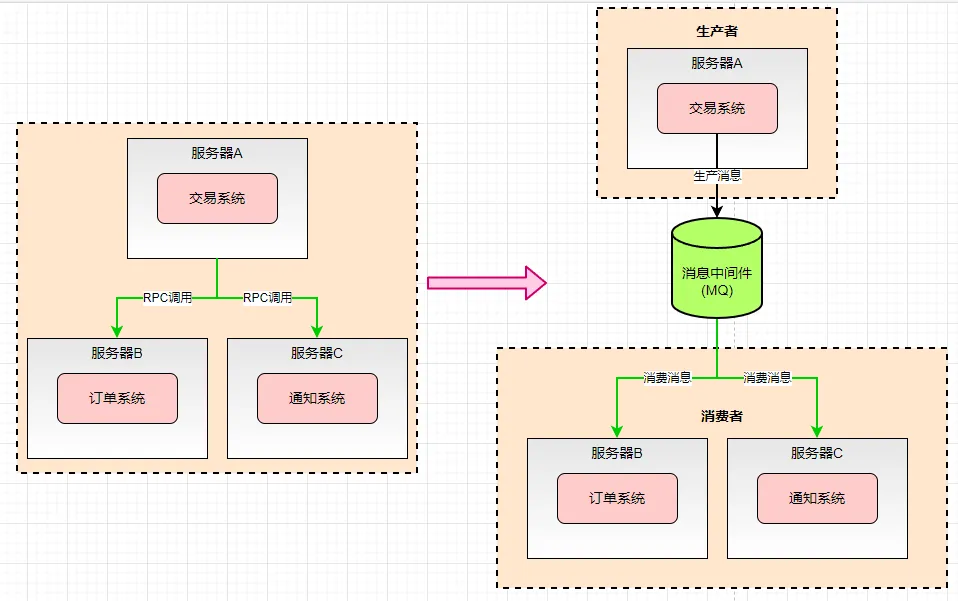

 **RocketMQ** 是阿里巴巴开源的一款分布式消息中间件，具有 **高吞吐量**、**低延迟** 和 **高可用性**。其主要组件包括：

1. **生产者**：负责发送消息到 Broker
2. **消费者**：从队列中拉取消息进行处理
3. **Broker**：消息存储和转发的核心组件
4. **Topic**：消息的类别，用于将消息进行分类
5. **队列**：消息存储的基本单元，用于按顺序存储消息

消息由 **生产者** 发送到 **Broker**，再根据路由规则存储到 **队列** 中，**消费者** 从队列中拉取消息进行处理。RocketMQ 适用于 **异步解耦** 和 **流量削峰** 等场景。

## 消息队列有哪些消息模型？
**消息队列有两种模型：队列模型和发布/订阅模型。**

**1. 队列模型**

这是最初的一种消息队列模型，对应着消息队列“发-存-收”的模型。

+ 生产者往某个队列里面发送消息，一个队列可以存储多个生产者的消息。
+ 一个队列也可以有多个消费者，但是消费者之间是竞争关系，也就是说**每条消息只能被一个消费者消费**。


**2. 发布/订阅模型**

如果需要将一份消息数据分发给多个消费者，并且每个消费者都要求收到全量的消息，**队列模型无法满足这个需求**。解决的方式就是发布/订阅模型。

在发布 - 订阅模型中：

+ **消息的发送方**称为**发布者（Publisher）**，
+ **消息的接收方**称为**订阅者（Subscriber）**，
+ **服务端存放消息的容器**称为**主题（Topic）**。

发布者将消息发送到主题中，订阅者在接收消息之前需要先“订阅主题”。  
“订阅”在这里既是一个动作，同时还可以认为是主题在消费时的一个逻辑副本，每份订阅中，订阅者都可以接收到主题的**所有消息**。

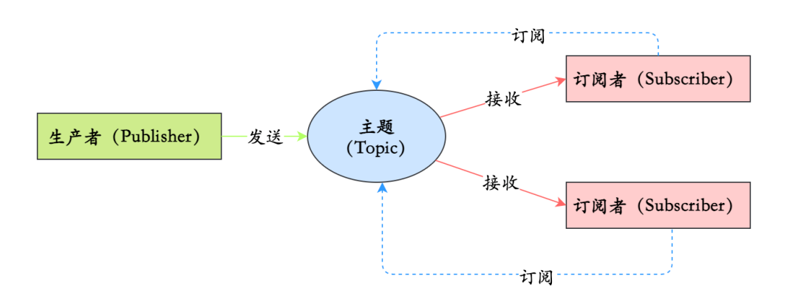

**它和“队列模式”的异同：**

+ 生产者就是发布者，队列就是主题，消费者就是订阅者，无本质区别。
+ 唯一的不同点在于：**一份消息数据是否可以被多次消费**。

<details class="lake-collapse"><summary id="u1e644a0b"><strong><span class="ne-text">更加详细的模型</span></strong></summary><p id="ud16b90f1" class="ne-p"><span class="ne-text">消息队列通常支持多种消息模型，以满足不同的业务场景需求。以下是常见的消息模型：</span></p><hr id="T7awT" class="ne-hr"><h3 id="Ixw36"><span class="ne-text">1. </span><strong><span class="ne-text">点对点模型（Point-to-Point, P2P）</span></strong></h3><ul class="ne-ul"><li id="ucae712d5" data-lake-index-type="0"><strong><span class="ne-text">特点</span></strong><span class="ne-text">：</span></li></ul><ul class="ne-list-wrap"><ul ne-level="1" class="ne-ul"><li id="u7d965194" data-lake-index-type="0"><span class="ne-text">消息生产者将消息发送到队列，</span><strong><span class="ne-text">只有一个消费者</span></strong><span class="ne-text">能消费该消息。</span></li><li id="u5b0e371b" data-lake-index-type="0"><span class="ne-text">消息被消费后，会从队列中移除。</span></li></ul></ul><ul class="ne-ul"><li id="u7162a133" data-lake-index-type="0"><strong><span class="ne-text">适用场景</span></strong><span class="ne-text">：</span></li></ul><ul class="ne-list-wrap"><ul ne-level="1" class="ne-ul"><li id="u573eb4d0" data-lake-index-type="0"><span class="ne-text">任务分发、订单处理等需要</span><strong><span class="ne-text">一对一</span></strong><span class="ne-text">通信的场景。</span></li></ul></ul><ul class="ne-ul"><li id="u23387b05" data-lake-index-type="0"><strong><span class="ne-text">示例</span></strong><span class="ne-text">：</span></li></ul><ul class="ne-list-wrap"><ul ne-level="1" class="ne-ul"><li id="u69007b3b" data-lake-index-type="0"><span class="ne-text">RabbitMQ 的 Queue 模型。</span></li></ul></ul><hr id="V6v4W" class="ne-hr"><h3 id="mYTma"><span class="ne-text">2. </span><strong><span class="ne-text">发布/订阅模型（Publish/Subscribe, Pub/Sub）</span></strong></h3><ul class="ne-ul"><li id="u01a30382" data-lake-index-type="0"><strong><span class="ne-text">特点</span></strong><span class="ne-text">：</span></li></ul><ul class="ne-list-wrap"><ul ne-level="1" class="ne-ul"><li id="udedfd3d7" data-lake-index-type="0"><span class="ne-text">消息生产者将消息发送到</span><strong><span class="ne-text">主题（Topic）</span></strong><span class="ne-text">，</span><strong><span class="ne-text">多个消费者</span></strong><span class="ne-text">可以订阅该主题并消费消息。</span></li><li id="u2ad126a8" data-lake-index-type="0"><span class="ne-text">每个消费者都会收到相同的消息。</span></li></ul></ul><ul class="ne-ul"><li id="u3279ee6f" data-lake-index-type="0"><strong><span class="ne-text">适用场景</span></strong><span class="ne-text">：</span></li></ul><ul class="ne-list-wrap"><ul ne-level="1" class="ne-ul"><li id="ua091b904" data-lake-index-type="0"><span class="ne-text">日志收集、事件通知等需要</span><strong><span class="ne-text">一对多</span></strong><span class="ne-text">广播的场景。</span></li></ul></ul><ul class="ne-ul"><li id="ubfb8bfa4" data-lake-index-type="0"><strong><span class="ne-text">示例</span></strong><span class="ne-text">：</span></li></ul><ul class="ne-list-wrap"><ul ne-level="1" class="ne-ul"><li id="u5ca3bc16" data-lake-index-type="0"><span class="ne-text">Kafka 的 Topic 模型，RocketMQ 的 Topic 模型。</span></li></ul></ul><hr id="xqbW4" class="ne-hr"><h3 id="BLFeF"><span class="ne-text">3. </span><strong><span class="ne-text">广播模型（Broadcast）</span></strong></h3><ul class="ne-ul"><li id="uc9bfd7d2" data-lake-index-type="0"><strong><span class="ne-text">特点</span></strong><span class="ne-text">：</span></li></ul><ul class="ne-list-wrap"><ul ne-level="1" class="ne-ul"><li id="u1ad7c39d" data-lake-index-type="0"><span class="ne-text">消息生产者将消息发送到队列或主题，</span><strong><span class="ne-text">所有消费者</span></strong><span class="ne-text">都会收到相同的消息。</span></li><li id="u7b29915a" data-lake-index-type="0"><span class="ne-text">与发布/订阅模型类似，但通常用于更简单的场景。</span></li></ul></ul><ul class="ne-ul"><li id="u654b3b49" data-lake-index-type="0"><strong><span class="ne-text">适用场景</span></strong><span class="ne-text">：</span></li></ul><ul class="ne-list-wrap"><ul ne-level="1" class="ne-ul"><li id="u6fcaa1fa" data-lake-index-type="0"><span class="ne-text">系统通知、配置更新等需要</span><strong><span class="ne-text">全量广播</span></strong><span class="ne-text">的场景。</span></li></ul></ul><ul class="ne-ul"><li id="u9e1630f1" data-lake-index-type="0"><strong><span class="ne-text">示例</span></strong><span class="ne-text">：</span></li></ul><ul class="ne-list-wrap"><ul ne-level="1" class="ne-ul"><li id="u9f603543" data-lake-index-type="0"><span class="ne-text">RocketMQ 的广播消费模式。</span></li></ul></ul><hr id="WjB0S" class="ne-hr"><h3 id="r3Wal"><span class="ne-text">4. </span><strong><span class="ne-text">请求/响应模型（Request/Reply）</span></strong></h3><ul class="ne-ul"><li id="ud59e9919" data-lake-index-type="0"><strong><span class="ne-text">特点</span></strong><span class="ne-text">：</span></li></ul><ul class="ne-list-wrap"><ul ne-level="1" class="ne-ul"><li id="u078fa627" data-lake-index-type="0"><span class="ne-text">生产者发送消息后，等待消费者处理并返回响应。</span></li><li id="ua5d13e61" data-lake-index-type="0"><span class="ne-text">类似于同步调用，但通过消息队列实现异步解耦。</span></li></ul></ul><ul class="ne-ul"><li id="uda2a2796" data-lake-index-type="0"><strong><span class="ne-text">适用场景</span></strong><span class="ne-text">：</span></li></ul><ul class="ne-list-wrap"><ul ne-level="1" class="ne-ul"><li id="ub4932fdf" data-lake-index-type="0"><span class="ne-text">需要</span><strong><span class="ne-text">双向通信</span></strong><span class="ne-text">的场景，如 RPC 调用。</span></li></ul></ul><ul class="ne-ul"><li id="u35a834fe" data-lake-index-type="0"><strong><span class="ne-text">示例</span></strong><span class="ne-text">：</span></li></ul><ul class="ne-list-wrap"><ul ne-level="1" class="ne-ul"><li id="ubf52b0e4" data-lake-index-type="0"><span class="ne-text">RabbitMQ 的 RPC 模式。</span></li></ul></ul><hr id="ZpkBs" class="ne-hr"><h3 id="pKIfu"><span class="ne-text">5. </span><strong><span class="ne-text">扇出模型（Fanout）</span></strong></h3><ul class="ne-ul"><li id="ud9a82223" data-lake-index-type="0"><strong><span class="ne-text">特点</span></strong><span class="ne-text">：</span></li></ul><ul class="ne-list-wrap"><ul ne-level="1" class="ne-ul"><li id="ua4e41db5" data-lake-index-type="0"><span class="ne-text">消息生产者将消息发送到</span><strong><span class="ne-text">交换机（Exchange）</span></strong><span class="ne-text">，交换机会将消息</span><strong><span class="ne-text">广播</span></strong><span class="ne-text">到所有绑定的队列。</span></li><li id="u572ba0b4" data-lake-index-type="0"><span class="ne-text">每个队列的消费者都会收到相同的消息。</span></li></ul></ul><ul class="ne-ul"><li id="u54af54ba" data-lake-index-type="0"><strong><span class="ne-text">适用场景</span></strong><span class="ne-text">：</span></li></ul><ul class="ne-list-wrap"><ul ne-level="1" class="ne-ul"><li id="u22442ce6" data-lake-index-type="0"><span class="ne-text">需要将消息</span><strong><span class="ne-text">分发给多个系统</span></strong><span class="ne-text">的场景。</span></li></ul></ul><ul class="ne-ul"><li id="u4dd85728" data-lake-index-type="0"><strong><span class="ne-text">示例</span></strong><span class="ne-text">：</span></li></ul><ul class="ne-list-wrap"><ul ne-level="1" class="ne-ul"><li id="u4e103615" data-lake-index-type="0"><span class="ne-text">RabbitMQ 的 Fanout 交换机。</span></li></ul></ul><hr id="rbwkl" class="ne-hr"><h3 id="PVkDf"><span class="ne-text">6. </span><strong><span class="ne-text">路由模型（Routing）</span></strong></h3><ul class="ne-ul"><li id="ua9fb6fd7" data-lake-index-type="0"><strong><span class="ne-text">特点</span></strong><span class="ne-text">：</span></li></ul><ul class="ne-list-wrap"><ul ne-level="1" class="ne-ul"><li id="u3131976f" data-lake-index-type="0"><span class="ne-text">消息生产者将消息发送到交换机，并根据**路由键（Routing Key）**将消息分发到特定的队列。</span></li><li id="ud6414710" data-lake-index-type="0"><span class="ne-text">只有符合路由规则的消费者才能收到消息。</span></li></ul></ul><ul class="ne-ul"><li id="ueb847c7d" data-lake-index-type="0"><strong><span class="ne-text">适用场景</span></strong><span class="ne-text">：</span></li></ul><ul class="ne-list-wrap"><ul ne-level="1" class="ne-ul"><li id="u0e7c86f8" data-lake-index-type="0"><span class="ne-text">需要根据条件</span><strong><span class="ne-text">选择性分发消息</span></strong><span class="ne-text">的场景。</span></li></ul></ul><ul class="ne-ul"><li id="uf495255c" data-lake-index-type="0"><strong><span class="ne-text">示例</span></strong><span class="ne-text">：</span></li></ul><ul class="ne-list-wrap"><ul ne-level="1" class="ne-ul"><li id="u9275d009" data-lake-index-type="0"><span class="ne-text">RabbitMQ 的 Direct 和 Topic 交换机。</span></li></ul></ul><hr id="biz6b" class="ne-hr"><h3 id="fWp5R"><span class="ne-text">7. </span><strong><span class="ne-text">死信队列模型（Dead Letter Queue, DLQ）</span></strong></h3><ul class="ne-ul"><li id="u10ce1461" data-lake-index-type="0"><strong><span class="ne-text">特点</span></strong><span class="ne-text">：</span></li></ul><ul class="ne-list-wrap"><ul ne-level="1" class="ne-ul"><li id="u5a1410d6" data-lake-index-type="0"><span class="ne-text">当消息无法被正常消费时，会被转移到</span><strong><span class="ne-text">死信队列</span></strong><span class="ne-text">，以便后续处理或分析。</span></li></ul></ul><ul class="ne-ul"><li id="uc2d15e20" data-lake-index-type="0"><strong><span class="ne-text">适用场景</span></strong><span class="ne-text">：</span></li></ul><ul class="ne-list-wrap"><ul ne-level="1" class="ne-ul"><li id="u66a45c92" data-lake-index-type="0"><span class="ne-text">处理</span><strong><span class="ne-text">异常消息</span></strong><span class="ne-text">，避免消息丢失。</span></li></ul></ul><ul class="ne-ul"><li id="ue79b7780" data-lake-index-type="0"><strong><span class="ne-text">示例</span></strong><span class="ne-text">：</span></li></ul><ul class="ne-list-wrap"><ul ne-level="1" class="ne-ul"><li id="u37d88878" data-lake-index-type="0"><span class="ne-text">RabbitMQ 和 RocketMQ 都支持死信队列。</span></li></ul></ul><hr id="a9Zbo" class="ne-hr"><h3 id="Q0JZp"><span class="ne-text">8. </span><strong><span class="ne-text">延迟队列模型（Delayed Queue）</span></strong></h3><ul class="ne-ul"><li id="u729f4f8c" data-lake-index-type="0"><strong><span class="ne-text">特点</span></strong><span class="ne-text">：</span></li></ul><ul class="ne-list-wrap"><ul ne-level="1" class="ne-ul"><li id="u0acbf47d" data-lake-index-type="0"><span class="ne-text">消息发送后，不会立即被消费，而是延迟一段时间后再投递给消费者。</span></li></ul></ul><ul class="ne-ul"><li id="u931761af" data-lake-index-type="0"><strong><span class="ne-text">适用场景</span></strong><span class="ne-text">：</span></li></ul><ul class="ne-list-wrap"><ul ne-level="1" class="ne-ul"><li id="uef2eef34" data-lake-index-type="0"><span class="ne-text">定时任务、订单超时处理等需要</span><strong><span class="ne-text">延迟执行</span></strong><span class="ne-text">的场景。</span></li></ul></ul><ul class="ne-ul"><li id="uaf00d063" data-lake-index-type="0"><strong><span class="ne-text">示例</span></strong><span class="ne-text">：</span></li></ul><ul class="ne-list-wrap"><ul ne-level="1" class="ne-ul"><li id="ue6b7e397" data-lake-index-type="0"><span class="ne-text">RocketMQ 的延迟消息功能。</span></li></ul></ul><hr id="q8jjN" class="ne-hr"><h3 id="vTOza"><span class="ne-text">9. </span><strong><span class="ne-text">顺序消息模型（Ordered Message）</span></strong></h3><ul class="ne-ul"><li id="ue65e9ba1" data-lake-index-type="0"><strong><span class="ne-text">特点</span></strong><span class="ne-text">：</span></li></ul><ul class="ne-list-wrap"><ul ne-level="1" class="ne-ul"><li id="u5ce9e037" data-lake-index-type="0"><span class="ne-text">消息按照发送顺序被消费，确保消息的</span><strong><span class="ne-text">严格顺序性</span></strong><span class="ne-text">。</span></li></ul></ul><ul class="ne-ul"><li id="ub44ad808" data-lake-index-type="0"><strong><span class="ne-text">适用场景</span></strong><span class="ne-text">：</span></li></ul><ul class="ne-list-wrap"><ul ne-level="1" class="ne-ul"><li id="u009f715a" data-lake-index-type="0"><span class="ne-text">订单状态变更、金融交易等需要</span><strong><span class="ne-text">顺序处理</span></strong><span class="ne-text">的场景。</span></li></ul></ul><ul class="ne-ul"><li id="uc58ec5dd" data-lake-index-type="0"><strong><span class="ne-text">示例</span></strong><span class="ne-text">：</span></li></ul><ul class="ne-list-wrap"><ul ne-level="1" class="ne-ul"><li id="ufe6f767c" data-lake-index-type="0"><span class="ne-text">RocketMQ 和 Kafka 的顺序消息功能。</span></li></ul></ul><hr id="IUgAG" class="ne-hr"><h3 id="H3MmQ"><span class="ne-text">总结</span></h3><p id="u6fa428fe" class="ne-p"><span class="ne-text">不同的消息模型适用于不同的业务场景：</span></p><ul class="ne-ul"><li id="u460c2271" data-lake-index-type="0"><strong><span class="ne-text">点对点模型</span></strong><span class="ne-text">：一对一任务处理。</span></li><li id="ud768c4a1" data-lake-index-type="0"><strong><span class="ne-text">发布/订阅模型</span></strong><span class="ne-text">：一对多事件广播。</span></li><li id="u8f2bcd7b" data-lake-index-type="0"><strong><span class="ne-text">广播模型</span></strong><span class="ne-text">：全量通知。</span></li><li id="u1f3b606d" data-lake-index-type="0"><strong><span class="ne-text">请求/响应模型</span></strong><span class="ne-text">：双向通信。</span></li><li id="u9a543cf1" data-lake-index-type="0"><strong><span class="ne-text">扇出模型</span></strong><span class="ne-text">：多系统分发。</span></li><li id="u8af86dcd" data-lake-index-type="0"><strong><span class="ne-text">路由模型</span></strong><span class="ne-text">：条件性分发。</span></li><li id="uc0a15663" data-lake-index-type="0"><strong><span class="ne-text">死信队列模型</span></strong><span class="ne-text">：异常消息处理。</span></li><li id="u83ab49c0" data-lake-index-type="0"><strong><span class="ne-text">延迟队列模型</span></strong><span class="ne-text">：定时任务。</span></li><li id="u6e3818ac" data-lake-index-type="0"><strong><span class="ne-text">顺序消息模型</span></strong><span class="ne-text">：严格顺序处理。</span></li></ul><p id="u40f8edfd" class="ne-p"><span class="ne-text">根据业务需求选择合适的消息模型，可以更好地发挥消息队列的作用。</span></p></details>
## 那 RocketMQ 的消息模型呢？
**RocketMQ 使用的消息模型是标准的发布-订阅模型，在 RocketMQ 的术语表中，生产者、消费者和主题，与发布-订阅模型中的概念是完全一样的。**

RocketMQ 本身的消息是由下面几部分组成：

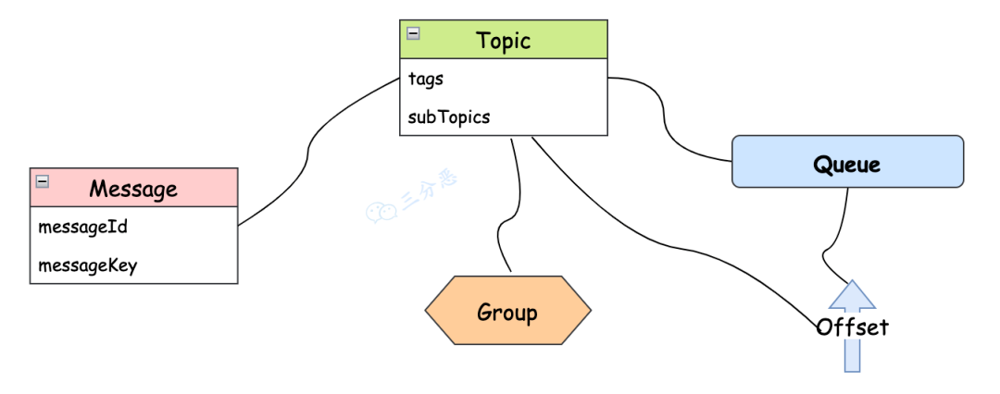

**1. Message（消息）**  
Message（消息）就是要传输的信息。

+ 一条消息必须有一个**主题（Topic）**，主题可以看做是你的信件要邮寄的地址。
+ 一条消息也可以拥有一个可选的**标签（Tag）和额外的键值对**，它们可以用于设置一个业务 Key 并在 Broker 上查找此消息以便在开发期间查找问题。

**2. Topic（主题）**  
Topic（主题）可以看做消息的归类，它是消息的第一级类型。

+ 比如一个电商系统可以分为：交易消息、物流消息等，一条消息必须有一个 Topic 。
+ Topic 与生产者和消费者的关系非常松散，一个 Topic 可以有 0 个、1 个、多个生产者向其发送消息，一个生产者也可以同时向不同的 Topic 发送消息。
+ 一个 Topic 也可以被 0 个、1 个、多个消费者订阅。

**3. Tag（标签）**  
Tag（标签）可以看作子主题，它是消息的第二级类型，用于为用户提供额外的灵活性。

+ 使用标签，同一业务模块不同目的的消息就可以用相同 Topic 而不同的 Tag 来标识。比如交易消息又可以分为：交易创建消息、交易完成消息等，一条消息可以没有 Tag 。
+ 标签有助于保持你的代码干净和连贯，并且还可以为 RocketMQ 提供的查询系统提供帮助。

**4. Group（消费组）**  
在 RocketMQ 中，订阅者的概念是通过消费组（Consumer Group）来体现的。

+ 每个消费组都消费主题中一份完整的消息，不同消费组之间消费进度彼此不受影响，也就是说，一条消息被 **Consumer Group1** 消费过，也会再给 **Consumer Group2** 消费。
+ 消费组中包含多个消费者，同一个组内的消费者是竞争消费的关系，每个消费者负责消费组内的一部分消息。
+ 默认情况，如果一条消息被消费者 **Consumer1** 消费了，那同组的其他消费者就不会再收到这条消息。

**5. Message Queue（消息队列）**  
Message Queue（消息队列），一个 Topic 下可以设置多个消息队列，Topic 包括多个 Message Queue 。

+ 如果一个 Consumer 需要获取 Topic 下所有的消息，就要遍历所有的 Message Queue。
+ RocketMQ 还有一些其它的 Queue，例如 ConsumerQueue。

**6. Offset（消费进度）**  
在 Topic 的消费过程中，由于消息需要被不同的组进行多次消费，所以消费完的消息并不会立即被删除，这就需要 RocketMQ 为每个消费组在每个队列上维护一个消费位置（Consumer Offset）。

+ 这个位置之前的消息都被消费过，之后的消息都没有被消费过。
+ 每成功消费一条消息，消费位置就加一。
+ 也可以这么说，Queue 是一个长度无限的数组，**Offset 就是下标**。

 RocketMQ 的消息模型中，这些就是比较关键的概念了。画张图总结一下：  

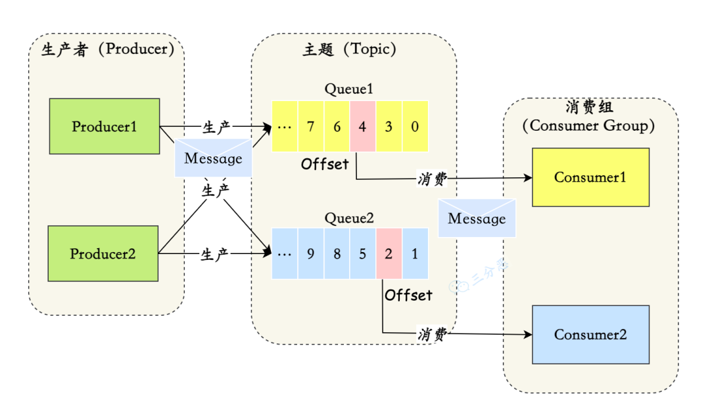

 所以总结来说，`RocketMQ` 通过**使用在一个 **`**Topic**`** 中配置多个队列并且每个队列维护每个消费者组的消费位置** 实现了 **主题模式/发布订阅模式** 。  

## 消息的消费模式了解吗？
**消息消费模式有两种：Clustering（集群消费）和 Broadcasting（广播消费）。**

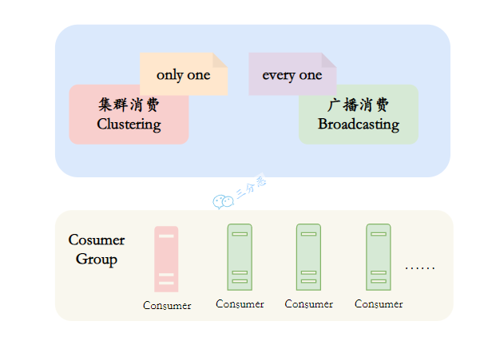

**1. Clustering（集群消费）**

+ 默认情况下就是**集群消费**。
+ 在这种模式下，一个消费者组共同消费一个主题的多个队列。
+ 一个队列只会被一个消费者消费，**如果某个消费者挂掉**，分组内其它消费者会接替挂掉的消费者继续消费。

**2. Broadcasting（广播消费）**

+ 在**广播消费**模式下，消息会发给消费者组中的**每一个消费者**进行消费。

<details class="lake-collapse"><summary id="uf2d187d8"><strong><span class="ne-text">详细解答</span></strong></summary><p id="ued4a2e4d" class="ne-p"><span class="ne-text">是的，消息的消费模式是指消费者（Consumer）如何从消息队列中消费消息的方式。常见的消息消费模式有以下几种：</span></p><h3 id="vrMMS"><strong><span class="ne-text">1. </span></strong><strong><span class="ne-text">独占消费模式（Exclusive Consumption）</span></strong></h3><ul class="ne-ul"><li id="u9c0625c7" data-lake-index-type="0"><strong><span class="ne-text">描述</span></strong><strong><span class="ne-text">：在该模式下，每个消息只能被一个消费者独占消费，消费者将从队列中取出消息后，消息立即变为已消费状态，其他消费者无法再次消费该消息。</span></strong></li><li id="u4b54ad25" data-lake-index-type="0"><strong><span class="ne-text">特点</span></strong><strong><span class="ne-text">： </span></strong></li></ul><ul class="ne-list-wrap"><ul ne-level="1" class="ne-ul"><li id="u416f9871" data-lake-index-type="0"><strong><span class="ne-text">消息被消费后不再可用，确保消息只被一个消费者处理。</span></strong></li><li id="uc07ca939" data-lake-index-type="0"><strong><span class="ne-text">适用于任务处理型的场景，确保每个任务被单独处理。</span></strong></li></ul></ul><ul class="ne-ul"><li id="ue0985229" data-lake-index-type="0"><strong><span class="ne-text">适用场景</span></strong><strong><span class="ne-text">： </span></strong></li></ul><ul class="ne-list-wrap"><ul ne-level="1" class="ne-ul"><li id="ue0c9437e" data-lake-index-type="0"><strong><span class="ne-text">异步任务处理、消息队列中的任务分发。</span></strong></li><li id="u6f30eea1" data-lake-index-type="0"><strong><span class="ne-text">负载均衡场景。</span></strong></li></ul></ul><h3 id="jRStc"><strong><span class="ne-text">2. </span></strong><strong><span class="ne-text">共享消费模式（Shared Consumption）</span></strong></h3><ul class="ne-ul"><li id="u1754fa68" data-lake-index-type="0"><strong><span class="ne-text">描述</span></strong><strong><span class="ne-text">：在该模式下，多个消费者可以共享消费同一队列中的消息。消费者通常以轮询的方式消费消息，即每个消费者轮流消费队列中的消息。</span></strong></li><li id="u1a428e63" data-lake-index-type="0"><strong><span class="ne-text">特点</span></strong><strong><span class="ne-text">： </span></strong></li></ul><ul class="ne-list-wrap"><ul ne-level="1" class="ne-ul"><li id="u68aa907f" data-lake-index-type="0"><strong><span class="ne-text">消息会在消费者之间进行均衡分配。</span></strong></li><li id="u283fad82" data-lake-index-type="0"><strong><span class="ne-text">每个消息只会被一个消费者消费，多个消费者并行消费提高处理效率。</span></strong></li><li id="uc308a73e" data-lake-index-type="0"><strong><span class="ne-text">避免单一消费者压力过大，适合高并发处理。</span></strong></li></ul></ul><ul class="ne-ul"><li id="u9d2bfe16" data-lake-index-type="0"><strong><span class="ne-text">适用场景</span></strong><strong><span class="ne-text">： </span></strong></li></ul><ul class="ne-list-wrap"><ul ne-level="1" class="ne-ul"><li id="ufcca1334" data-lake-index-type="0"><strong><span class="ne-text">高吞吐量、并行任务处理。</span></strong></li><li id="u2055806b" data-lake-index-type="0"><strong><span class="ne-text">工作队列、负载均衡任务。</span></strong></li></ul></ul><h3 id="IT5sJ"><strong><span class="ne-text">3. </span></strong><strong><span class="ne-text">广播消费模式（Broadcast Consumption）</span></strong></h3><ul class="ne-ul"><li id="u5b33a64c" data-lake-index-type="0"><strong><span class="ne-text">描述</span></strong><strong><span class="ne-text">：在广播模式下，消息会被发送到所有订阅该消息的消费者。每个消费者都会接收到相同的消息，适用于将相同的信息广播给多个消费者的场景。</span></strong></li><li id="uc4ba3bdd" data-lake-index-type="0"><strong><span class="ne-text">特点</span></strong><strong><span class="ne-text">： </span></strong></li></ul><ul class="ne-list-wrap"><ul ne-level="1" class="ne-ul"><li id="uc18f14b5" data-lake-index-type="0"><strong><span class="ne-text">每个消费者都会接收到同样的消息，支持消息的广播传递。</span></strong></li><li id="u84a6411e" data-lake-index-type="0"><strong><span class="ne-text">适用于需要所有消费者都处理消息的场景。</span></strong></li></ul></ul><ul class="ne-ul"><li id="u66719e82" data-lake-index-type="0"><strong><span class="ne-text">适用场景</span></strong><strong><span class="ne-text">： </span></strong></li></ul><ul class="ne-list-wrap"><ul ne-level="1" class="ne-ul"><li id="u6f617eee" data-lake-index-type="0"><strong><span class="ne-text">实时通知、系统广播（如更新推送、系统事件通知）。</span></strong></li><li id="u449bab80" data-lake-index-type="0"><strong><span class="ne-text">系统之间的数据同步或广播消息。</span></strong></li></ul></ul><h3 id="BqBtH"><strong><span class="ne-text">4. </span></strong><strong><span class="ne-text">顺序消费模式（Ordered Consumption）</span></strong></h3><ul class="ne-ul"><li id="ua03b2af7" data-lake-index-type="0"><strong><span class="ne-text">描述</span></strong><strong><span class="ne-text">：在该模式下，消息的消费顺序是按照生产者发送消息的顺序来处理的。消费者按照消息的生产顺序进行消费，适用于那些对顺序性有严格要求的场景。</span></strong></li><li id="u4e625921" data-lake-index-type="0"><strong><span class="ne-text">特点</span></strong><strong><span class="ne-text">： </span></strong></li></ul><ul class="ne-list-wrap"><ul ne-level="1" class="ne-ul"><li id="ud932e5e1" data-lake-index-type="0"><strong><span class="ne-text">消息必须按生产者发送的顺序来消费。</span></strong></li><li id="ub1c194e4" data-lake-index-type="0"><strong><span class="ne-text">适用于需要处理顺序严格控制的场景，如金融交易、订单处理等。</span></strong></li></ul></ul><ul class="ne-ul"><li id="u84e9bef6" data-lake-index-type="0"><strong><span class="ne-text">适用场景</span></strong><strong><span class="ne-text">： </span></strong></li></ul><ul class="ne-list-wrap"><ul ne-level="1" class="ne-ul"><li id="ubf023d66" data-lake-index-type="0"><strong><span class="ne-text">订单处理、金融交易、消息流的顺序消费。</span></strong></li></ul></ul><h3 id="Tn2yb"><strong><span class="ne-text">5. </span></strong><strong><span class="ne-text">并行消费模式（Parallel Consumption）</span></strong></h3><ul class="ne-ul"><li id="u1b277cc1" data-lake-index-type="0"><strong><span class="ne-text">描述</span></strong><strong><span class="ne-text">：并行消费模式允许多个消费者同时处理多个消息。每个消费者处理队列中的一个或多个消息，不同消费者可以并行处理不同的消息。</span></strong></li><li id="u5b946088" data-lake-index-type="0"><strong><span class="ne-text">特点</span></strong><strong><span class="ne-text">： </span></strong></li></ul><ul class="ne-list-wrap"><ul ne-level="1" class="ne-ul"><li id="ucba77149" data-lake-index-type="0"><strong><span class="ne-text">消费者并行消费多个消息，提高处理效率。</span></strong></li><li id="ubf9d3e4f" data-lake-index-type="0"><strong><span class="ne-text">对消息的顺序性要求不高，通常适用于任务分发型系统。</span></strong></li></ul></ul><ul class="ne-ul"><li id="u36ccf6a9" data-lake-index-type="0"><strong><span class="ne-text">适用场景</span></strong><strong><span class="ne-text">： </span></strong></li></ul><ul class="ne-list-wrap"><ul ne-level="1" class="ne-ul"><li id="u05def34f" data-lake-index-type="0"><strong><span class="ne-text">批量数据处理、分布式任务处理、数据清理等场景。</span></strong></li></ul></ul><h3 id="ZjgQC"><strong><span class="ne-text">6. </span></strong><strong><span class="ne-text">事务消费模式（Transactional Consumption）</span></strong></h3><ul class="ne-ul"><li id="u4cf03f82" data-lake-index-type="0"><strong><span class="ne-text">描述</span></strong><strong><span class="ne-text">：在事务消费模式下，消费者在消费消息时，需要保证消息处理与其他操作（如数据库操作）的一致性。如果消息消费成功，则提交事务；如果消费失败，则回滚事务，确保消息处理的原子性。</span></strong></li><li id="u1400e9b9" data-lake-index-type="0"><strong><span class="ne-text">特点</span></strong><strong><span class="ne-text">： </span></strong></li></ul><ul class="ne-list-wrap"><ul ne-level="1" class="ne-ul"><li id="ua850593f" data-lake-index-type="0"><strong><span class="ne-text">保证消息消费的原子性，避免消息丢失或重复消费。</span></strong></li><li id="u3bf752f9" data-lake-index-type="0"><strong><span class="ne-text">与本地事务紧密绑定，保证分布式系统中消息与业务的最终一致性。</span></strong></li></ul></ul><ul class="ne-ul"><li id="u21de0541" data-lake-index-type="0"><strong><span class="ne-text">适用场景</span></strong><strong><span class="ne-text">： </span></strong></li></ul><ul class="ne-list-wrap"><ul ne-level="1" class="ne-ul"><li id="ub02efb5e" data-lake-index-type="0"><strong><span class="ne-text">分布式事务、资金转账、订单支付等需要保证一致性的场景。</span></strong></li></ul></ul><h3 id="TiXmY"><strong><span class="ne-text">7. </span></strong><strong><span class="ne-text">按需消费模式（Lazy Consumption）</span></strong></h3><ul class="ne-ul"><li id="u3bf0017d" data-lake-index-type="0"><strong><span class="ne-text">描述</span></strong><strong><span class="ne-text">：在该模式下，消费者会根据需求动态选择是否消费消息。通常，消费者在队列中没有消息时不会主动请求，而是根据业务需求触发消息消费。</span></strong></li><li id="u0ac55b36" data-lake-index-type="0"><strong><span class="ne-text">特点</span></strong><strong><span class="ne-text">： </span></strong></li></ul><ul class="ne-list-wrap"><ul ne-level="1" class="ne-ul"><li id="ubaae88f6" data-lake-index-type="0"><strong><span class="ne-text">消费者只在需要时才消费消息，避免不必要的资源消耗。</span></strong></li><li id="u201f573c" data-lake-index-type="0"><strong><span class="ne-text">适合偶尔触发的任务或需要延迟执行的任务。</span></strong></li></ul></ul><ul class="ne-ul"><li id="u10a882c8" data-lake-index-type="0"><strong><span class="ne-text">适用场景</span></strong><strong><span class="ne-text">： </span></strong></li></ul><ul class="ne-list-wrap"><ul ne-level="1" class="ne-ul"><li id="u55e6f8ea" data-lake-index-type="0"><strong><span class="ne-text">异步任务调度、延时处理任务。</span></strong></li></ul></ul><h3 id="yu98G"><strong><span class="ne-text">总结：</span></strong></h3><p id="u4945e57f" class="ne-p"><strong><span class="ne-text">选择合适的消费模式有助于优化系统性能和满足业务需求。例如，如果需要高并发处理，可以选择共享消费；如果需要确保消息顺序消费，则选择顺序消费；而对于分布式事务等对一致性要求较高的场景，可以选择事务消费模式</span></strong></p></details>
## RocketMQ 基本架构了解吗？
**RocketMQ** 的基本架构设计清晰且高效，主要由四个核心组件组成：**NameServer**、**Broker**、**Producer** 和 **Consumer**。

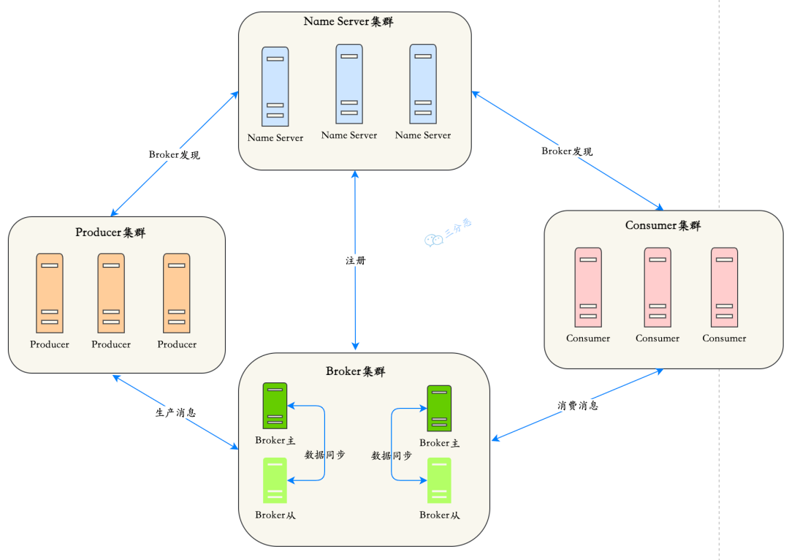

以下是 RocketMQ 的基本架构及其各组件的功能：

+ **NameServer**：提供服务发现和路由功能，管理Broker信息。
+ **Broker**：负责消息的存储和转发，支持主从架构和消息持久化。
+ **Producer**：消息生产者，负责发送消息到Broker。
+ **Consumer**：消息消费者，负责从Broker拉取消息。

---

### 1. **NameServer（命名服务）**
+ **功能**：
    - 负责管理 **Broker** 的路由信息。
    - 提供轻量级的服务发现和路由功能。
+ **特点**：
    - 无状态，易于扩展。
    - 每个 NameServer 独立运行，不与其他 NameServer 通信。
+ **作用**：
    - Producer 和 Consumer 通过 NameServer 获取 Broker 的地址信息，从而发送和消费消息。

---

### 2. **Broker（消息存储和转发）**
+ **功能**：
    - 负责消息的存储、投递和查询。
    - 接收 Producer 发送的消息并存储，同时将消息投递给 Consumer。
+ **核心模块**：
    - **CommitLog**：消息的物理存储文件，所有消息都顺序写入 CommitLog。
    - **ConsumeQueue**：消息的逻辑队列，存储消息的偏移量，方便 Consumer 快速定位消息。
    - **IndexFile**：消息的索引文件，支持按关键字查询消息。
+ **特点**：
    - 支持主从架构，实现高可用。
    - 消息持久化，确保数据不丢失。
+ **作用**：
    - 是 RocketMQ 的核心组件，负责消息的存储和转发。

---

### 3. **Producer（消息生产者）**
+ **功能**：
    - 负责生成并发送消息到 Broker。
+ **特点**：
    - 支持同步、异步和单向发送消息。
    - 支持事务消息，确保消息和本地事务的一致性。
+ **作用**：
    - 将业务数据封装成消息并发送到 RocketMQ。

---

### 4. **Consumer（消息消费者）**
+ **功能**：
    - 从 Broker 拉取消息并进行处理。
+ **消费模式**：
    - **Push 模式**：Broker 主动推送消息给 Consumer。
    - **Pull 模式**：Consumer 主动从 Broker 拉取消息。
+ **特点**：
    - 支持集群消费和广播消费。
    - 支持顺序消费和并发消费。
+ **作用**：
    - 从 RocketMQ 获取消息并执行业务逻辑。

---

### RocketMQ 的工作流程
1. **启动 NameServer**：
    - NameServer 启动后，等待 Broker、Producer 和 Consumer 注册。
2. **Broker 注册**：
    - Broker 启动后，向所有 NameServer 注册，并定时发送心跳以维持连接。
3. **Producer 发送消息**：
    - Producer 从 NameServer 获取 Broker 的路由信息，将消息发送到指定的 Broker。
4. **Broker 存储消息**：
    - Broker 接收到消息后，将其持久化到 CommitLog，并更新 ConsumeQueue 和 IndexFile。
5. **Consumer 消费消息**：
    - Consumer 从 NameServer 获取 Broker 的路由信息，从 Broker 拉取消息并进行处理。

---

### RocketMQ 的架构特点
1. **分布式架构**：
    - 支持水平扩展，能够轻松应对高并发和大规模消息存储。
2. **高可用性**：
    - Broker 支持主从架构，确保消息不丢失。
3. **高性能**：
    - 采用零拷贝技术和顺序写盘，提高消息的读写效率。
4. **丰富的功能**：
    - 支持事务消息、顺序消息、延迟消息、消息过滤等。

---

### 总结
RocketMQ 的基本架构由 **NameServer**、**Broker**、**Producer** 和 **Consumer** 组成，具有分布式、高可用、高性能的特点。其设计简洁高效，适合高并发、大规模的消息处理场景。

## 那能介绍一下这四部分吗？
**类比一下我们生活的邮政系统——**

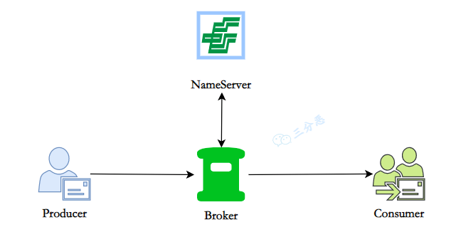

邮政系统要正常运行，离不开下面这四个角色：

1. **发信者**（Producer）
2. **收信者**（Consumer）
3. **负责暂存传输的邮局**（Broker）
4. **负责协调各个地方邮局的管理机构**（NameServer）

对应到 RocketMQ 中，这四个角色分别是：

+ **Producer**（生产者）
+ **Consumer**（消费者）
+ **Broker**（消息存储和转发角色）
+ **NameServer**（路由协调角色）

---

**RocketMQ 类比邮政体系：**

**1. NameServer**

+ **角色**：NameServer 是一个无状态的服务器，类似于 Kafka 使用的 Zookeeper，但比 Zookeeper 更轻量。
+ **特点**： 
    - 每个 NameServer 节点之间是相互独立，彼此没有任何信息交互。
    - NameServer 被设计成几乎是无状态的，通过部署多个节点来标识自己是一个伪集群。
    - Producer 在发送消息前从 NameServer 中获取 Topic 的路由信息，也就是发往哪个 Broker。
    - Consumer 也会定时从 NameServer 获取 Topic 的路由信息。
    - Broker 在启动时会向 NameServer 注册，并定时进行心跳连接，且定时同步维护的 Topic 到 NameServer。
+ **功能**： 
    1. 和 Broker 节点保持长连接。
    2. 维护 Topic 的路由信息。

---

**2. Broker**

+ **角色**：消息存储和中转角色，负责存储和转发消息。
+ **功能**： 
    - Broker 内部维护着一个个 **Consumer Queue**，用来存储消息的索引，真正存储消息的地方是 **CommitLog**（日志文件）。
    - 单个 Broker 与所有的 NameServer 保持着长连接和心跳，并会定时将 Topic 信息同步到 NameServer，和 NameServer 的通信底层是通过 **Netty** 实现的。
    - 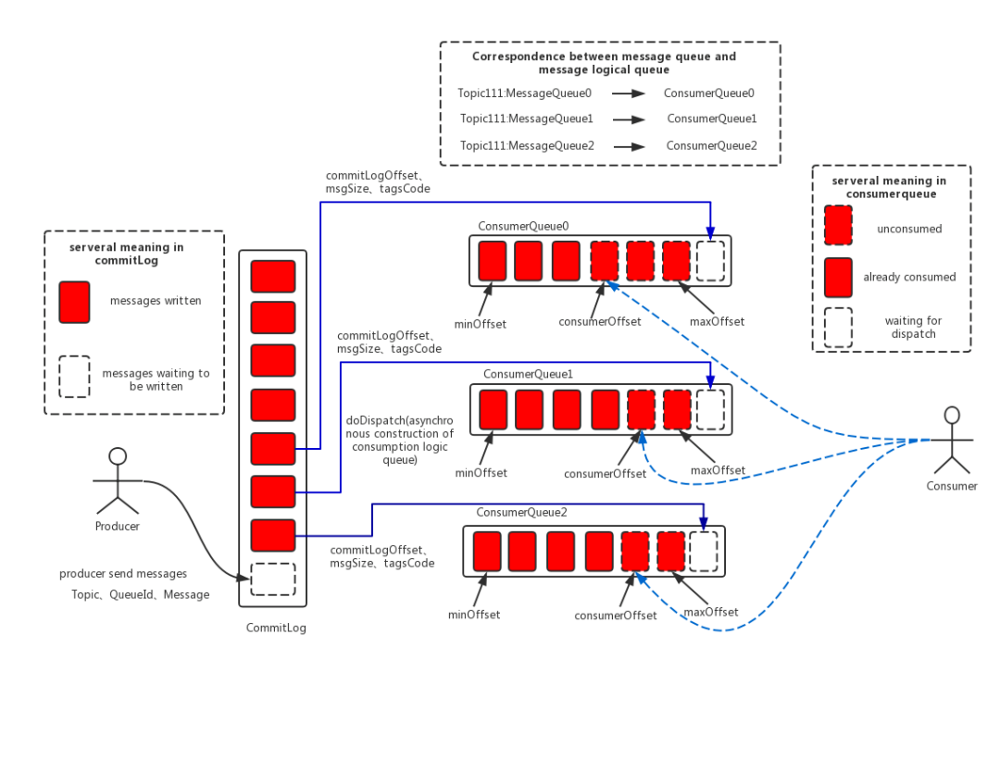

---

**3. Producer**

+ **角色**：消息生产者，业务端负责发送消息，由用户自行实现和分布式部署。
+ **功能**： 
    - Producer 由用户进行分布式部署，消息通过多种负载均衡模式发送到 Broker 集群，支持低延时，快速失败。
    - RocketMQ 提供了三种方式发送消息： 
        1. **同步发送**：发送方发出数据后，会在收到接收方发回响应之后才发下一个数据包。一般用于重要通知消息，例如重要通知邮件、营销短信。
        2. **异步发送**：发送方发出数据后，不等待接收方发回响应，接着发送下一个数据包。适用于对响应时间敏感的业务场景，例如用户视频上传后通知启动转码服务。
        3. **单向发送**：只负责发送消息，不等待服务器回应且没有回调函数触发，适用于某些耗时非常短但对可靠性要求不高的场景，例如日志收集。

---

**4. Consumer**

+ **角色**：消息消费者，负责消费消息，一般是后台系统负责异步消费。
+ **功能**： 
    - Consumer 也由用户部署，支持 **PUSH** 和 **PULL** 两种消费模式，支持集群消费和广播消费，提供实时的消息订阅机制。
    - **Pull**：拉取型消费者（Pull Consumer）主动从消息服务器拉取信息，只要批量拉取到消息，用户应用就会启动消费过程，因此 Pull 称为主动消费型。
    - **Push**：推送型消费者（Push Consumer）封装了消息的拉取、消费进度和其他的内部维护工作，将消息到达时执行的回调接口留给用户应用程序来实现。因此 Push 称为被动消费类型，但实际上它还是从消息服务器中拉取消息，不同于 Pull 的是 Push 需要先注册消费监听器，当监听器触发时才开始消费消息。

# 进阶
## 如何保证消息的可用性/可靠性/不丢失呢？
**精简版**

<details class="lake-collapse"><summary id="ue2ca5f85"></summary><h3 id="tPWhD"><strong><span class="ne-text">消息可能在哪些阶段丢失？</span></strong></h3><ul class="ne-ul"><li id="u02b2e561" data-lake-index-type="0"><strong><span class="ne-text">生产端</span></strong><span class="ne-text">: 网络中断或队列未确认导致消息未送达。</span></li><li id="uf23841a2" data-lake-index-type="0"><strong><span class="ne-text">队列端</span></strong><span class="ne-text">: 队列宕机或未持久化导致消息丢失。</span></li><li id="u33533eef" data-lake-index-type="0"><strong><span class="ne-text">消费端</span></strong><span class="ne-text">: 消费者未处理完成或未确认，消息被误删。</span></li></ul><p id="u2718aa4f" class="ne-p"><span class="ne-text">以下从这三个环节说明如何保证消息的</span><strong><span class="ne-text">可用性</span></strong><span class="ne-text">、</span><strong><span class="ne-text">可靠性</span></strong><span class="ne-text">和</span><strong><span class="ne-text">不丢失</span></strong><span class="ne-text">：</span></p><hr id="qym0r" class="ne-hr"><h3 id="dqRA6"><strong><span class="ne-text">1. 生产端：确保消息可靠送达</span></strong></h3><ul class="ne-ul"><li id="u428324ac" data-lake-index-type="0"><strong><span class="ne-text">措施</span></strong><span class="ne-text">:</span></li></ul><ul class="ne-list-wrap"><ul ne-level="1" class="ne-ul"><li id="u3e2d8a1d" data-lake-index-type="0"><strong><span class="ne-text">消息确认（ACK）</span></strong><span class="ne-text">: 生产端发送消息后等待确认，未收到则重试（如 RocketMQ 同步发送）。</span></li><li id="uf5df6da8" data-lake-index-type="0"><strong><span class="ne-text">重试机制</span></strong><span class="ne-text">: 配置重试次数，应对临时故障（如 RocketMQ 默认支持）。</span></li></ul></ul><ul class="ne-ul"><li id="u753de526" data-lake-index-type="0"><strong><span class="ne-text">效果</span></strong><span class="ne-text">: 确保消息到达队列端，保障</span><strong><span class="ne-text">可靠性</span></strong><span class="ne-text">和</span><strong><span class="ne-text">不丢失</span></strong><span class="ne-text">。</span></li></ul><hr id="AHHov" class="ne-hr"><h3 id="UZ2rF"><strong><span class="ne-text">2. 队列端：确保消息持久和高可用</span></strong></h3><ul class="ne-ul"><li id="ue98b38bb" data-lake-index-type="0"><strong><span class="ne-text">措施</span></strong><span class="ne-text">:</span></li></ul><ul class="ne-list-wrap"><ul ne-level="1" class="ne-ul"><li id="u8fe3e1f5" data-lake-index-type="0"><strong><span class="ne-text">持久化</span></strong><span class="ne-text">: 将消息写入磁盘而非仅存在内存。</span></li></ul></ul><ul class="ne-list-wrap"><ul class="ne-list-wrap"><ul ne-level="2" class="ne-ul"><li id="ue1d4b21c" data-lake-index-type="0"><span class="ne-text">同步刷盘：消息写入后立即刷入磁盘,数据可靠性高，但性能较低.</span></li><li id="uafc3ef62" data-lake-index-type="0"><span class="ne-text">异步刷盘：消息写入内存后立刻返回,由后台线程批量刷入磁盘。性能较高</span></li></ul></ul></ul><ul class="ne-list-wrap"><ul ne-level="1" class="ne-ul"><li id="ua3f1b8da" data-lake-index-type="0"><strong><span class="ne-text">多副本</span></strong><span class="ne-text">: 消息复制到多个节点，单点故障不影响。</span></li><li id="u32aae128" data-lake-index-type="0"><strong><span class="ne-text">高可用</span></strong><span class="ne-text">: 多节点集群部署，避免单点故障。</span></li></ul></ul><ul class="ne-ul"><li id="u6bcacd6b" data-lake-index-type="0"><strong><span class="ne-text">效果</span></strong><span class="ne-text">: 确保存储可靠，宕机可恢复，提升</span><strong><span class="ne-text">可用性</span></strong><span class="ne-text">和</span><strong><span class="ne-text">不丢失</span></strong><span class="ne-text">。</span></li></ul><hr id="VBXSQ" class="ne-hr"><h3 id="Lrahl"><strong><span class="ne-text">3. 消费端：确保消息被正确处理</span></strong></h3><ul class="ne-ul"><li id="u50eb384a" data-lake-index-type="0"><strong><span class="ne-text">措施</span></strong><span class="ne-text">:</span></li></ul><ul class="ne-list-wrap"><ul ne-level="1" class="ne-ul"><li id="u4b976225" data-lake-index-type="0"><strong><span class="ne-text">手动确认（ACK）</span></strong><span class="ne-text">: 消费端处理完后再确认，未确认则重投（如 RocketMQ 重试 16 次）。</span></li><li id="u8182d076" data-lake-index-type="0"><strong><span class="ne-text">死信队列</span></strong><span class="ne-text">: 多次失败转入死信队列，后续处理（如 RocketMQ 支持）。</span></li></ul></ul><ul class="ne-ul"><li id="u43c06de5" data-lake-index-type="0"><strong><span class="ne-text">效果</span></strong><span class="ne-text">: 保证消费完成，增强</span><strong><span class="ne-text">可靠性</span></strong><span class="ne-text">，避免遗漏。</span></li></ul><hr id="GvLBw" class="ne-hr"><h3 id="bB7bY"><strong><span class="ne-text">总结</span></strong></h3><ul class="ne-ul"><li id="u2f647dee" data-lake-index-type="0"><strong><span class="ne-text">生产端</span></strong><span class="ne-text">: 确认+重试，确保送达。</span></li><li id="u2353ab28" data-lake-index-type="0"><strong><span class="ne-text">队列端</span></strong><span class="ne-text">: 持久化+副本+集群，确保不丢。</span></li><li id="u014e8e46" data-lake-index-type="0"><strong><span class="ne-text">消费端</span></strong><span class="ne-text">: 手动 ACK+死信+幂等，确保可靠消费。</span></li></ul><p id="u3feb0217" class="ne-p"><span class="ne-text">这三端措施结合，全面保障消息的</span><strong><span class="ne-text">可用性</span></strong><span class="ne-text">、</span><strong><span class="ne-text">可靠性</span></strong><span class="ne-text">和</span><strong><span class="ne-text">不丢失</span></strong><span class="ne-text">。</span></p></details>
消息可能在哪些阶段丢失呢？可能会在这三个阶段发生丢失：**生产阶段**、**存储阶段** 和 **消费阶段** 。

所以要从这三个阶段考虑：

从 **生产阶段**、**存储阶段** 和 **消费阶段** 分别说明如何保证消息的 **可用性**、**可靠性** 和 **不丢失**：

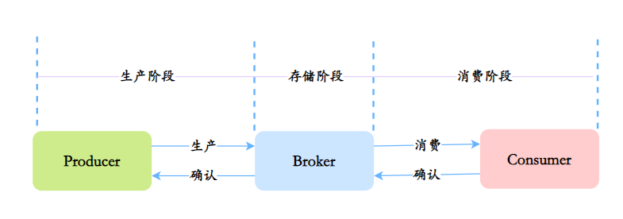

---

### 1. 生产阶段
 在生产阶段，主要**通过请求确认机制，来保证消息的可靠传递**。  

### **消息确认机制（ACK）**
+ **机制**：
    - 生产者发送消息后，等待 Broker 返回确认信息（ACK）。如果未收到确认信息，生产者可以重试发送。确保消息成功到达 Broker，避免消息丢失。
+ **RocketMQ 实现**：
    - RocketMQ 支持同步、异步和单向发送消息，生产者可以根据需求选择。

### **重试机制**
+ **机制**：
    - 如果消息发送失败，生产者可以配置重试次数。避免因网络抖动或 Broker 临时故障导致消息丢失。
+ **RocketMQ 实现**：
    - RocketMQ 默认支持重试机制，生产者可以自定义重试策略。

---

### 2. 存储阶段
在存储阶段，消息被 Broker 接收并持久化。以下是保证消息不丢失的关键措施：

### **消息持久化**
+ **机制**：
    -  消息只要持久化到 CommitLog（日志文件）中，即使 Broker 宕机，未消费的消息也能重新恢复再消费。  
+ **RocketMQ 实现**：
    - RocketMQ 使用 **CommitLog** 文件顺序写入消息，确保高性能的同时实现持久化。
+  **Broker 的刷盘机制：**
    - 将消息从内存持久化到磁盘，确保消息不丢失。
    - **两种模式**：
        1. **同步刷盘（Sync Flush）**：
            + 消息写入内存后，立即同步写入磁盘，确保高可靠性，但性能较低。
        2. **异步刷盘（Async Flush）**：
            + 消息写入内存后立即返回成功，磁盘写入由后台线程异步完成，性能高，但存在少量数据丢失风险。
    - **RocketMQ 实现**：
        * 支持同步和异步刷盘，默认使用异步刷盘，用户可根据需求配置。

### **主从架构与高可用部署**
#### **机制**
1. **多副本机制（主从架构）**：
    - Broker 采用主从架构，消息在主节点写入后，会 **同步或异步复制** 到从节点。
    - RocketMQ 支持 **同步复制**（强一致性）和 **异步复制**（高性能），用户可根据业务需求选择。
2. **高可用部署**：
    - Broker 和 NameServer 都采用 **集群部署**，避免单点故障。
    - 多 NameServer 和多 Broker 协同工作，确保系统整体高可用。

**作用**

        1. **多副本机制**：
            + 当主节点故障时，从节点可以 **接管服务**，确保消息不丢失且服务持续可用。
        2. **高可用部署**：
            + 即使某个节点故障，其他节点可以 **继续提供服务**，确保系统整体高可用性。

**RocketMQ 实现**

        * 支持 **主从架构**，提供同步和异步复制选项。
        * 支持 **多 NameServer** 和 **多 Broker 集群部署**，确保系统的高可用性和扩展性。

---

### 3. 消费阶段
在消费阶段，消费者从 Broker 拉取消息并进行处理。以下是保证消息不丢失的关键措施：

### **消息确认机制（ACK）**
+ **机制**：消费者在成功处理消息后，会向 Broker 发送确认（ACK）。如果消费者未发送 ACK，Broker 会认为消息未成功处理，可能会重新投递。确保消息被成功消费，避免消息丢失。
+ **RocketMQ 实现**：
    - RocketMQ 支持消息重试机制，如果消费失败，消息会被重新投递。RocketMQ 默认支持 **16 次重试**，重试间隔逐渐增加。

### **死信队列（DLQ）**
+ **机制**：
    - 如果消息达到最大重试次数仍未成功消费，会被转移到死信队列。避免消息无限重试，同时保留异常消息以便后续处理。
+ **RocketMQ 实现**：
    - RocketMQ 支持死信队列，用户可以从死信队列中手动处理消息。

### **幂等性设计**
+ **机制**：
    - 消费者在处理消息时，确保多次处理同一条消息不会产生副作用。避免消息重复消费导致的数据不一致问题。
+ **实现建议**：
    - 在消费者端通过唯一标识（如消息 ID）实现幂等性。

---

### 总结
+ **生产阶段**：通过消息确认、事务消息和重试机制，确保消息成功发送到 Broker。
+ **存储阶段**：通过消息持久化、多副本机制和高可用部署，确保消息在 Broker 中不丢失。
+ **消费阶段**：通过消息确认、重试机制、死信队列和幂等性设计，确保消息被成功消费。

通过这三个阶段的综合措施，可以最大限度地保证消息的 **可用性**、**可靠性** 和 **不丢失**。

## 如何处理消息重复的问题呢？（<font style="color:#DF2A3F;">消息去重 或者 幂等</font>）
<details class="lake-collapse"><summary id="ue41a7182"><span class="ne-text">处理RocketMQ消息重复消费的问题可以通过以下几种方法：</span></summary><ol class="ne-ol"><li id="u63ac4f0b" data-lake-index-type="0"><strong><span class="ne-text">唯一标识符</span></strong><span class="ne-text">：使用唯一标识符确保消息在队列中只存储一次，减少重复投递的可能性。</span></li><li id="u2182d928" data-lake-index-type="0"><strong><span class="ne-text">幂等性处理</span></strong><span class="ne-text">： 消费者实现幂等性，避免重复处理相同消息。可以通过消息唯一标识符或数据库唯一约束来去重。</span></li><li id="ua5211d3f" data-lake-index-type="0"><strong><span class="ne-text">消费确认机制</span></strong><span class="ne-text">： 消费者在处理完消息后，及时确认消息，避免未确认的消息被重复投递。  </span></li></ol><p id="u02eaf8ce" class="ne-p"><span class="ne-text">这些方法可以有效减少和处理消息的重复消费问题。</span></p><p id="u469ed518" class="ne-p"><br></p></details>
**RocketMQ 的消息投递与幂等性处理**

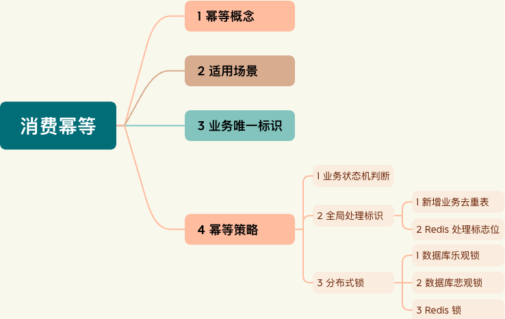

---

**1. RocketMQ 的消息特性**

+ **消息一定投递，且不丢失，但无法保证不重复消费。**
+ **需要在业务端做好消息的幂等性处理，或者进行消息去重。**

---

**2. 幂等性处理**

**幂等性定义**  
幂等性指一个操作可以执行多次，但不会产生副作用，即无论执行多少次，结果都是相同的。

**示例：支付场景**  
在支付场景中，消费者消费扣款消息，对订单执行扣款操作（金额为 100 元）。  
即使因网络原因导致消息重复投递，最终业务结果也需保证只扣款一次。

---

**3. 消息去重**

+ **原理**：在消费者消费消息前，先检查是否已消费过该消息。若已消费，则跳过处理。
+ **实现方式**： 
    - 通过一个专门的去重表记录已消费的消息 ID。
    - 每次消费前查询表是否存在该消息 ID，若存在则跳过消费。

```properties
public void processMessage(String messageId, String message) {
    if (!isMessageProcessed(messageId)) {
        // 处理消息
        markMessageAsProcessed(messageId);
    }
}

private boolean isMessageProcessed(String messageId) {
    // 查询去重表，检查消息ID是否存在
}

private void markMessageAsProcessed(String messageId) {
    // 将消息ID插入去重表
}
```

---

**4. 幂等性实现方法**

**4.1 消息携带业务唯一标识**

通过**雪花算法**生成全局唯一 ID：

```properties
Message msg = new Message(
    TOPIC, /* Topic */
    TAG, /* Tag */
    ("Hello RocketMQ " + i).getBytes(RemotingHelper.DEFAULT_CHARSET) /* Message body */
);
msg.setKey("ORDERID_100"); // 订单编号
SendResult sendResult = producer.send(msg);
```

---

**4.2 Redis 标志位校验**

1. **判断 Redis 中是否存在该业务主键的标志位。**
2. **若无标志位，执行业务逻辑，并在缓存中添加标志位。**

```properties
public ConsumeConcurrentlyStatus consumeMessage(List<MessageExt> msgs, ConsumeConcurrentlyContext context) {
    try {
        for (MessageExt messageExt : msgs) {
            String bizKey = messageExt.getKeys(); // 唯一业务主键

            // 1. 判断是否存在标志
            if (redisTemplate.hasKey(RedisKeyConstants.WAITING_SEND_LOCK + bizKey)) {
                continue;
            }

            // 2. 执行业务逻辑
            // TODO: do business

            // 3. 设置标志位
            redisTemplate.opsForValue().set(
                RedisKeyConstants.WAITING_SEND_LOCK + bizKey, 
                "1", 
                72, 
                TimeUnit.HOURS
            );
        }
        return ConsumeConcurrentlyStatus.CONSUME_SUCCESS;
    } catch (Exception e) {
        logger.error("consumeMessage error: ", e);
        return ConsumeConcurrentlyStatus.RECONSUME_LATER;
    }
}
```

---

**4.3 数据库唯一索引**

利用数据库唯一索引防止业务重复插入：

```properties
CREATE TABLE `t_order` (
  `id` bigint(20) NOT NULL AUTO_INCREMENT,
  `order_id` varchar(64) NOT NULL COMMENT '订单编号',
  `order_name` varchar(64) NOT NULL COMMENT '订单名称',
  PRIMARY KEY (`id`),
  UNIQUE KEY `order_id` (`order_id`)
) ENGINE=InnoDB DEFAULT CHARSET=utf8mb4 COMMENT='订单表';
```

---

**4.4 乐观锁机制**

通过版本号校验更新操作是否重复：

```properties
public void updateRecordWithOptimisticLock(int id, String newValue, int expectedVersion) {
    int updatedRows = jdbcTemplate.update(
        "UPDATE records SET value = ?, version = version + 1 WHERE id = ? AND version = ?",
        newValue, id, expectedVersion
    );
    if (updatedRows == 0) {
        throw new OptimisticLockingFailureException("Record has been modified by another transaction");
    }
}
```

---

**4.5 悲观锁机制**

通过数据库锁机制保证幂等性：

```properties
public void updateRecordWithPessimisticLock(int id) {
    jdbcTemplate.queryForObject("SELECT * FROM records WHERE id = ? FOR UPDATE", id);
    jdbcTemplate.update("UPDATE records SET value = ? WHERE id = ?", "newValue", id);
}
```

### 雪花算法了解吗
**雪花算法（Snowflake Algorithm）详解**

---

**1. 概述**

雪花算法是由 Twitter 开发的一种分布式唯一 ID 生成算法，主要用于解决高并发场景下的分布式唯一 ID 生成问题。生成的 ID 是一个 64 位的长整型数（long 型），按时间有序且全局唯一。

---

**2. 雪花算法 ID 的组成**

**总长度：64 位（1 个 long 型）**

| **部分** | **长度（bit）** | **描述** |
| --- | --- | --- |
| 最高位 | 1 | 固定为 `0`<br/>，表示生成的是正数。 |
| 时间戳 | 41 | 毫秒级时间戳，相对起始时间（epoch）。 |
| 机器 ID | 10 | 包含数据中心 ID 和机器 ID，支持 1024 个节点。 |
| 序列号 | 12 | 当前毫秒内的自增序列，最大支持 4096 个 ID。 |


**具体作用**

1. **最高位**
    - 固定为 0，不参与实际业务逻辑，只确保 ID 为正数。
2. **时间戳（41 位）**
    - 表示从自定义纪元（epoch）开始的毫秒时间戳。
    - 支持约 69 年的时间跨度：`2^41 / (1000 * 60 * 60 * 24 * 365) ≈ 69 年`。
3. **机器 ID（10 位）**
    - 包含 **5 位数据中心 ID** 和 **5 位机器 ID**。
    - 支持最多 32 个数据中心，每个数据中心下支持 32 台机器：`2^10 = 1024`。
4. **序列号（12 位）**
    - 在同一毫秒内的自增序列，用于支持高并发。
    - 每毫秒内最多生成 4096 个 ID：`2^12 = 4096`。

---

**3. 雪花算法的实现**

**优点**

+ 高效：基于时间戳和机器 ID 的计算，生成速度快。
+ 高可用：分布式生成，避免单点故障。
+ 有序性：ID 按时间生成，具有一定顺序。

**实现方式** 目前雪花算法的实现已非常成熟，可以直接使用现有工具库。例如，使用 **Hutool 工具库** 来快速生成雪花 ID。

---

**4. 使用 Hutool 工具库生成雪花 ID**

**代码示例**

```properties
import cn.hutool.core.util.IdUtil;

public class SnowflakeIdGenerator {
    public static void main(String[] args) {
        // 初始化雪花算法
        long snowflakeId = IdUtil.getSnowflakeNextId(); // 生成雪花 ID
        System.out.println("Generated Snowflake ID: " + snowflakeId);
    }
}
```

**输出示例**

```properties
Generated Snowflake ID: 153234598740312064
```

---

**5. 总结**

+ **雪花算法的特点**：高效、全局唯一、有序性。
+ **推荐工具**：直接使用 Hutool 中的 `IdUtil.getSnowflake()`，简化开发流程。
+ **适用场景**：分布式系统中需要唯一 ID 的场景，如订单号、用户 ID、日志跟踪 ID 等。

## 怎么处理消息积压？
+ **增加消费者数量**，提高处理速度。
+ 增加 Topic 的队列数量
+ 可以考虑创建一个临时 Topic，将积压的消息迁移到临时 Topic 中

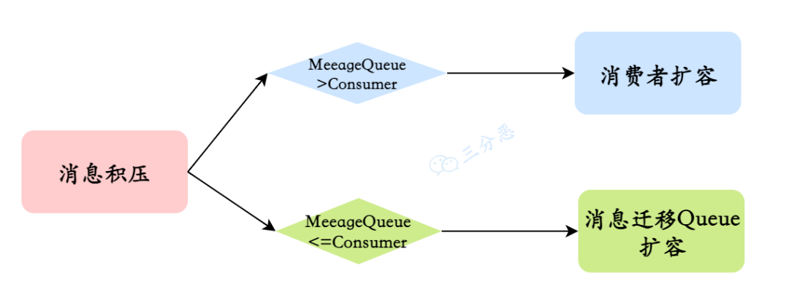

消息积压处理方案

当发生 **消息积压** 时，需要尽快将积压的消息消费完，提高消费能力。一般可以通过以下两种方法实现：

**1. 消费者扩容**

+ **前提条件**：当前 Topic 的 Message Queue 数量 **大于** 消费者数量。
+ **解决办法**： 
    - 对消费者进行扩容，增加消费者数量。
    - 提高消费能力，尽快将积压的消息消费完。

---

**2. 消息迁移 / Queue 扩容**

+ **前提条件**：当前 Topic 的 Message Queue 数量 **小于或等于** 消费者数量。
+ **解决办法**： 
    1. **扩容 Message Queue**： 
        * 新建一个 **临时的 Topic**，并设置更多的 Message Queue。
    2. **消息迁移**： 
        * 用一部分消费者将积压的消息快速转发到临时的 Topic，不进行业务处理（转发速度较快）。
    3. **消费临时 Topic**： 
        * 使用扩容后的消费者消费临时 Topic 中的数据。
    4. **恢复原状**： 
        * 消费完积压消息后，恢复到正常状态。

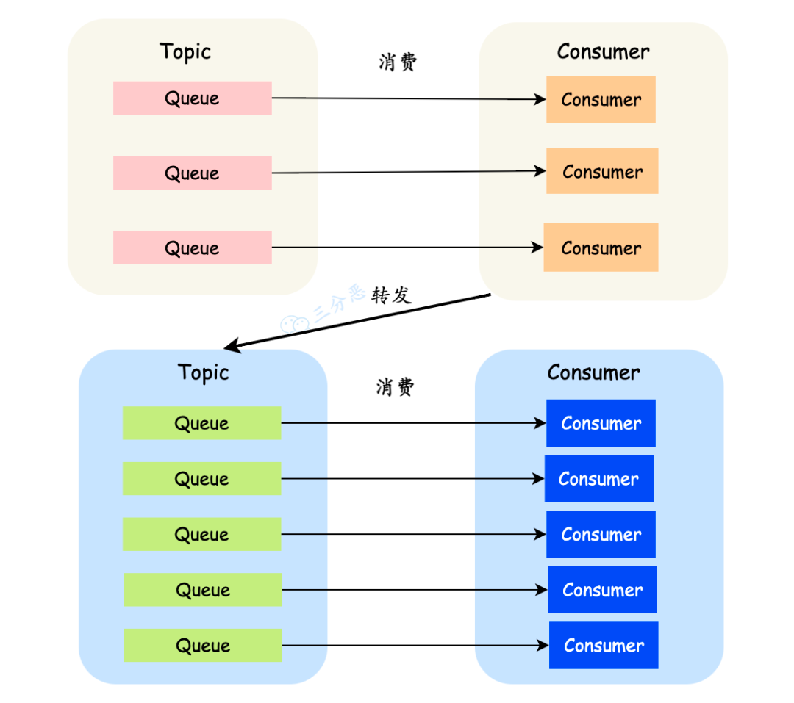

---

通过以上两种方法，可以有效提高消费能力，快速解决消息积压问题。

## RocketMQ 的消息拉取和推送机制?
**推送**：**Broker** 主动推送消息到 **Consumer**（长轮询实现）。

**拉取**：**Consumer** 主动从 **Broker** 拉取消息。

**RocketMQ** 默认用 **长轮询**，**Consumer** 发起请求，若无消息，**Broker** 挂起一段时间，减少空轮询。

##  RocketMQ 和 Kafka 的架构区别  
<details class="lake-collapse"><summary id="u6baa740e"></summary><p id="u98a34570" class="ne-p" style="text-align: center"></p></details>
## 顺序消息如何实现？
    - 分区顺序：过合理的标识符（如订单ID、用户ID等）来设计分区，确保相关的消息都被发送到同一个队列。  
    - 全局顺序：将所有消息发送到一个**单独的队列**中。消息**按生产顺序写入**，并**按顺序读取消费**。

**RocketMQ 实现顺序消息的关键点**

实现顺序消息的关键在于**保证消息生产和消费过程中严格的顺序控制**，即确保**同一业务的消息按顺序发送到同一个队列中，并由同一个消费者线程按顺序消费**。

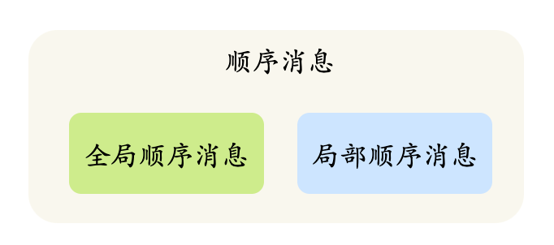

---

**1. 局部顺序消息的实现**

局部顺序消息保证在某个逻辑分区或业务逻辑下的消息顺序，例如：

+ **同一个订单**或**同一个用户**的消息按顺序消费，
+ 而**不同订单**或**不同用户**之间的顺序不做保证。

**实现方式：**

+ **消息分区策略**： 
    - 根据业务的唯一标识（如订单号、用户ID）进行分区。
    - 将消息按照分区键映射到特定的队列中。
+ **消费过程**： 
    - 消费者从同一个队列中按顺序读取消息。

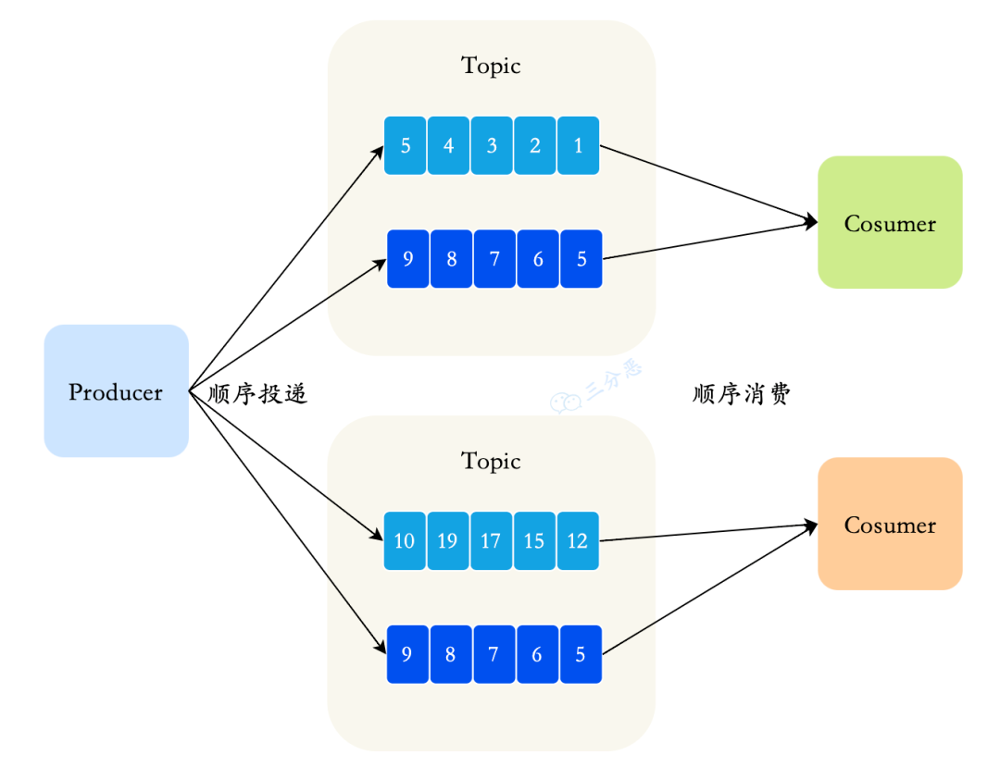

---

**2. 全局顺序消息的实现**

全局顺序消息保证**消息在整个系统范围内的严格顺序**，即**消息按照生产的顺序被消费**。

**实现方式：**

1. **单队列模式**： 
    - 将所有消息发送到一个**单独的队列**中。
    - 确保消息在单队列中**按生产顺序写入**，并**按顺序读取消费**。
2. **注意事项**： 
    - 由于全局顺序消息需要集中处理，会限制系统的并发能力。
    - 应谨慎使用该模式，仅适用于需要严格顺序的场景。


---

通过以上方式，RocketMQ 可以实现灵活的局部或全局顺序消息处理，满足不同场景的需求。

## 如何实现消息过滤？
### **RocketMQ 消息过滤总结**


---

**1. 两种过滤方式**

1. **Broker 端过滤**
    - **标签过滤 (Tag)**：生产者为消息设置 `Tag`，消费者按 `Tag` 订阅。 

```properties
producer.send(new Message("TopicTest", "TagA", "Hello".getBytes()));
consumer.subscribe("TopicTest", "TagA");
```

    - **SQL 过滤**：按消息属性设置复杂条件（如 `age > 25`）。 

```properties
consumer.subscribe("TopicTest", MessageSelector.bySql("age > 25"));
```

    - **优点**：减少无关消息传输，效率高。
    - **限制**：标签简单，SQL 需要 Broker 支持且有性能开销。
2. **客户端过滤**
    - 消费者拉取所有消息后，按自定义逻辑过滤。 

```properties
if (new String(msg.getBody()).contains("keyword")) {
    System.out.println("Filtered Message");
}
```

    - **优点**：灵活，完全自主。
    - **限制**：所有消息需传输到客户端，增加网络负载。

---

**2. 使用建议**

+ 简单过滤：优先用 **标签过滤**。
+ 复杂条件：启用 **SQL 过滤**。
+ 特殊需求：用 **客户端过滤**，但注意性能。

这两种方法根据实际场景权衡选择，既可高效处理消息，又能满足灵活性需求。

## 延时消息了解吗？
**电商的订单超时自动取消**  
电商的订单超时自动取消是一个典型的利用延时消息的例子。当用户提交订单后，可以发送一个延时消息，**1小时后检查订单状态**，如果仍未付款，则取消订单并释放库存。

---

**RocketMQ 支持延时消息**

在生产消息时，可以设置消息的延时级别，具体示例如下：

```properties
// 实例化一个生产者来产生延时消息
DefaultMQProducer producer = new DefaultMQProducer("ExampleProducerGroup");
// 启动生产者
producer.start();
int totalMessagesToSend = 100;
for (int i = 0; i < totalMessagesToSend; i++) {
    Message message = new Message("TestTopic", ("Hello scheduled message " + i).getBytes());
    // 设置延时等级3,这个消息将在10秒之后发送 (现在只支持固定的几个时间,详见 delayTimeLevel)
    message.setDelayTimeLevel(3);
    // 发送消息
    producer.send(message);
}
```

---

**目前 RocketMQ 支持的延时级别**

RocketMQ 支持的延时级别是**有限的**，如下所示：

```properties
private String messageDelayLevel = "1s 5s 10s 30s 1m 2m 3m 4m 5m 6m 7m 8m 9m 10m 20m 30m 1h 2h";
```

---

**RocketMQ 如何实现延时消息？  
****RocketMQ 通过 延时级别（Delay Level） 实现延时消息，生产者使用 **`**setDelayTimeLevel(level)**`** 设定延迟，消息会暂存于 **`**SCHEDULE_TOPIC_XXXX**`**，到期后投递到目标 Topic 供消费者正常消费。  
**

RocketMQ 的延时消息实现可以概括为**八个字：临时存储 + 定时任务**。

1. **Broker 接收延时消息后**，**消息会暂存于延时 topic**`SCHEDULE_TOPIC_XXXX` 对应的**时间段队列 (Message Queue)** 中。**到期后投递到目标 Topic 供消费者正常消费。**

这种方式有效利用了定时机制来处理延时消息。

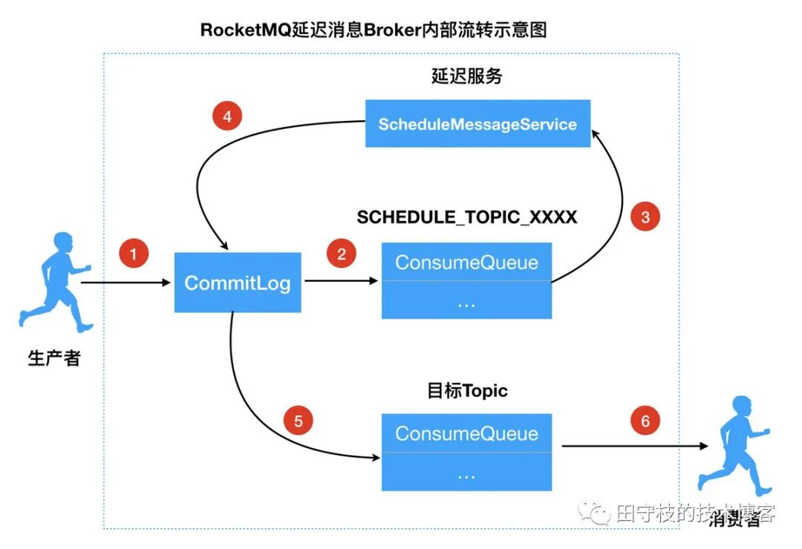

## 怎么实现分布式消息事务的？半消息？
**分布式消息事务**是一种保证消息在分布式系统中**最终一致性**的机制。典型实现包括**半消息**的概念，以下是详细步骤和原理。

---

**分布式消息事务的核心流程**

1. **生产半消息（Prepare Message）**
    - 生产者先发送一条**半消息**到消息队列中。
    - 半消息是指状态为“暂不可消费”的消息。
    - 消息队列会确认此半消息被成功存储。
2. **执行本地事务**
    - 生产者在发送半消息后，执行其对应的**本地事务逻辑**（例如扣减库存、更新数据库等）。
    - 本地事务成功或失败决定了消息的下一步动作。
3. **事务消息的确认或回滚**
    - **确认（Commit）**：如果本地事务执行成功，生产者向消息队列发送确认指令，将半消息标记为“可消费”状态。
    - **回滚（Rollback）**：如果本地事务失败，生产者向消息队列发送回滚指令，删除半消息。
4. **消息回查机制**
    - 如果生产者在执行事务消息确认或回滚时出现异常（如网络断开），消息队列会启动回查机制： 
        * 消息队列定期询问生产者的事务状态（如事务提交成功或失败）。
        * 根据回查结果决定消息是“确认”还是“回滚”。

---

**分布式消息事务实现示例**

以 RocketMQ 为例，以下是实现事务消息的代码：

**生产者**

```properties
// 创建事务消息生产者
TransactionMQProducer producer = new TransactionMQProducer("TransactionProducerGroup");
producer.setTransactionListener(new TransactionListener() {
    @Override
    public LocalTransactionState executeLocalTransaction(Message msg, Object arg) {
        // 执行本地事务逻辑
        try {
            // 示例：扣减库存、更新数据库等
            boolean success = executeLocalTransactionLogic();
            return success ? LocalTransactionState.COMMIT_MESSAGE : LocalTransactionState.ROLLBACK_MESSAGE;
        } catch (Exception e) {
            return LocalTransactionState.ROLLBACK_MESSAGE;
        }
    }

    @Override
    public LocalTransactionState checkLocalTransaction(MessageExt msg) {
        // 消息回查逻辑
        // 检查本地事务状态（例如通过数据库查询事务状态表）
        boolean isTransactionCommitted = checkTransactionStatus();
        return isTransactionCommitted ? LocalTransactionState.COMMIT_MESSAGE : LocalTransactionState.ROLLBACK_MESSAGE;
    }
});
producer.start();

// 发送事务消息
Message msg = new Message("TestTopic", "Hello Transaction".getBytes());
producer.sendMessageInTransaction(msg, null);
```

**消费者**

消费者正常消费确认后的事务消息，不需要特殊处理。

---

**半消息的意义**

+ **状态隔离**：半消息状态“暂不可消费”，防止消费者消费未确认的消息。
+ **延迟处理**：通过事务回查机制补偿生产者异常场景。

---

**分布式事务消息的优点**

1. **最终一致性**：保证分布式系统中数据一致。
2. **高性能**：相比分布式事务（如 2PC），性能更高。
3. **可靠性**：通过回查机制处理异常情况。

---

**RocketMQ 的事务消息特性**

+ **异步确认或回滚**：减少事务处理时间。
+ **支持自定义回查逻辑**：提升灵活性。
+ **回查周期可配置**：避免频繁检查。

通过半消息机制，分布式消息事务在保证一致性的同时，降低了对系统性能的影响。

**半消息**：  
是指暂时还不能被 **Consumer** 消费的消息，**Producer** 成功发送到 **Broker** 端的消息，但此消息被标记为 “暂不可投递” 状态。只有当 **Producer** 端执行完本地事务后，经过二次确认后，**Consumer** 才能消费此条消息。

依赖半消息，可以实现分布式消息事务，其中的关键在于 **二次确认** 以及 **消息回查**：

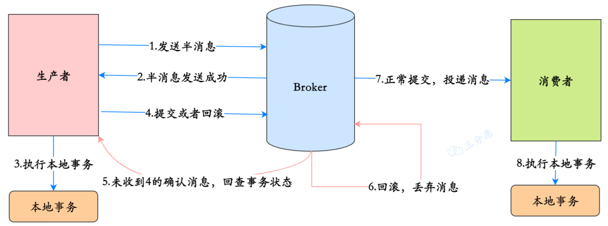

**流程：**

1. **Producer 向 Broker 发送半消息**。
2. **Producer 端收到响应**，消息发送成功，此时消息是半消息，标记为 “不可投递” 状态，**Consumer** 无法消费。
3. **Producer 端执行本地事务**。
4. 正常情况下，本地事务执行完成，**Producer 向 Broker 发送 Commit 或 Rollback**： 
    - 如果是 **Commit**，**Broker** 将半消息标记为正常消息，**Consumer** 可以消费；
    - 如果是 **Rollback**，**Broker** 丢弃此消息。
5. **异常情况**： 
    - **Broker 端迟迟等不到二次确认**，在一定时间后，会查询所有的半消息，然后到 **Producer** 端查询半消息的执行情况。
6. **Producer 端查询本地事务的状态**。
7. 根据事务状态，提交 **Commit 或 Rollback** 到 **Broker** 端。（**步骤 5, 6, 7 为消息回查**）
8. **消费者段消费到消息后**，执行本地事务。

**总结：** 半消息通过严格的二次确认机制和消息回查机制，实现了分布式消息事务的可靠性和一致性。

## 死信队列知道吗？
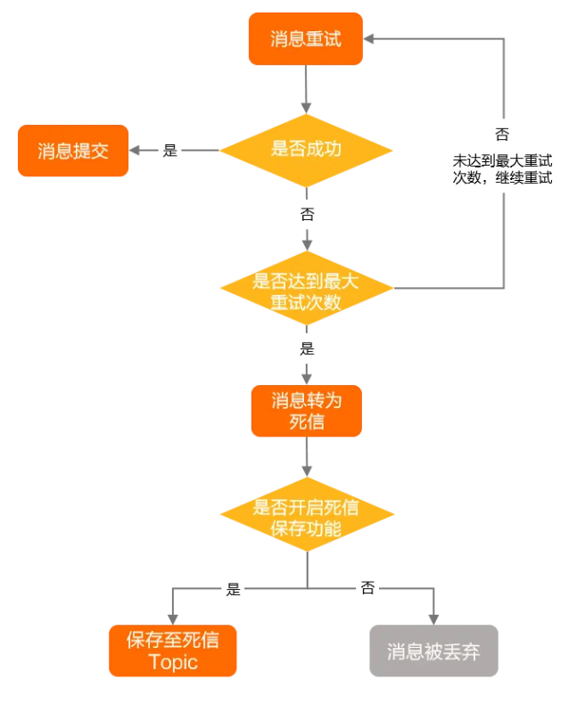

**1. 什么是死信队列？**

死信队列是 RocketMQ 中用来存放处理失败的消息的特殊队列。消息在以下情况会进入死信队列：

1. 消费重试次数超过上限仍然失败。
2. 消费者主动返回 `RECONSUME_LATER` 且达到最大重试次数。
3. Broker 无法成功将消息推送到消费者。

死信队列的功能是避免消息永久积压，同时便于后续排查和处理。

---

**2. 死信队列的特点**

+ **按消费组生成**：每个消费组都有独立的死信队列，格式为：`%DLQ%<ConsumerGroup>`。
+ **不可订阅**：只能通过控制台或 API 查看死信消息，不能像普通队列那样订阅消费。
+ **不影响生产者**：生产者不关心死信，死信处理主要由消费者负责。

## 如何保证 RocketMQ 的高可用？
保证 **RocketMQ 的高可用性** 是确保消息队列系统稳定运行的关键。RocketMQ 提供了多种机制来实现高可用，主要包括 **主从架构**、**多副本机制**、**故障转移** 和 **集群部署** 等。以下是实现 RocketMQ 高可用的详细方法：

---

**1. 主从架构**

+ **核心思想**：每个 Broker 节点分为主节点（Master）和从节点（Slave），主节点负责读写，从节点负责数据备份和故障转移。
+ **实现方式**：
    - 主节点和从节点之间通过同步或异步方式复制数据。
    - 当主节点发生故障时，从节点可以接管服务，保证消息的可用性。
+ **优点**：
    - 提高系统的容错能力。
    - 在主节点故障时，从节点可以快速接管，减少服务中断时间。

---

**2. 消息持久化**

+ **核心思想**：将消息持久化到磁盘，确保即使 Broker 重启，消息也不会丢失。
+ **实现方式**：
    - RocketMQ 默认将消息持久化到磁盘，可以通过配置 `flushDiskType` 参数来设置刷盘方式（`SYNC_FLUSH` 或 `ASYNC_FLUSH`）。
    - 示例：

```properties
flushDiskType=SYNC_FLUSH
```

+ **优点**：
    - 提高数据的可靠性。
    - 在 Broker 重启后，可以从磁盘恢复消息。

---

**3. 集群部署**

+ **核心思想****：通过部署多个 Broker 和 NameServer 节点，形成集群，避免单点故障。**
+ **实现方式****：**
    - **Broker 集群****：部署多个 Broker 节点，每个 Topic 分布在不同的 Broker 上。**
    - **NameServer 集群****：部署多个 NameServer 节点，提供高可用的服务发现功能。**
+ **优点****：**
    - **提高系统的扩展性和容错能力。**
    - **在某个节点故障时，其他节点可以继续提供服务。**


---

**3. 故障转移**

+ **核心思想**：当主节点发生故障时，从节点可以自动接管服务，保证系统的可用性。
+ **实现方式**：
    - RocketMQ 的 NameServer 会监控 Broker 的状态，当主节点故障时，会将从节点提升为主节点。
    - 生产者会自动重连到新的主节点，继续发送消息。
+ **优点**：
    - 减少服务中断时间。
    - 提高系统的容错能力。

---

**5. 多副本机制**

+ **核心思想**：将消息的多个副本存储在不同的 Broker 节点上，确保即使某个节点故障，消息仍然可用。
+ **实现方式**：
    - RocketMQ 支持多副本机制，可以通过配置 `brokerRole` 参数来设置 Broker 的角色（`SYNC_MASTER`、`ASYNC_MASTER`、`SLAVE`）。
    - 示例：

```properties
brokerRole=SYNC_MASTER
```

+ **优点**：
    - 提高数据的可靠性。
    - 在节点故障时，可以从其他副本恢复数据。

---

**6. 生产者重试机制**

+ **核心思想**：当消息发送失败时，生产者会自动重试，确保消息成功发送。
+ **实现方式**：
    - RocketMQ 的生产者默认会重试发送失败的消息，可以通过 `setRetryTimesWhenSendFailed` 方法设置重试次数。
    - 示例：

```properties
producer.setRetryTimesWhenSendFailed(3);
```

+ **优点**：
    - 提高消息发送的成功率。
    - 在网络抖动或 Broker 故障时，仍然可以保证消息发送。

---

**7. 消费者重试机制**

+ **核心思想**：当消息消费失败时，消费者会自动重试，确保消息成功消费。
+ **实现方式**：
    - RocketMQ 的消费者默认会重试消费失败的消息，最多重试 16 次。
    - 可以通过 `setMaxReconsumeTimes` 方法设置最大重试次数。
    - 示例：

```properties
consumer.setMaxReconsumeTimes(10);
```

+ **优点**：
    - 提高消息消费的成功率。
    - 在消费者处理逻辑出现问题时，仍然可以保证消息消费。

---

**8. 监控与报警**

+ **核心思想**：通过监控 RocketMQ 的运行状态，及时发现和处理问题。
+ **实现方式**：
    - 使用 RocketMQ 的管理控制台或监控工具（如 Prometheus、Grafana）实时监控 Broker、NameServer、生产者和消费者的状态。
    - 设置报警规则，当系统出现异常时，及时通知相关人员。
+ **优点**：
    - 提高系统的可维护性。
    - 在问题发生前，可以提前预警和处理。

---

**9. 总结**

| 方法 | 说明 | 优点 |
| --- | --- | --- |
| **主从架构** | 主节点负责读写，从节点负责备份 | 提高容错能力，减少服务中断时间 |
| **多副本机制** | 将消息的多个副本存储在不同节点 | 提高数据可靠性 |
| **故障转移** | 主节点故障时，从节点接管服务 | 减少服务中断时间 |
| **集群部署** | 部署多个 Broker 和 NameServer 节点 | 提高扩展性和容错能力 |
| **消息持久化** | 将消息持久化到磁盘 | 提高数据可靠性 |
| **生产者重试机制** | 消息发送失败时，自动重试 | 提高消息发送的成功率 |
| **消费者重试机制** | 消息消费失败时，自动重试 | 提高消息消费的成功率 |
| **监控与报警** | 实时监控系统状态，设置报警规则 | 提高系统的可维护性 |


通过以上方法，可以有效保证 RocketMQ 的高可用性，确保消息队列系统稳定运行。

# 原理
## 说一下 RocketMQ 的整体工作流程？
**简单来说，RocketMQ 是一个分布式消息队列，也就是消息队列 + 分布式系统。**

---

**作为消息队列：**

+ 它是 **发-存-收** 的一个模型，对应的角色分别是： 
    - **Producer**（生产者）
    - **Broker**（中间存储）
    - **Consumer**（消费者）

**作为分布式系统：**

+ 它需要包含 **服务端、客户端、注册中心**，对应的角色分别是： 
    - **Broker**（服务端）
    - **Producer/Consumer**（客户端）
    - **NameServer**（注册中心）

---

**RocketMQ 的主要工作流程：**

RocketMQ 由以下部分组成：

+ **NameServer 注册中心集群**
+ **Producer 生产者集群**
+ **Consumer 消费者集群**
+ **若干 Broker（RocketMQ 进程）**

**具体流程：**

1. **Broker 启动：**
    - Broker 在启动时向所有的 **NameServer** 注册，并保持长连接。
    - 每 30 秒发送一次 **心跳**。
2. **Producer 发送消息：**
    - **Producer** 在发送消息时，从 **NameServer** 获取 **Broker** 的服务器地址。
    - 根据 **负载均衡算法** 选择一台服务器来发送消息。
3. **Consumer 消费消息：**
    - **Consumer** 在消费消息时，同样从 **NameServer** 获取 **Broker** 地址。
    - 然后主动拉取消息进行消费。

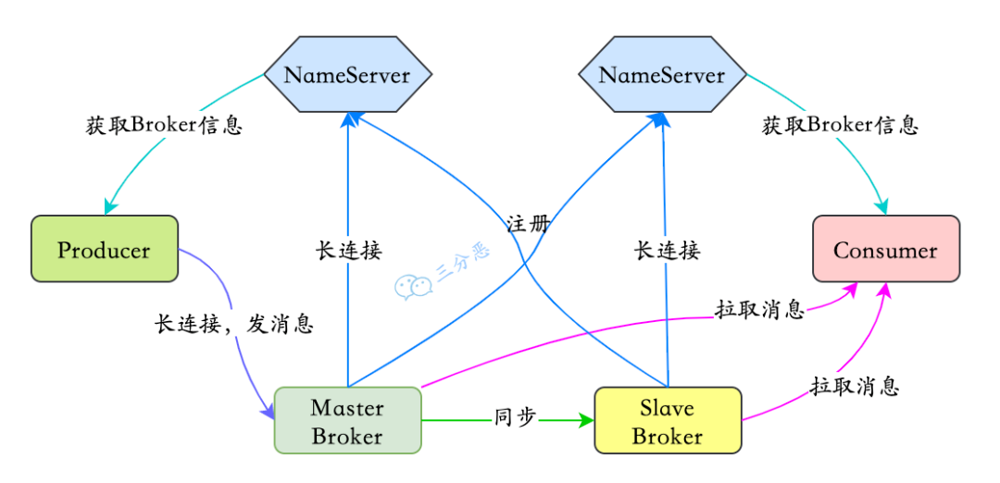

## 为什么 RocketMQ 不使用 Zookeeper 作为注册中心呢？
 Kafka 我们都知道采用 Zookeeper 作为注册中心——当然也开始逐渐去 Zookeeper，RocketMQ 不使用 Zookeeper 其实主要可能从这几方面来考虑：  

RocketMQ 不使用 Zookeeper 作为注册中心，主要基于以下几点考虑：

1. **可用性优先**：根据 CAP 理论，Zookeeper 选择 CP 模型，在 Leader 选举期间服务不可用，而注册中心需要高可用性（AP）。RocketMQ 的 NameServer 无需选举，随时可用。
2. **轻量高效**：NameServer 实现简单，支持水平扩展，抗压能力强。Zookeeper 的写操作性能有限，扩展性差。
3. **去重持久化**：Zookeeper 的持久化机制（ZAB 协议、Snapshot）复杂且性能开销大，而 NameServer 不需要过重的持久化设计。
4. **弱依赖注册中心**：生产者和消费者首次获取路由后可缓存地址，即使 NameServer 短期不可用，消息发送仍能正常运行。

**总结**：RocketMQ 通过轻量化、去中心化的 NameServer 提供高效、可靠的路由管理，避免了 Zookeeper 的复杂性和性能瓶颈，更符合消息队列的高可用需求。

## Broker 是怎么保存数据的呢？
RocketMQ 的存储层主要由以下几个关键文件组成：

+ **CommitLog**：所有消息的实际存储文件，采用顺序追加的方式写入。
+ **ConsumeQueue**：消息的逻辑队列，存储消息在 CommitLog 中的索引，方便消费者快速定位消息。
+ **IndexFile**：可选的索引文件，根据消息的 key（如消息 ID 或业务键）提供快速查询功能。

Broker 将所有消息统一写入 CommitLog，然后通过 ConsumeQueue 和 IndexFile 提供高效的读取和查询能力。这种“日志 + 索引”的设计借鉴了 Kafka 的思想，但 RocketMQ 在实现上有自己的优化。

---

在 RocketMQ 中，**Broker** 负责存储消息数据，采用了高效的存储机制来保证性能和可靠性。

Broker 的数据存储主要分为两部分：

+ **CommitLog**：存储所有消息的原始数据，按照消息到达的顺序追加写入。
+ **ConsumeQueue**：为每个 Topic 的每个队列（Queue）维护一个索引，记录消息在 CommitLog 中的位置。

消息存储主要依赖以下三个核心文件结构：

---

**1. 消息存储的核心文件**

**1.1 CommitLog**

+ **功能**：用于存储消息的原始数据（字节流）。
+ **特点**： 
    - 顺序写入，性能高。
    - 所有消息都先写入 CommitLog，按 Topic 和队列建立索引。
    - 消息持久化时使用页缓存（PageCache），大部分情况下直接写入内存，定期刷盘到磁盘。
+ **文件结构**： 
    - 每个文件大小固定（默认 1GB）。
    - 文件命名为连续的偏移量，如 `00000000000000000000`、`00000000000001073741824`。

**1.2 ConsumeQueue**

+ **功能**： ConsumeQueue 是消息的索引文件，用于快速定位消息在 CommitLog 中的位置。  
+ **特点**： 
    -  按 Topic 和 Queue 分区：每个 Topic 的每个队列都有一个独立的 ConsumeQueue。  
    - 每个索引条目包括物理偏移量、消息大小、消息 Tag 的哈希值。
    - 消费者根据 ConsumeQueue 快速定位到 CommitLog 中的具体消息。
+ **文件结构**： 
    - 每个 Topic 的每个队列都有独立的 ConsumeQueue 文件。

**1.3 IndexFile**

+ **功能**：基于消息的 Key 或者时间戳建立哈希索引，用于快速查询消息。
+ **特点**： 
    - 哈希索引：根据消息的 Key 计算哈希值，快速定位消息。
    - 时间范围索引：支持按时间范围查询消息。

---

**2. 消息写入流程**

1. **生产者发送消息到 Broker**。
2. **消息写入 CommitLog**： 
    - 使用内存映射（MMAP）技术，将消息写入内存。
    - 根据刷盘策略（同步或异步），定期将数据刷到磁盘。

Broker 提供了两种刷盘机制，确保消息的持久化：

        * **同步刷盘**：消息写入 CommitLog 后，立即刷盘到磁盘，确保数据不丢失，但性能较低。
        * **异步刷盘**：消息写入 CommitLog 后，先写入内存中的 PageCache，由操作系统异步刷盘，性能较高，但存在数据丢失的风险。
3. **同步到 ConsumeQueue**： 
    - 根据消息的 Topic 和队列，将消息的偏移量、大小等信息写入 ConsumeQueue。
4. **更新 IndexFile**（如果消息设置了 Key 或时间索引）： 
    - 创建哈希索引，便于后续按条件查询消息。

---

**3. 消息读取流程**

1. 消费者根据 Topic 和队列编号，从 ConsumeQueue 获取消息在 CommitLog 中的偏移量。
2. Broker 根据偏移量定位到 CommitLog，读取对应的消息内容。
3. 将消息返回给消费者。

---

**4. RocketMQ 数据存储的优化**

**4.1 顺序写入**

+ CommitLog 采用顺序写入磁盘，避免了随机写操作，提高性能。
+ 使用内存映射文件（MMAP），减少 IO 开销。

**4.2 分片存储**

+ CommitLog 文件大小固定（默认 1GB），支持滚动存储，避免大文件操作。
+ ConsumeQueue 按 Topic 和队列分片，便于快速查找。

**4.3 延迟刷盘**

+ 支持异步刷盘策略，在性能和数据可靠性之间取得平衡。

**4.4 索引机制**

+ ConsumeQueue 提供高效的消费索引。
+ IndexFile 提供多维度的查询能力。

---

**5. 数据清理机制**

+ RocketMQ 提供过期消息清理机制，默认保留消息 72 小时。
+ 清理规则： 
    - 超过配置的保留时间。
    - 消费者已消费的消息。
    - 文件占用的存储空间超限。
+ 清理方法：删除旧的 CommitLog 和对应的 ConsumeQueue 文件。

---

**6. 总结**

RocketMQ 的数据存储设计结合了高性能顺序写入和高效索引机制：

+ **CommitLog**：存储消息的原始数据。
+ **ConsumeQueue**：快速定位消息的逻辑索引。
+ **IndexFile**：按 Key 或时间索引查询消息。

这种结构既保证了消息存储的高吞吐量，又提供了灵活的查询和消费能力。若需要深入探讨某部分机制或代码实现，请进一步告知！

## 说说 RocketMQ 怎么对文件进行读写的？
**总结：RocketMQ 文件读写的高效设计**

RocketMQ 在文件读写方面巧妙地利用了操作系统的多种高效机制，包括 **PageCache**、**顺序读写** 和 **零拷贝**，从而实现了高吞吐、低延迟的消息存储和检索。以下是其核心设计要点的总结：

---

**1. PageCache 机制**

+ **作用**：PageCache 是操作系统对文件的缓存，用于加速文件的读写操作。
+ **优势**：
    - **顺序读写性能接近内存**：RocketMQ 的 ConsumeQueue 文件存储的数据较少，且是顺序读取，在 PageCache 的预读取机制下，读取性能几乎接近读内存。
    - **异步刷盘**：对于 CommitLog 的写入，数据先写入 PageCache，随后由操作系统异步刷盘（pdflush 线程），提高了写入效率。
    - **预读取优化**：当读取文件未命中 PageCache 时，操作系统会从磁盘读取数据，并预读取相邻块的数据，减少后续读取的延迟。

---

**2. 顺序读写**

+ **CommitLog 顺序写**：所有消息按照到达顺序追加写入 CommitLog 文件，充分利用磁盘的顺序写性能，避免了随机写的性能损耗。
+ **ConsumeQueue 顺序读**：ConsumeQueue 文件存储的是消息的索引，读取时是顺序访问，性能极高。
+ **随机读优化**：对于 CommitLog 的随机读取（如根据索引查找消息内容），RocketMQ 通过优化系统 IO 调度算法（如设置为“Deadline”）和采用 SSD 存储，提升了随机读性能。

---

**3. 零拷贝技术**

+ **MappedByteBuffer** （内存映射文件）  ：RocketMQ 使用 NIO 的 **FileChannel（文件通道）** 和 **MappedByteBuffer （内存映射文件）  **，将磁盘文件直接映射到用户态的内存地址中，避免了传统 IO 中数据在用户态和内核态之间的多次拷贝。
+ **优势**：
    - 减少 CPU 和内存开销：零拷贝技术大幅降低了数据拷贝的开销，提高了文件读写的效率。
    - 直接操作内存：文件操作转化为对内存地址的直接操作，性能极高。
+ **定长结构设计**：为了方便内存映射，RocketMQ 的文件存储采用定长结构，确保整个文件可以一次性映射到内存。

---

**4. 文件读写流程的核心优化**

+ **写入流程**：
    1. 消息顺序写入 CommitLog。
    2. 生成索引并写入 ConsumeQueue。
    3. 根据刷盘策略（同步或异步）将数据持久化到磁盘。
+ **读取流程**：
    1. 从 ConsumeQueue 顺序读取索引。
    2. 根据索引从 CommitLog 中读取消息内容。
    3. 使用零拷贝技术将消息发送给 Consumer。

---

**5. 高性能与高可靠性的平衡**

+ **高性能**：通过 PageCache、顺序读写和零拷贝技术，RocketMQ 实现了极高的文件读写性能，适合高吞吐、低延迟的场景。
+ **高可靠性**：通过同步刷盘和主从复制机制，确保消息不丢失，同时支持故障转移。

---

**总结**

RocketMQ 的文件读写设计充分利用了操作系统的 **PageCache**、**顺序读写** 和 **零拷贝** 机制，实现了高效的消息存储和检索。其核心思想是通过减少磁盘随机访问、优化数据拷贝和利用内存映射，最大化提升性能。这种设计使得 RocketMQ 能够在大规模消息处理场景中表现出色，同时保证了系统的高可靠性和可扩展性。

### 说说什么是零拷贝?
**在操作系统中，使用传统的方式，数据需要经历几次拷贝，并且要经历用户态/内核态切换：**

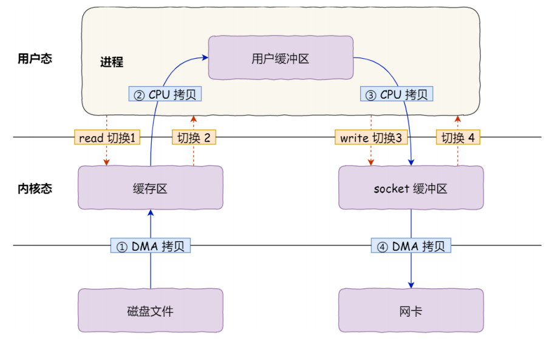

1. **从磁盘复制数据到内核态内存；**
2. **从内核态内存复制到用户态内存；**
3. **从用户态内存复制到网络驱动的内核态内存；**
4. **从网络驱动的内核态内存复制到网卡中进行传输。**

---

**优化方式：**  
 所以，可以通过零拷贝的方式，**减少用户态与内核态的上下文切换**和**内存拷贝的次数**，用来提升 I/O 的性能。零拷贝比较常见的实现方式是**mmap**，这种机制在 Java 中是通过 MappedByteBuffer  （内存映射文件）  实现的。  

+ 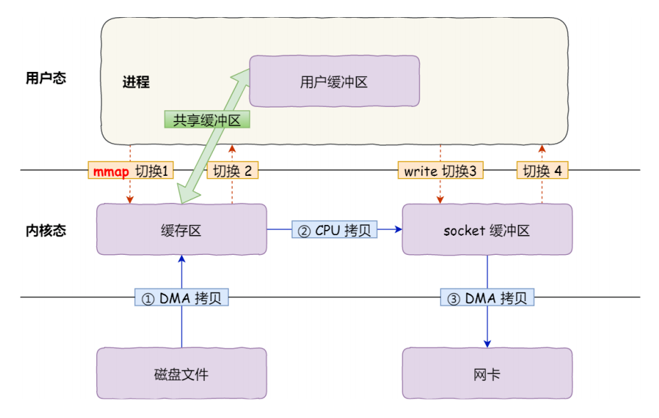

## RocketMQ 的零拷贝
<details class="lake-collapse"><summary id="uefd84716"></summary><h3 id="iCgXl"><strong><span class="ne-text">RocketMQ 的零拷贝优化</span></strong><span class="ne-text"> </span><span class="ne-text">🚀</span></h3><p id="ubdb5a1e9" class="ne-p"><span class="ne-text">RocketMQ 通过 </span><code class="ne-code"><strong><span class="ne-text">mmap</span></strong></code><strong><span class="ne-text"> + </span></strong><code class="ne-code"><strong><span class="ne-text">sendfile</span></strong></code><span class="ne-text"> 实现 </span><strong><span class="ne-text">零拷贝</span></strong><span class="ne-text">，提升消息存储与消费效率。</span></p><h3 id="k4ZdM"><strong><span class="ne-text">1. 消息存储（mmap）</span></strong></h3><ul class="ne-ul"><li id="ueba135ac" data-lake-index-type="0"><strong><span class="ne-text">采用 </span></strong><code class="ne-code"><strong><span class="ne-text">mmap()</span></strong></code><strong><span class="ne-text"> 进行内存映射</span></strong><span class="ne-text">，消息直接写入 </span><strong><span class="ne-text">PageCache</span></strong><span class="ne-text">，避免</span><strong><span class="ne-text">内核缓冲区 → 用户态缓冲区</span></strong><span class="ne-text">的 CPU 拷贝，提高吞吐量。</span></li></ul><h3 id="WQl2i"><strong><span class="ne-text">2. 消息消费（sendfile）</span></strong></h3><ul class="ne-ul"><li id="u110a5475" data-lake-index-type="0"><strong><span class="ne-text">Broker 发送消息时，直接调用 </span></strong><code class="ne-code"><strong><span class="ne-text">sendfile()</span></strong></code><span class="ne-text">，数据从 </span><strong><span class="ne-text">磁盘 → 内核缓冲区（DMA）→ Socket（DMA）→ 网卡</span></strong><span class="ne-text">，完全绕过用户态，减少 CPU 负担。</span></li></ul><h3 id="t5c3Y"><strong><span class="ne-text">3. 优势</span></strong></h3><p id="u67400ce3" class="ne-p"><span class="ne-text">✅</span><span class="ne-text"> </span><strong><span class="ne-text">减少 CPU 拷贝</span></strong><span class="ne-text">，提升吞吐量。<br /></span><span class="ne-text">✅</span><span class="ne-text"> </span><strong><span class="ne-text">降低内存占用</span></strong><span class="ne-text">，减少数据冗余存储。<br /></span><span class="ne-text">✅</span><span class="ne-text"> </span><strong><span class="ne-text">减少上下文切换</span></strong><span class="ne-text">，提高消息传输效率。</span></p><p id="u72603b83" class="ne-p"><span class="ne-text">RocketMQ 的零拷贝技术通过 </span><span class="ne-text">mmap</span><span class="ne-text"> 和 </span><span class="ne-text">sendfile</span><span class="ne-text"> 实现了高效的消息存储和传输：</span></p><ul class="ne-ul"><li id="u6a60a7b8" data-lake-index-type="0"><strong><span class="ne-text">mmap</span></strong><span class="ne-text">：将 CommitLog 文件映射到内存，优化生产者写入。</span></li><li id="ufa770b0f" data-lake-index-type="0"><strong><span class="ne-text">sendfile</span></strong><span class="ne-text">：直接从存储传输到网络，优化消费者读取。</span></li></ul><p id="u0d7e9b54" class="ne-p"><span class="ne-text">RocketMQ </span><strong><span class="ne-text">依靠零拷贝实现高吞吐</span></strong><span class="ne-text">，适用于大规模消息处理和分布式事务场景。 </span><span class="ne-text">🚀</span></p></details>
## 消息刷盘怎么实现的呢？
在 **RocketMQ** 中，**消息刷盘** 是指将内存中的消息数据同步到磁盘，以确保消息的持久化和可靠性。RocketMQ 提供了两种刷盘模式：**同步刷盘**和**异步刷盘**。以下是其实现细节和机制。

---

**1. RocketMQ 中的刷盘机制**

**1.1 刷盘类型**

1. **同步刷盘（SYNC_FLUSH）**：
    - 消息写入后立即将数据刷入磁盘，并等待刷盘完成后才返回给生产者。
    - 数据可靠性高，但性能较低。
2. **异步刷盘（ASYNC_FLUSH，默认）**：
    - 消息写入内存后立即返回生产者，由后台线程批量将消息刷入磁盘。
    - 性能较高，但在系统宕机时可能丢失未刷盘的数据。

---

**2. 刷盘的实现原理**

 刷盘的最终实现都是使用**NIO**中的 MappedByteBuffer.force() 将映射区的数据写入到磁盘，如果是同步刷盘的话，在**Broker**把消息写到**CommitLog**映射区后，就会等待写入完成。  

**2.1 CommitLog 写入**

1. **消息存储到内存映射文件**：
    - RocketMQ 使用 `MappedByteBuffer` 实现内存映射，将消息写入操作映射到文件系统的内存缓存（PageCache）。
    - 消息实际存储在操作系统的 PageCache 中，未直接写入磁盘。
2. **触发刷盘**：
    - **同步刷盘**：写入消息后立即调用刷盘操作，将数据从 PageCache 刷到磁盘。
    - **异步刷盘**：后台线程定期检查是否有未刷盘的数据，并批量写入磁盘。

**2.2 刷盘线程**

RocketMQ 的刷盘线程通过 `FlushRealTimeService` 实现：

+ 异步刷盘模式下，后台线程定期检查内存映射区域（`MappedByteBuffer`）中是否有未刷盘数据。
+ 刷盘线程调用 `MappedByteBuffer.force()`，将内存中的数据强制写入磁盘。

**2.3 刷盘流程**

+ **异步刷盘示例**：
    1. 消息写入内存映射区域（`MappedByteBuffer`）。
    2. RocketMQ 的 `FlushRealTimeService` 周期性调用刷盘逻辑。
    3. 使用 `MappedByteBuffer.force()` 将数据从内存刷到磁盘。
+ **同步刷盘示例**：
    1. 消息写入 `MappedByteBuffer` 后，直接调用刷盘逻辑。
    2. 等待 `MappedByteBuffer.force()` 执行完成后，返回写入结果。

---

**4. 刷盘模式对比**

| **模式** | **数据可靠性** | **性能** | **适用场景** |
| --- | --- | --- | --- |
| 同步刷盘（SYNC） | 高，数据不易丢失 | 较低，需等待刷盘完成 | 关键业务场景，要求数据不丢失 |
| 异步刷盘（ASYNC） | 较低，可能丢失少量数据 | 高，批量刷盘提升性能 | 高性能场景，可接受少量数据丢失 |


---

**总结**

+ **核心机制**：RocketMQ 通过内存映射文件（`MappedByteBuffer`）和 `force()` 实现刷盘操作。
+ **同步刷盘**：数据安全性高，但性能略低。
+ **异步刷盘**：性能优越，通过后台线程批量刷盘，适合大部分高性能场景。
+ **配置灵活**：根据业务需求在可靠性和性能之间平衡选择。

## 能说下 RocketMQ 的负载均衡是如何实现的？RocketMQ 的 **负载均衡** 是其高性能和高可用性的重要保障，主要通过 **Producer 负载均衡** 和 **Consumer 负载均衡** 来实现。以下是 RocketMQ 负载均衡的详细实现机制：
---

**1. Producer 负载均衡**

Producer 的负载均衡主要体现在消息发送时如何选择目标 Broker 和 Queue。

**实现机制**

+ **Topic 与 Queue 的关系**：
    - 每个 Topic 可以分为多个 Queue（默认 4 个），Queue 是消息存储和分发的基本单位。
    - Queue 分布在不同的 Broker 上，Producer 根据负载均衡策略选择目标 Queue。
+ **负载均衡策略**：
    - **轮询（Round Robin）**：Producer 依次选择 Topic 下的 Queue，均匀分布消息。
    - **随机（Random）**：Producer 随机选择 Topic 下的 Queue。
    - **哈希（Hash）**：根据消息的 Key 或特定字段计算哈希值，选择对应的 Queue。
+ **动态感知**：
    - Producer 会定期从 NameServer 获取最新的 Broker 和 Queue 信息，动态调整负载均衡策略。

**优点**

+ 消息均匀分布到多个 Queue 和 Broker，避免单个 Broker 或 Queue 成为性能瓶颈。
+ 支持动态扩容和缩容，适应集群规模的变化。

---

**2. Consumer 负载均衡**

Consumer 的负载均衡主要体现在如何分配 Queue 给多个 Consumer 实例。

**实现机制**

+ **Consumer Group**：
    - 多个 Consumer 实例可以组成一个 Consumer Group，共同消费一个 Topic 的消息。
    - 每个 Queue 只能被同一个 Consumer Group 中的一个 Consumer 实例消费。
+ **负载均衡策略**：
    - **平均分配（AllocateMessageQueueAveragely）**：将 Queue 平均分配给 Consumer Group 中的所有 Consumer 实例。
    - **环形分配（AllocateMessageQueueAveragelyByCircle）**：将 Queue 按环形顺序分配给 Consumer 实例。
    - **一致性哈希（AllocateMessageQueueConsistentHash）**：使用一致性哈希算法分配 Queue，适合动态变化的 Consumer 实例。
    - **自定义分配**：用户可以实现自定义的负载均衡策略。
+ **Rebalance 机制**：
    - Consumer 会定期触发 Rebalance 操作，重新分配 Queue。
    - Rebalance 的触发条件包括：
        * Consumer Group 中的 Consumer 实例数量变化（新增或减少）。
        * Topic 的 Queue 数量变化（Broker 扩容或缩容）。
+ **Offset 管理**：
    - Consumer 会记录每个 Queue 的消费进度（Offset），确保消息不会重复消费或丢失。

**优点**

+ 多个 Consumer 实例可以并行消费消息，提高消费吞吐量。
+ 支持动态扩容和缩容，适应 Consumer 实例数量的变化。

---

**3. Broker 负载均衡**

Broker 的负载均衡主要体现在消息存储和投递的分布上。

**实现机制**

+ **主从架构**：
    - Master Broker 负责写操作，Slave Broker 负责读操作和故障转移。
    - 读写分离可以减轻 Master Broker 的负载。
+ **Queue 分布**：
    - Topic 的 Queue 均匀分布在多个 Broker 上，避免单个 Broker 成为性能瓶颈。
+ **动态扩容**：
    - 新增 Broker 时，NameServer 会动态调整 Topic 的 Queue 分布，实现负载均衡。

**优点**

+ 读写分离和 Queue 分布均匀，提高系统的整体性能和可用性。
+ 支持动态扩容和缩容，适应业务规模的变化。

---

**4. 负载均衡的高可用性**

+ **故障转移**：
    - 如果某个 Broker 或 Consumer 实例宕机，RocketMQ 会自动触发 Rebalance，将 Queue 重新分配给其他健康的 Broker 或 Consumer 实例。
+ **消息重试**：
    - 如果消息消费失败，RocketMQ 会将其放入重试队列，稍后重新投递，确保消息不丢失。

---

**5. 负载均衡的配置**

+ **Producer 配置**：
    - 可以通过 `DefaultMQProducer` 设置负载均衡策略。
+ **Consumer 配置**：
    - 可以通过 `DefaultMQPushConsumer` 或 `DefaultMQPullConsumer` 设置负载均衡策略。
+ **Broker 配置**：
    - 可以通过 `broker.conf` 配置文件调整 Broker 的读写权重和 Queue 分布。

---

**总结**

RocketMQ 的负载均衡通过 **Producer 负载均衡**、**Consumer 负载均衡** 和 **Broker 负载均衡** 实现，确保消息的生产、存储和消费均匀分布到多个节点，避免单点性能瓶颈。其核心机制包括：

+ **动态感知**：Producer 和 Consumer 动态获取集群状态，调整负载均衡策略。
+ **Rebalance 机制**：Consumer 定期重新分配 Queue，适应集群规模的变化。
+ **高可用性**：通过故障转移和消息重试机制，确保系统的稳定性和可靠性。  
这种负载均衡设计使得 RocketMQ 能够支持大规模分布式场景下的高吞吐、低延迟消息传递。

## RocketMQ 消息长轮询了解吗？
**RocketMQ 的消息长轮询（Long Polling）** 是一种消息拉取机制，旨在减少消息消费的延迟，同时避免频繁的无效拉取请求。它是 RocketMQ 实现高效消息消费的核心机制之一。以下是对 RocketMQ 消息长轮询的详细解析：

---

1. **什么是长轮询？**

长轮询是一种介于 **短轮询** 和 **推送（Push）** 之间的消息拉取机制：

+ **短轮询**：消费者定期向 Broker 发送拉取请求，即使没有消息也会立即返回。这种方式会导致大量无效请求，增加网络和系统开销。
+ **推送（Push）**：Broker 主动将消息推送给消费者，虽然实时性高，但会增加 Broker 的负载，且难以控制消息的消费速率。
+ **长轮询**：消费者向 Broker 发送拉取请求后，如果当前没有消息，Broker 会保持连接并等待一段时间（默认 15 秒），直到有新消息到达或超时。这种方式既减少了无效请求，又保证了消息的实时性。

---

**2. RocketMQ 长轮询的实现原理**

RocketMQ 的长轮询机制主要分为两个部分：

+ **消费者拉取消息**：消费者通过 `PullRequest` 向 Broker 发送拉取请求。
+ **Broker 处理拉取请求**：
    - 如果队列中有消息，Broker 立即返回消息给消费者。
    - 如果队列中没有消息，Broker 不会立即返回，而是将请求挂起，等待新消息到达或超时。

**具体流程：**

1. 消费者向 Broker 发送 `PullRequest`，请求拉取消息。
2. Broker 检查目标队列是否有消息：
    - 如果有消息，立即返回消息给消费者。
    - 如果没有消息，Broker 将请求挂起，并启动一个定时任务（默认 15 秒）。
3. 在挂起期间，如果有新消息到达，Broker 会立即唤醒挂起的请求并返回消息。
4. 如果超时后仍然没有消息，Broker 返回空响应，消费者可以再次发起拉取请求。

---

**3. 长轮询的优点**

+ **减少无效请求**：相比于短轮询，长轮询减少了大量无效的拉取请求，降低了网络和系统开销。
+ **实时性高**：相比于短轮询，长轮询能够在新消息到达时立即返回，减少了消息的消费延迟。
+ **可控性强**：相比于推送模式，长轮询由消费者主动发起请求，能够更好地控制消息的消费速率。


> 更新: 2025-05-09 17:20:01  
> 原文: <https://www.yuque.com/neumx/laxg2e/qsidq77hbn7h3y7a>