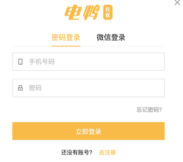
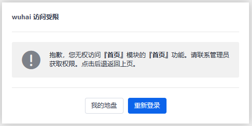
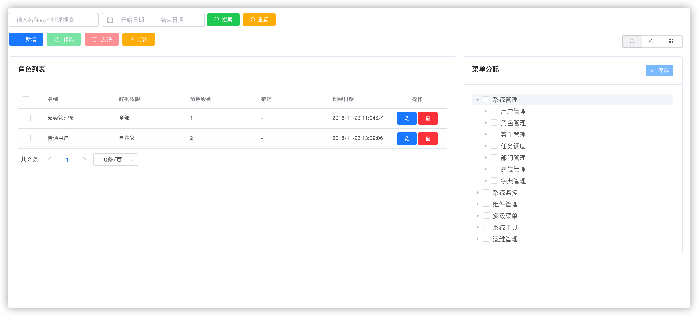
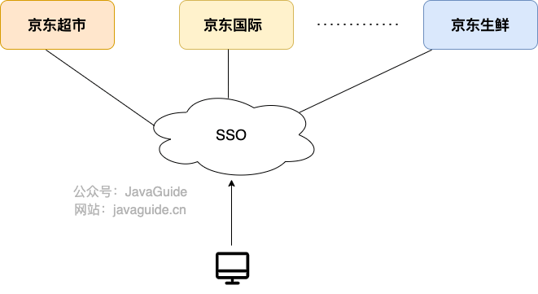

# 认证授权基础概念详解

# 认证授权基础概念详解
## 认证 (Authentication) 和授权 (Authorization)的区别是什么？
这是一个绝大多数人都会混淆的问题。首先先从读音上来认识这两个名词，很多人都会把它俩的读音搞混，所以我建议你先先去查一查这两个单词到底该怎么读，他们的具体含义是什么。

说简单点就是：

+ **认证 (Authentication)：**你是谁。
+ **授权 (Authorization)：**你有权限干什么。

稍微正式点（啰嗦点）的说法就是：

+ **Authentication（认证）**是验证您的身份的凭据（例如用户名/用户 ID 和密码），通过这个凭据，系统得以知道你就是你，也就是说系统存在你这个用户。所以，Authentication 被称为身份/用户验证。
+ **Authorization（授权）**发生在**Authentication（认证）**之后。授权嘛，光看意思大家应该就明白，它主要掌管我们访问系统的权限。比如有些特定资源只能具有特定权限的人才能访问比如 admin，有些对系统资源操作比如删除、添加、更新只能特定人才具有。

认证：



认证登录

授权：



没有权限

这两个一般在我们的系统中被结合在一起使用，目的就是为了保护我们系统的安全性。

## RBAC 模型了解吗？
系统权限控制最常采用的访问控制模型就是**RBAC 模型**。

**什么是 RBAC 呢？**

RBAC 即基于角色的权限访问控制（Role-Based Access Control）。这是一种通过角色关联权限，角色同时又关联用户的授权的方式。

简单地说：一个用户可以拥有若干角色，每一个角色又可以被分配若干权限，这样就构造成“用户-角色-权限” 的授权模型。在这种模型中，用户与角色、角色与权限之间构成了多对多的关系，如下图


RBAC 权限模型示意图

**在 RBAC 中，权限与角色相关联，用户通过成为适当角色的成员而得到这些角色的权限。这就极大地简化了权限的管理。**

本系统的权限设计相关的表如下（一共 5 张表，2 张用户建立表之间的联系）：


通过这个权限模型，我们可以创建不同的角色并为不同的角色分配不同的权限范围（菜单）。



通常来说，如果系统对于权限控制要求比较严格的话，一般都会选择使用 RBAC 模型来做权限控制。

## 什么是 Cookie ? Cookie 的作用是什么?


Cookie和Session都是用来跟踪浏览器用户身份的会话方式，但是两者的应用场景不太一样。

维基百科是这样定义Cookie的：

Cookies是某些网站为了辨别用户身份而储存在用户本地终端上的数据（通常经过加密）。

简单来说：**Cookie****存放在客户端，一般用来保存用户信息**。

下面是Cookie的一些应用案例：

1. 我们在Cookie中保存已经登录过的用户信息，下次访问网站的时候页面可以自动帮你登录的一些基本信息给填了。除此之外，Cookie还能保存用户首选项，主题和其他设置信息。
2. 使用Cookie保存SessionId或者Token，向后端发送请求的时候带上Cookie，这样后端就能取到Session或者Token了。这样就能记录用户当前的状态了，因为 HTTP 协议是无状态的。
3. Cookie还可以用来记录和分析用户行为。举个简单的例子你在网上购物的时候，因为 HTTP 协议是没有状态的，如果服务器想要获取你在某个页面的停留状态或者看了哪些商品，一种常用的实现方式就是将这些信息存放在Cookie
4. ……

## 如何在项目中使用 Cookie 呢？
我这里以 Spring Boot 项目为例。

**1)设置****Cookie****返回给客户端**

```plain
@GetMapping("/change-username")
public String setCookie(HttpServletResponse response) {
    // 创建一个 cookie
    Cookie cookie = new Cookie("username", "Jovan");
    //设置 cookie过期时间
    cookie.setMaxAge(7 * 24 * 60 * 60); // expires in 7 days
    //添加到 response 中
    response.addCookie(cookie);

    return "Username is changed!";
}
```

**2) 使用 Spring 框架提供的****@CookieValue****注解获取特定的 cookie 的值**

```plain
@GetMapping("/")
public String readCookie(@CookieValue(value = "username", defaultValue = "Atta") String username) {
    return "Hey! My username is " + username;
}
```

**3) 读取所有的****Cookie****值**

```plain
@GetMapping("/all-cookies")
public String readAllCookies(HttpServletRequest request) {

    Cookie[] cookies = request.getCookies();
    if (cookies != null) {
        return Arrays.stream(cookies)
                .map(c -> c.getName() + "=" + c.getValue()).collect(Collectors.joining(", "));
    }

    return "No cookies";
}
```

更多关于如何在 Spring Boot 中使用Cookie的内容可以查看这篇文章：[How to use cookies in Spring Boot](https://attacomsian.com/blog/cookies-spring-boot)[open in new window](https://attacomsian.com/blog/cookies-spring-boot)。

## Cookie 和 Session 有什么区别？
*_Session_***的主要作用就是通过服务端记录用户的状态。**典型的场景是购物车，当你要添加商品到购物车的时候，系统不知道是哪个用户操作的，因为 HTTP 协议是无状态的。服务端给特定的用户创建特定的Session之后就可以标识这个用户并且跟踪这个用户了。

Cookie数据保存在客户端(浏览器端)，Session数据保存在服务器端。相对来说Session安全性更高。如果使用Cookie的一些敏感信息不要写入Cookie中，最好能将Cookie信息加密然后使用到的时候再去服务器端解密。

**那么，如何使用****Session****进行身份验证？**

## 如何使用 Session-Cookie 方案进行身份验证？
很多时候我们都是通过SessionID来实现特定的用户，SessionID一般会选择存放在 Redis 中。举个例子：

1. 用户成功登陆系统，然后返回给客户端具有SessionID的Cookie。
2. 当用户向后端发起请求的时候会把SessionID带上，这样后端就知道你的身份状态了。

关于这种认证方式更详细的过程如下：


1. 用户向服务器发送用户名、密码、验证码用于登陆系统。
2. 服务器验证通过后，服务器为用户创建一个Session，并将Session信息存储起来。
3. 服务器向用户返回一个SessionID，写入用户的Cookie。
4. 当用户保持登录状态时，Cookie将与每个后续请求一起被发送出去。
5. 服务器可以将存储在Cookie上的SessionID与存储在内存中或者数据库中的Session信息进行比较，以验证用户的身份，返回给用户客户端响应信息的时候会附带用户当前的状态。

使用Session的时候需要注意下面几个点：

+ 依赖Session的关键业务一定要确保客户端开启了Cookie。
+ 注意Session的过期时间。

另外，Spring Session 提供了一种跨多个应用程序或实例管理用户会话信息的机制。如果想详细了解可以查看下面几篇很不错的文章：

+ [Getting Started with Spring Session](https://codeboje.de/spring-Session-tutorial/)[open in new window](https://codeboje.de/spring-Session-tutorial/)
+ [Guide to Spring Session](https://www.baeldung.com/spring-Session)[open in new window](https://www.baeldung.com/spring-Session)
+ [Sticky Sessions with Spring Session & Redis](https://medium.com/@gvnix/sticky-Sessions-with-spring-Session-redis-bdc6f7438cc3)[open in new window](https://medium.com/@gvnix/sticky-Sessions-with-spring-Session-redis-bdc6f7438cc3)

## 多服务器节点下 Session-Cookie 方案如何做？
Session-Cookie 方案在单体环境是一个非常好的身份认证方案。但是，当服务器水平拓展成多节点时，Session-Cookie 方案就要面临挑战了。

举个例子：假如我们部署了两份相同的服务 A，B，用户第一次登陆的时候 ，Nginx 通过负载均衡机制将用户请求转发到 A 服务器，此时用户的 Session 信息保存在 A 服务器。结果，用户第二次访问的时候 Nginx 将请求路由到 B 服务器，由于 B 服务器没有保存 用户的 Session 信息，导致用户需要重新进行登陆。

**我们应该如何避免上面这种情况的出现呢？**

有几个方案可供大家参考：

1. 某个用户的所有请求都通过特性的哈希策略分配给同一个服务器处理。这样的话，每个服务器都保存了一部分用户的 Session 信息。服务器宕机，其保存的所有 Session 信息就完全丢失了。
2. 每一个服务器保存的 Session 信息都是互相同步的，也就是说每一个服务器都保存了全量的 Session 信息。每当一个服务器的 Session 信息发生变化，我们就将其同步到其他服务器。这种方案成本太大，并且，节点越多时，同步成本也越高。
3. 单独使用一个所有服务器都能访问到的数据节点（比如缓存）来存放 Session 信息。为了保证高可用，数据节点尽量要避免是单点。
4. Spring Session 是一个用于在多个服务器之间管理会话的项目。它可以与多种后端存储（如 Redis、MongoDB 等）集成，从而实现分布式会话管理。通过 Spring Session，可以将会话数据存储在共享的外部存储中，以实现跨服务器的会话同步和共享。

## 如果没有 Cookie 的话 Session 还能用吗？
这是一道经典的面试题！

一般是通过Cookie来保存SessionID，假如你使用了Cookie保存SessionID的方案的话， 如果客户端禁用了Cookie，那么Session就无法正常工作。

但是，并不是没有Cookie之后就不能用Session了，比如你可以将SessionID放在请求的url里面[https://javaguide.cn/?Session_id=xxx。这种方案的话可行，但是安全性和用户体验感降低。当然，为了安全你也可以对SessionID进行一次加密之后再传入后端。](https://javaguide.cn/?Session_id=xxx。这种方案的话可行，但是安全性和用户体验感降低。当然，为了安全你也可以对SessionID进行一次加密之后再传入后端。)

## 为什么 Cookie 无法防止 CSRF 攻击，而 Token 可以？
**CSRF(Cross Site Request Forgery)****一般被翻译为****跨站请求伪造**。那么什么是**跨站请求伪造**呢？说简单用你的身份去发送一些对你不友好的请求。举个简单的例子：

小壮登录了某网上银行，他来到了网上银行的帖子区，看到一个帖子下面有一个链接写着“科学理财，年盈利率过万”，小壮好奇的点开了这个链接，结果发现自己的账户少了 10000 元。这是这么回事呢？原来黑客在链接中藏了一个请求，这个请求直接利用小壮的身份给银行发送了一个转账请求,也就是通过你的 Cookie 向银行发出请求。

```plain
<a src=http://www.mybank.com/Transfer?bankId=11&money=10000>科学理财，年盈利率过万</>
```

上面也提到过，进行Session认证的时候，我们一般使用Cookie来存储SessionId,当我们登陆后后端生成一个SessionId放在 Cookie 中返回给客户端，服务端通过 Redis 或者其他存储工具记录保存着这个SessionId，客户端登录以后每次请求都会带上这个SessionId，服务端通过这个SessionId来标示你这个人。如果别人通过Cookie拿到了SessionId后就可以代替你的身份访问系统了。

Session认证中Cookie中的SessionId是由浏览器发送到服务端的，借助这个特性，攻击者就可以通过让用户误点攻击链接，达到攻击效果。

但是，我们使用Token的话就不会存在这个问题，在我们登录成功获得Token之后，一般会选择存放在localStorage（浏览器本地存储）中。然后我们在前端通过某些方式会给每个发到后端的请求加上这个Token,这样就不会出现 CSRF 漏洞的问题。因为，即使有个你点击了非法链接发送了请求到服务端，这个非法请求是不会携带Token的，所以这个请求将是非法的。


需要注意的是：不论是Cookie还是Token都无法避免**跨站脚本攻击（Cross Site Scripting）XSS**。

跨站脚本攻击（Cross Site Scripting）缩写为 CSS 但这会与层叠样式表（Cascading Style Sheets，CSS）的缩写混淆。因此，有人将跨站脚本攻击缩写为 XSS。

XSS 中攻击者会用各种方式将恶意代码注入到其他用户的页面中。就可以通过脚本盗用信息比如Cookie。

推荐阅读：[如何防止 CSRF 攻击？—美团技术团队](https://tech.meituan.com/2018/10/11/fe-security-csrf.html)[open in new window](https://tech.meituan.com/2018/10/11/fe-security-csrf.html)

## 什么是 JWT?JWT 由哪些部分组成？
[JWT 基础概念详解](https://javaguide.cn/system-design/security/jwt-intro.html)

## 如何基于 JWT 进行身份验证？ 如何防止 JWT 被篡改？
[JWT 基础概念详解](https://javaguide.cn/system-design/security/jwt-intro.html)

## 什么是 SSO?
SSO(Single Sign On)即单点登录说的是用户登陆多个子系统的其中一个就有权访问与其相关的其他系统。举个例子我们在登陆了京东金融之后，我们同时也成功登陆京东的京东超市、京东国际、京东生鲜等子系统。



SSO 示意图

## SSO 有什么好处？
+ **用户角度**:用户能够做到一次登录多次使用，无需记录多套用户名和密码，省心。
+ **系统管理员角度**: 管理员只需维护好一个统一的账号中心就可以了，方便。
+ **新系统开发角度:**新系统开发时只需直接对接统一的账号中心即可，简化开发流程，省时。

## 如何设计实现一个 SSO 系统?
[SSO 单点登录详解](https://javaguide.cn/system-design/security/sso-intro.html)

## 什么是 OAuth 2.0？
OAuth 是一个行业的标准授权协议，主要用来授权第三方应用获取有限的权限。而 OAuth 2.0 是对 OAuth 1.0 的完全重新设计，OAuth 2.0 更快，更容易实现，OAuth 1.0 已经被废弃。详情请见：[rfc6749](https://tools.ietf.org/html/rfc6749)[open in new window](https://tools.ietf.org/html/rfc6749)。

实际上它就是一种授权机制，它的最终目的是为第三方应用颁发一个有时效性的令牌 Token，使得第三方应用能够通过该令牌获取相关的资源。

OAuth 2.0 比较常用的场景就是第三方登录，当你的网站接入了第三方登录的时候一般就是使用的 OAuth 2.0 协议。

另外，现在 OAuth 2.0 也常见于支付场景（微信支付、支付宝支付）和开发平台（微信开放平台、阿里开放平台等等）。

下图是[Slack OAuth 2.0 第三方登录](https://api.slack.com/legacy/oauth)[open in new window](https://api.slack.com/legacy/oauth)的示意图：


**推荐阅读：**

+ [OAuth 2.0 的一个简单解释](http://www.ruanyifeng.com/blog/2019/04/oauth_design.html)[open in new window](http://www.ruanyifeng.com/blog/2019/04/oauth_design.html)
+ [10 分钟理解什么是 OAuth 2.0 协议](https://deepzz.com/post/what-is-oauth2-protocol.html)[open in new window](https://deepzz.com/post/what-is-oauth2-protocol.html)
+ [OAuth 2.0 的四种方式](http://www.ruanyifeng.com/blog/2019/04/oauth-grant-types.html)[open in new window](http://www.ruanyifeng.com/blog/2019/04/oauth-grant-types.html)
+ [GitHub OAuth 第三方登录示例教程](http://www.ruanyifeng.com/blog/2019/04/github-oauth.html)[open in new window](http://www.ruanyifeng.com/blog/2019/04/github-oauth.html)

## 参考
+ 不要用 JWT 替代 session 管理（上）：全面了解 Token,JWT,OAuth,SAML,SSO：[https://zhuanlan.zhihu.com/p/38942172](https://zhuanlan.zhihu.com/p/38942172)[open in new window](https://zhuanlan.zhihu.com/p/38942172)
+ Introduction to JSON Web Tokens：[https://jwt.io/introduction](https://jwt.io/introduction)[open in new window](https://jwt.io/introduction)
+ JSON Web Token Claims：[https://auth0.com/docs/secure/tokens/json-web-tokens/json-web-token-claims](https://auth0.com/docs/secure/tokens/json-web-tokens/json-web-token-claims)[open in new window](https://auth0.com/docs/secure/tokens/json-web-tokens/json-web-token-claims)


> 更新: 2024-01-04 22:38:39  
原文: [https://www.yuque.com/vip6688/neho4x/vnxiw1if7t0y68dk](https://www.yuque.com/vip6688/neho4x/vnxiw1if7t0y68dk)
>


> 更新: 2024-11-25 09:25:05  
> 原文: <https://www.yuque.com/neumx/laxg2e/f332f193935f8373b58965cab8c48711>