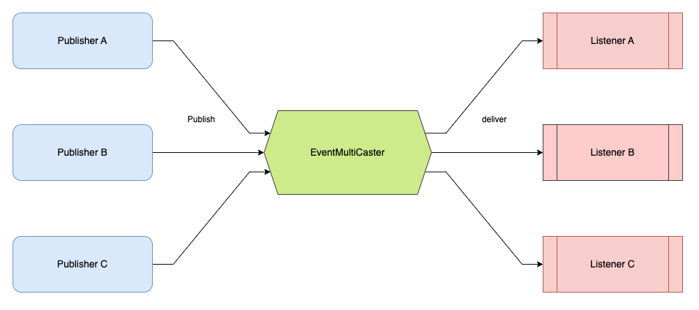

# 几种典型的后端面试场景题（补充）

# 几种典型的后端面试场景题（补充）
## 一个系统用户登录信息保存在服务器 A 上，服务器 B 如何获取到 Session 信息？
> 对于 Session 的基本概念不了解的同学，可以查看我写的[认证授权基础概念详解](https://javaguide.cn/system-design/security/basis-of-authority-certification.html)这篇文章，里面有详细介绍到。
>

这道问题的本质是在问分布式 Session 共享的解决方案。

正如题目描述的那样，假设一个系统用户登录信息保存在服务器 A 上，该系统用户通过服务器 A 登录之后，需要访问服务器 B 的某个登录的用户才能访问的接口。假设 Session 信息只保存在服务器 A 上，就会导致服务器 B 认为该用户并未登录。因此，我们需要让 Session 信息被所有的服务器都能访问到，也就是**分布式 Session 共享**。

常见的分布式 Session 共享的解决方案有下面这几种（这里介绍三种最常见也是比较有代表性的）：

### **1、Session 复制（实际项目中不会采用这种方案）**
用户第一次访问某个服务器时，该服务器创建一个新的 Session，并将该 Session 的数据复制到其他服务器上。这样，在用户的后续请求中，无论访问哪个服务器，都可以访问到相同的 Session 数据。

+ 优点：数据安全（即使某些服务器宕机，也不会导致 Session 数据的丢失）
+ 缺点：实现相对比较复杂、效率很低（尤其是服务器太多的情况下，Session 复制的成本太高）、内存占用大（每个服务器都需要保存相同的 Session 数据）、数据不一致性问题（由于数据同步存在时间延迟，服务器之间的 Session 数据可能存在短暂的不一致）

### **2、数据库保存（不推荐）**
将 Session 数据存储到共享的数据库中，所有的服务器都可以访问。

+ 优点：数据安全（数据库通常自带多种保障数据安全的措施比如数据备份）
+ 缺点：存在性能瓶颈（受限于数据库，还会增加数据库的负担）、实现复杂（需要手动实现 Session 的淘汰更新逻辑）

### **3、分布式缓存保存（推荐）**
将 Session 数据存储到分布式缓存比如 Redis 中，所有的服务器都可以访问。

这是目前最广泛使用的方案。

+ 优点：性能优秀、支持横向扩展（如 Redis 集群）
+ 缺点：存在数据丢失风险（虽然 Redis 支持多种数据持久化方式，但仍然可能会丢失小部分数据）

## 你知道哪些实现业务解耦的方法（提示：事件驱动）？
这个问题在中大厂面试中还是比较常见的，阿里、字节、美团等公司的面试都有问到过这个问题。

解耦是一种很重要的软件工程原则，它可以提高代码的质量和可复用性，降低系统的耦合度和维护成本。在日常开发中，处处可以看到解耦思想的运用，例如，AOP 可以让我们将横切关注点（如日志、事务、权限控制等）从核心业务逻辑中分离出来，实现关注点的分离。IoC 可以让我们将对象的创建和依赖管理交给容器，实现对象的控制反转。插件架构（也被称为微内核架构）下，通过增加插件即可增强系统功能，非常易于扩展功能，适合做定制化。

实现业务解耦的方法有很多比如事件驱动、协议通信，我们这里重点关注事件驱动这种业务解耦的常见方式。

事件驱动可以让不同的业务组件之间保持松散的耦合，提高系统的可扩展性和灵活性。

事件驱动的实现方式和表现形式有很多种，常用的有以下两种：

### **1、基于发布订阅模式的事件驱动**
发布订阅模式下，发布者和订阅者之间没有直接的联系，通过一个中间件（比如 MQ、Redis）来进行消息的传递。

MQ 实现解耦就是这种模式。生产者发布事件（消息）到消息队列，消费者根据自己需要对事件进行消费。并且，一个事件可以被一个或多个消费者消费。

这就是消息队列广泛采用的发布订阅模型。


这种方式在业务解耦的同时，还实现了异步，提高了系统的吞吐量和接口的响应速度。生产者把事件放到消息队列之后就立即返回，随后，消费者再对消息进行消费。

常见的消息队列有 Kafka、RocketMQ、RabbitMQ、Pulsar 等等。成熟的消息队列的功能性比较完善，自带消息持久化、负载均衡、消息高可能等功能。

除了 MQ 之外，还有一些其他的中间件可以实现基于发布订阅模式的事件驱动，比如 Redis 中的**发布订阅 (pub/sub) 功能 （Redis 2.0 引入的）。**


Redis 的 pub/sub 涉及发布者（Publisher）和订阅者（Subscriber，也叫消费者）两个角色：

+ 发布者通过`PUBLISH`投递消息给指定 channel。
+ 订阅者通过`SUBSCRIBE`订阅它关心的 channel。并且，订阅者可以订阅一个或者多个 channel。

和消息队列很类似，本质其实还是消息队列。不过，这种方式存在消息丢失（客户端断开连接或者 Redis 宕机都会导致消息丢失）、消息堆积（发布者发布消息的时候不会管消费者的具体消费能力如何）等问题不好解决。

再多提一嘴，Redis 5.0 新增加的一个数据结构Stream来做消息队列。Stream支持：

+ 发布 / 订阅模式
+ 按照消费者组进行消费
+ 消息持久化（ RDB 和 AOF）

不过，和专业的消息队列相比，使用 Redis 来实现消息队列还是有很多欠缺的地方比如消息丢失和堆积问题不好解决。因此，我们通常建议不要使用 Redis 来做消息队列。

### **2、基于观察者模式的事件驱动**
观察者模式下，不存在中间件这个角色。观察者模式抽象出了一个 Subject（被观察者），用于维护观察者列表，并在自身状态发生变化时通知所有的观察者。

观察者模式和发布订阅模式的简单对比如下（后面会进行详细对比）：


可以看到，发布订阅模式其实就是在观察者模式的基础上多了一个中间件（也就是图中的事件通道）。

常见的基于观察者模式的事件驱动框架有 Spring Event、Guava EventBus 等。

网上有很多文章说 Spring Event 和 Guava EventBus 是发布订阅模式，其实也没问题，大部分人应该都是这样认为。这个真不需要太纠结，毕竟二者在表现形式上确实是发布订阅形式。

```java
// 事件发布者
@Component
public class CustomSpringEventPublisher {
    @Autowired
    private ApplicationEventPublisher applicationEventPublisher;

    public void publishCustomEvent(final String message) {
        System.out.println("Publishing custom event. ");
        CustomSpringEvent customSpringEvent = new CustomSpringEvent(this, message);
        applicationEventPublisher.publishEvent(customSpringEvent);
    }
}

// 事件监听者
@Component
public class CustomSpringEventListener implements ApplicationListener<CustomSpringEvent> {
    @Override
    public void onApplicationEvent(CustomSpringEvent event) {
        System.out.println("Received spring custom event - " + event.getMessage());
    }
}
```

但如果你认可观察者模式和发布订阅模式是有区别的话，那说二者是基于观察者模式更合适一些。你可以将 Spring Event 中的 EventMultiCaster，Guava EventBus 中的 EventBus 看作是 Subject 的一部分，用于维护观察者，并在自身状态发生变化时通知所有的观察者。 Spring Event 和 Guava EventBus 只是没有显示地维护观察者和被观察者的关系罢了，实际上还是维护了，直接交互了。



Guava 官网对 EventBus 的描述是这样的（ 文档地址 ：[https://github.com/google/guava/wiki/EventBusExplained](https://github.com/google/guava/wiki/EventBusExplained)）：

> EventBusallows publish-subscribe-style communication between components without requiring the components to explicitly register with one another (and thus be aware of each other). It is designed exclusively to replace traditional Java in-process event distribution using explicit registration. It isnota general-purpose publish-subscribe system, nor is it intended for interprocess communication.
>
> EventBus允许组件之间进行发布-订阅式通信，而不需要组件显式地相互注册（从而了解彼此）。它专门设计用于替代使用显式注册的传统 Java 进程内事件分发。它不是通用的发布-订阅系统，也不是用于进程间通信。
>

Spring Event 和 Guava EventBus 默认是同步的，但也能实现异步，只是功能比较鸡肋。

Java 中实现观察者模式的两种方法是：

+ 使用 Java API 中提供的java.util.Observable类和java.util.Observer接口(Java 9 中已废弃) 。
+ 使用 Java Beans 中提供的java.beans.PropertyChangeListener接口和java.beans.PropertyChangeSupport类。

下面我们来简单对比一下发布订阅模式和观察者模式

发布订阅模式和观察者模式是两种常见的行为型设计模式，都可以用来实现业务解耦，有一些文章或者书籍直接把观察者模式称为发布订阅模式。在我看来，两者虽然思想一致，但还是存在一些区别的，适用场景也不同。

+ 发布订阅模式中，发布者和订阅者是完全解耦的，它们之间不直接交互，通过中间件进行消息传递。而观察者模式中，需要维护观察者信息，被观察者（Subject）和观察者是直接交互的。
+ 发布订阅模式可以利用中间件（比如 MQ、Redis）来实现分布式的消息传递，可以用于跨应用或跨进程的场景。而观察者模式直接基于对象本身的数据变化来进行通信，无法用于跨应用或跨进程的场景。
+ 观察者模式大多数时候是同步的，而发布订阅模式大多数时候是异步的。观察者模式中，当被观察者发生变化时，它会立即通知所有的观察者。发布-订阅模式中，发布者和订阅者之间没有直接的联系，通过一个中间件（比如 MQ、Redis）来进行消息的传递，发布者发布消息到中间件即可，消费者再通过中间件进行消费。

[观察者模式 vs 发布-订阅模式](https://mp.weixin.qq.com/s/FPdR51uTRC6f_XEkea9YiA)这篇文章介绍的还挺不错的，如果你还是不理解的话，可以看看。

## 如何实现扫码登录？
参考答案：

+ [聊聊二维码扫码登录的原理](https://mp.weixin.qq.com/s/odkqiHVnzHXKZuHQRNnWug)
+ [聊一聊二维码扫描登录原理](https://juejin.im/entry/5e83e7ae51882573ba2074c8)

## 如何不通过压测预估项目的 QPS？
常见的性能测试工具，我们应该都不陌生了：

+ Jmeter：Apache JMeter 是 JAVA 开发的性能测试工具。
+ LoadRunner：一款商业的性能测试工具。
+ Galtling：一款基于 Scala 开发的高性能服务器性能测试工具。
+ ab：全称为 Apache Bench 。Apache 旗下的一款测试工具，非常实用。


这个问题问的考察点在于，我们如何不利用这些工具来预估项目的 QPS。

一种常用的办法是，根据你的项目的日活跃用户数（DAU）来估算 QPS。这种方式比较简单，但需要项目有一定的用户数据和行为分析经验作为支撑。

假设我们的系统有 100 万的日活跃用户，每个用户日均发送 10 次请求。这样的话，总请求量为 1000 万，均值 QPS 为 1000 万 / (246060) ≈ 116。但用户的访问也符合局部性原理，通常我们可以认为 20% 的时间集中了 80% 的活跃用户访问，也就是说峰值时间占总时间的 20%。那么，峰值时间的 QPS 为 1000 万0.8 / (2460600.2) ≈ 463 。

这里预估的 QPS 如果遇到像秒杀活动、限时抢购这种特殊的场景，还需要在峰值时间的 QPS 的基础上再乘以 5 或者其他合适的倍数。

另外，由于没有考虑请求的复杂度和服务器的性能，我们可以在计算得出的 QPS 基础上，根据项目实际情况去进一步预估 QPS。


> 更新: 2024-01-04 19:44:07  
原文: [https://www.yuque.com/vip6688/neho4x/izvmwigk3rduz92s](https://www.yuque.com/vip6688/neho4x/izvmwigk3rduz92s)
>


> 更新: 2024-11-25 09:25:13  
> 原文: <https://www.yuque.com/neumx/laxg2e/bef2f6992c0ab7053d099c62fe1359c9>