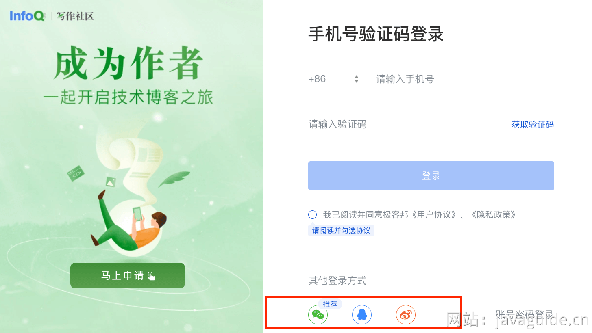
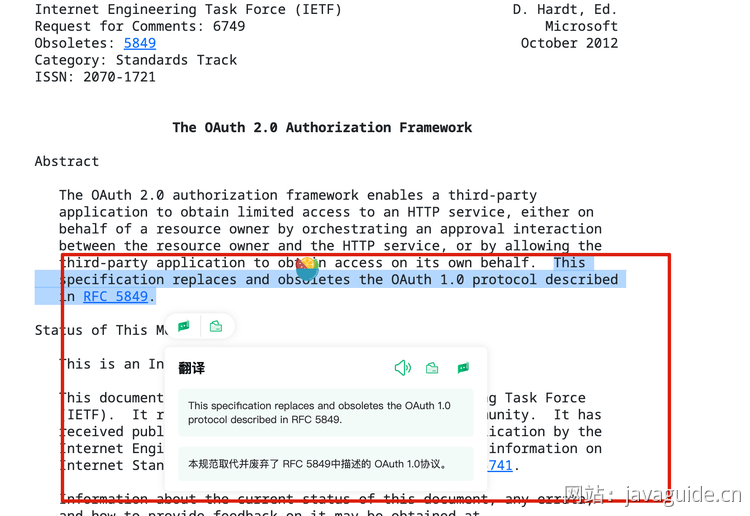
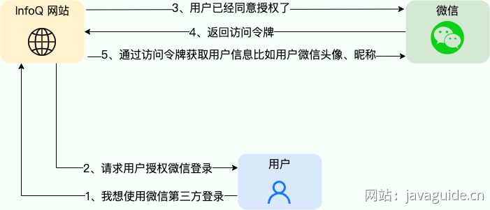
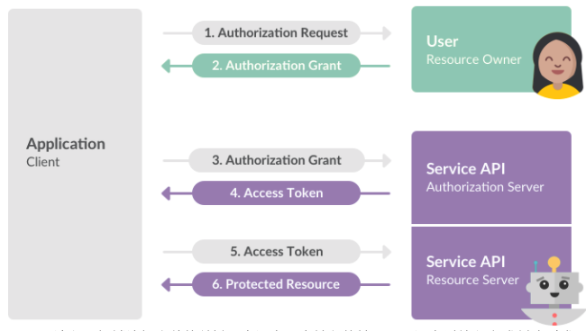
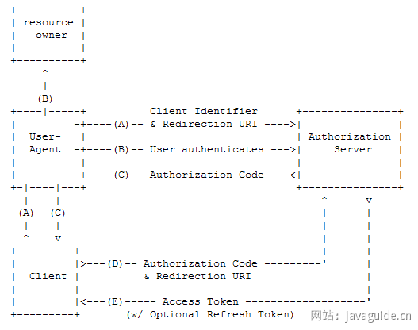
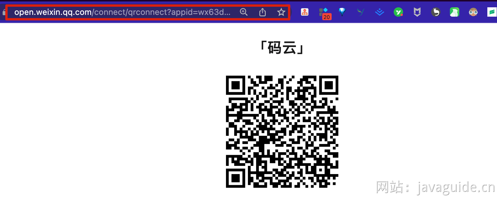
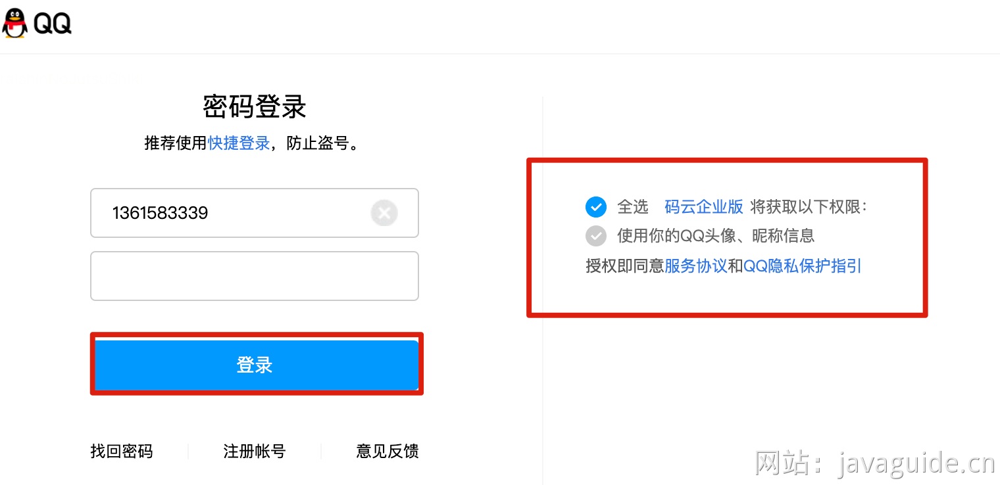
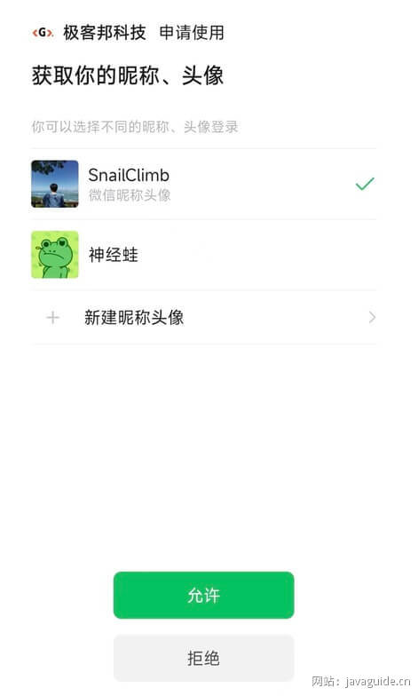
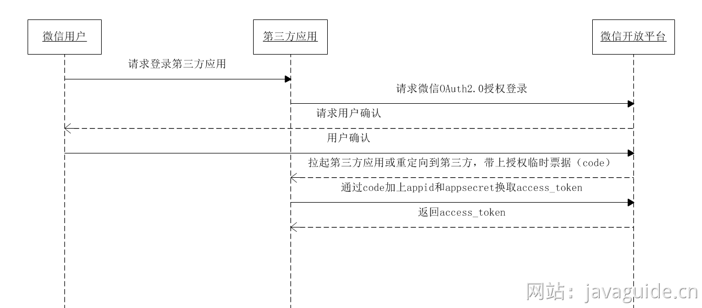

# 如何实现第三方授权登录？

# 如何实现第三方授权登录？
面试中，第三方授权登录是场景题常考的一个知识点。

第三方授权登录具体的问法，常见的如下面这些形式：

+ 如何实现第三方授权登录？
+ 如果我们的网站要对接第三方登录，你该怎么做？
+ 如何快速接入一个新开发的网站，让公司内部的员工可以访问？
+ 如何让别人的应用支持使用我们的产品进行第三方登录？
+ ......

考虑到很多同学还不清楚第三方授权登录的基本知识，因此，这篇文章会从基础开始讲起，最后我会给出一个面试回答的简易版本。

⚠️注意：需要掌握第三方授权登录的原理也就是具体的验证流程。

下面是正文内容。

### OAuth 2.0 介绍
简单来说，第三方授权登录就是直接通过已有的第三方平台账号登录对应的网站或应用，而不需要从头开始注册账号。第三方授权登录的用户体验非常好，安全性也得到了增加。

常见的第三方平台如国内的 QQ、微信、支付宝、微博、Github、Gitee 等等，国外的 Google、Facebook、Twitter、StackOverflow 等等。如下图所示，Infoq 写作社区的登录方式就支持 QQ、微信、微博这三种第三方授权登录方式。

绝大部分网站或应用，只需要集成微信和 QQ 这两种第三方授权登录的方式就完全够了。对于程序员群体占主体的网站或应用，建议还需集成Github和Gitee 这两种。

第三方授权登录一般是通过**OAuth**来做的，这是一个行业标准授权协议，主要用来授权第三方应用获取有限的权限以访问受保护的资源（比如用户的信息）。也就是说，**OAuth 实际解决的是授权问题而不是认证问题**，一定不要搞混了 （对于认证和授权这两个基本概念不了解的同学，可以查看我写的[认证授权基础概念详解](https://javaguide.cn/system-design/security/basis-of-authority-certification.html)这篇文章，里面有详细介绍到）。

OAuth 2.0 是对 OAuth 1.0 的完全重新设计，OAuth 2.0 更快，更容易实现，OAuth 1.0 已经被废弃。详情请见：[RFC 6749](https://tools.ietf.org/html/rfc6749)。

不要把 OAuth 理解复杂了，实际上，它就是一种被广泛使用的授权机制，它的最终目的是为第三方应用颁发一个有时效性的令牌 Token，使得第三方应用能够通过该令牌获取用户在其他服务提供者（比如微信、QQ ）上相关的资源（比如用户的信息）。

下图是我绘制的一张展示 InfoQ网站使用微信第三方登录的简单原理图。

不过，OAuth 2.0 协议不仅仅能做第三方授权登录，这只是其最常见的一个应用场景，还有一个常见场景**开放接口的调用**也可以基于 OAuth 2.0 协议来做。

我们这里以第三方授权登录为引子，开放接口的调用的原理也是类似的。

下图是[Slack OAuth 2.0 第三方授权登录](https://api.slack.com/legacy/oauth)的示意图：

简单解释一下上图涉及到的一些角色：

+ **Client**：客户端/第三方应用，指需要被授权访问 Resource Owner 的资源的客户端/第三方应用，通常是一个 Web 应用或者移动应用，比如这里接入微信登录的 Infoq 写作社区就是 Client。
+ **Resource Owner**：资源拥有者，指具有权利授予对其资源进行访问的用户，比如某个微信帐号的拥有者。
+ **Authorization Server**：认证服务器，负责处理客户端的授权请求并颁发访问令牌（Access Token），以便其获取用户资源。像微信、QQ、支付宝等第三方平台都配置的有对应的 Authorization Server 。
+ **Resource Server**：资源服务器，负责存储受保护的资源，并负责对客户端请求的访问令牌的有效性进行验证，以确保客户端有权访问请求的资源。微信、QQ、支付宝等第三方平台都配置的有对应的 Resource Server 。

搞清楚这些角色对于我们后续后面理解 OAuth 2.0 的原理非常有帮助。

其中，Resource Owner 和 Authorization Server 这两者都是第三方平台需要维护的，客户端/第三方应用只需要按照第三方平台的规则对接即可。

OAuth 2.0 第三方授权登录的基本流程如下：

+ 客户端向资源拥有者也就是用户发送授权申请。
+ 用户同意给予客户端授权。
+ 客户端使用上一步获得的授权，向认证服务器申请 Access Token（访问令牌）。
+ 认证服务器对客户端进行认证以后，确认无误，同意发放 Access Token。
+ 客户端使用 Access Token，向资源服务器申请获取资源。
+ 资源服务器确认 Access Token 无误，同意向客户端开放资源。

### OAuth2.0 授权模式
OAuth2.0 的核心是认证服务器向第三方颁发令牌，其根据不同的互联网应用场景，定义了一下四种允许第三方应用获取令牌的模式：

+ **授权码模式**：授权码模式是 OAuth 2.0 中最常用的模式之一，也是最安全的一种模式。在这种模式下，客户端先申请一个 Authorization Code（授权码），然后再用该码获取 Access Token（访问令牌）。
+ **隐藏/简化模式**：隐藏/简化模式是一种简化的授权码模式，这种方式没有申请 Authorization Code 这个中间步骤，直接将 Access Token 传递给客户端，所以称为隐藏/简化模式。
+ **密码模式**：密码模式是一种在用户信任客户端的情况下使用的模式，因为客户端需要直接从用户那里获取用户名和密码，并将其作为 Client Credentials（客户端凭证）发送到认证服务器来换取访问令牌。但是，这可能会使用户的密码泄露，因此应该谨慎使用。
+ **客户端凭证模式**：客户端凭证模式是一种不基于用户的认证模式，它允许客户端直接使用 Client Credentials 向认证服务器请求令牌。

这里我们主要介绍一下最常使用也是最安全的授权码模式，微信、QQ 等第三方平台授权登录就是使用的这种模式。实际面试中，我们详细介绍一种自己最了解的授权码模式就足够了。

其他三种授权码模式，这里就不详细介绍了，感兴趣的同学可以自己查阅资料研究学习。

### 授权码模式的授权验证流程
授权码模式的授权验证流程示意图如下（图片来源：[OAuth2.0 协议草案 V21 的 4.1 节](http://tools.ietf.org/html/draft-ietf-oauth-v2-21)）

整个流程主要分为以下六步：

**1、客户端请求授权**

用户访问客户端（第三方应用），客户端引导（重定向）用户的代理（浏览器）去到认证服务器的授权页面，这个时候客户端会在 URI 上附上 Client ID（客户端 ID，用于唯一标识）、Rediection URI（重定向 URI）和 Response Type（响应类型）、Scope（授权作用范围）等信息。

微信登录的请求授权页面的 URI 示例：[https://open.weixin.qq.com/connect/qrconnect?appid=APPID&redirect_uri=REDIRECT_URI&response_type=code&scope=SCOPE&state=STATE#wechat_redirect](https://open.weixin.qq.com/connect/qrconnect?appid=APPID&redirect_uri=REDIRECT_URI&response_type=code&scope=SCOPE&state=STATE#wechat_redirect)。

我们可以任意打开一个支持微信登录的网站测试一下，微信扫码即可验证。

QQ 登录的请求授权页面的 URI 示例：

[https://graph.qq.com/oauth2.0/authorize?response_type=code&client_id=[YOUR_APPID]&redirect_uri=[YOUR_REDIRECT_URI]&scope=[THE_SCOPE]](https://graph.qq.com/oauth2.0/authorize?response_type=code&client_id=%5BYOUR_APPID%5D&redirect_uri=%5BYOUR_REDIRECT_URI%5D&scope=%5BTHE_SCOPE%5D)

我们可以任意打开一个支持微信登录的网站测试一下，同时支持密码和扫码登录。

**2、认证服务器要求用户授权**

认证服务器验证客户端身份和访问权限，并要求用户提供认证信息进行身份验证，确定用户是否授权请求。

**3、用户同意授权，认证服务器返回 Authorization Code**

用户同意授权后，认证服务器将 Authorization Code（授权码）传递给客户端，客户端收到 Authorization Code 后可以使用它来请求 Access Token。

**4、客户端使用授权码申请访问令牌**

客户端使用 Authorization Code 向认证服务器申请 Access Token，这个时候客户端会在 URI 上附上 Client ID、Client Secret Key （客户端秘钥）Authorization Code 和 Rediection URI 等信息。

**5、认证服务器颁发 Access Token**

认证服务器认证客户端，检验 Authorization Code 以及 Rediection URI，检验成功后发放 Access Token 以及 Refresh Token（刷新令牌，可选）。

**6、访问资源服务器对应的资源**

客户端使用访问令牌向资源服务器请求被保护的资源。

#### 什么情况下 Access Token 应该失效？
除了过期之外，下面这三种情况 Access Token 也应该失效：

+ 用户修改帐户密码。
+ 用户冻结或者注销帐号。
+ 用户取消对改第三方应用授权。

#### Authorization Code 一般有效期多久？
Authorization Code 有效期应该设置得尽可能短，以提高安全性。一般来说，推荐将 Authorization Code 的有效期设置为 5~20 分钟。并且，Authorization Code 通常只能使用一次，不可重复使用。

#### 除了 Access Token 之外，为什么还有一个 Refresh Token 呢？
这是因为 Access Token 只是向资源服务器申请获取资源的凭证，其有效期一般较短，通常在 2~3 个小时。当 Access Token 超时后，可以使用 Refresh Token 进行刷新，比如为 Refresh Token 的有效期较长一点比如 6 小时。

Refresh Token 刷新结果有两种：

+ 若 Access Token 已超时，那么进行 Refresh Token 会获取一个新的 Access Token，新的超时时间；
+ 若 Access Token 未超时，那么进行 Refresh Token 不会改变 Access Token，但超时时间会刷新，相当于续期 Access Token。

面试中，面试官还可能会要求我们结合一个具体的场景聊第三方授权登录，比如最常用的微信登录。

整体的流程和原理和我们上面提到的差不多，只是个别传递和返回数据不同，具体可以参考微信官方文档：[网站应用微信登录开发指南](https://developers.weixin.qq.com/doc/oplatform/Website_App/WeChat_Login/Wechat_Login.html)，上面介绍的很详细。

### 第三方登录开源组件
实际项目中，我们可以借助第三方授权登录的开源工具类库来提高开发效率。尤其是在需要对接的第三方登录平台比较多的时候，第三方登录开源组件可以帮助我们节省很多时间。

这里以国内比较有名的 JustAuth 为例。JustAuth 支持 Github、Gitee、今日头条、支付宝、新浪微博、微信、飞书、Google、Facebook、Twitter、StackOverflow 等第三方平台的授权登录，几乎涵盖了所有的常见第三方平台。

**JustAuth 支持的第三方平台概览：**

并且，它还支持自定义 State 缓存、各种分布式缓存组件以及自定义 OAuth 平台。

+ 项目地址 :[https://github.com/justauth/JustAuth](https://github.com/justauth/JustAuth)
+ 官方文档 :[https://justauth.wiki/](https://justauth.wiki/)
+ 示例项目：[https://github.com/justauth/JustAuth-demo](https://github.com/justauth/JustAuth-demo)

### 自定义授权服务
如果我们想要让别人的应用支持使用我们的产品进行第三方登录的话，我们可以基于 OAuth2.0 实现授权服务。

根据我们前面提到的 OAuth 2.0 第三方授权登录的基本流程，我们需要实现以下两个服务器：

+ 认证服务器：处理第三方应用的授权请求并颁发访问令牌（Access Token），以便其获取用户资源，需要单独开发，可以和资源服务器放在一个项目中，也可以单独起一个独立的项目。认证服务器的职责其实很简单，主要就是提供认证接口，认证通过后返回生成 Access Token。
+ 资源服务器：负责存储受保护的资源（比如用户信息）。通过对第三方应用请求的 Access Token 的有效性进行验证，以确保第三方应用有权访问请求的资源。我们可以将我们的原系统看作是一个简易的资源服务器，只是还未实现 Access Token 的有效性验证以及接口访问权限的校验而已。由于微服务项目最终对外暴露的只有网关服务一个端口，所有的请求都会经过网关路由转发到内网微服务上，因此具体的校验流程可以放到网关这一层。

## 如何实现扫码登录？
参考答案：

+ [聊聊二维码扫码登录的原理](https://mp.weixin.qq.com/s/odkqiHVnzHXKZuHQRNnWug)
+ [聊一聊二维码扫描登录原理](https://juejin.im/entry/5e83e7ae51882573ba2074c8)

## 一个系统用户登录信息保存在服务器 A 上，服务器 B 如何获取到 Session 信息？
> 对于 Session 的基本概念不了解的同学，可以查看我写的[认证授权基础概念详解](https://javaguide.cn/system-design/security/basis-of-authority-certification.html)这篇文章，里面有详细介绍到。
>

这道问题的本质是在问分布式 Session 共享的解决方案。

正如题目描述的那样，假设一个系统用户登录信息保存在服务器 A 上，该系统用户通过服务器 A 登录之后，需要访问服务器 B 的某个登录的用户才能访问的接口。假设 Session 信息只保存在服务器 A 上，就会导致服务器 B 认为该用户并未登录。因此，我们需要让 Session 信息被所有的服务器都能访问到，也就是**分布式 Session 共享**。

常见的分布式 Session 共享的解决方案有下面这几种（这里介绍三种最常见也是比较有代表性的）：

**1、Session 复制（实际项目中不会采用这种方案）**

用户第一次访问某个服务器时，该服务器创建一个新的 Session，并将该 Session 的数据复制到其他服务器上。这样，在用户的后续请求中，无论访问哪个服务器，都可以访问到相同的 Session 数据。

+ 优点：数据安全（即使某些服务器宕机，也不会导致 Session 数据的丢失）
+ 缺点：实现相对比较复杂、效率很低（尤其是服务器太多的情况下，Session 复制的成本太高）、内存占用大（每个服务器都需要保存相同的 Session 数据）、数据不一致性问题（由于数据同步存在时间延迟，服务器之间的 Session 数据可能存在短暂的不一致）

**2、数据库保存（不推荐）**

将 Session 数据存储到共享的数据库中，所有的服务器都可以访问。

+ 优点：数据安全（数据库通常自带多种保障数据安全的措施比如数据备份）
+ 缺点：存在性能瓶颈（受限于数据库，还会增加数据库的负担）、实现复杂（需要手动实现 Session 的淘汰更新逻辑）

**3、分布式缓存保存（推荐）**

将 Session 数据存储到分布式缓存比如 Redis 中，所有的服务器都可以访问。

这是目前最广泛使用的方案。

+ 优点：性能优秀、支持横向扩展（如 Redis 集群）
+ 缺点：存在数据丢失风险（虽然 Redis 支持多种数据持久化方式，但仍然可能会丢失小部分数据）

> 更新: 2024-01-04 18:39:06  
原文: [https://www.yuque.com/vip6688/neho4x/kst5v2nr24ih95bl](https://www.yuque.com/vip6688/neho4x/kst5v2nr24ih95bl)
>

> 更新: 2024-11-25 09:25:25  
> 原文: <https://www.yuque.com/neumx/laxg2e/c5e5a3c6c5bfdb54eaef821f24960603>