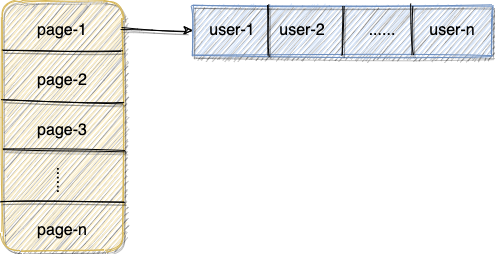

# 如何统计网站UV？

# 如何统计网站UV？
我们先来聊聊描述系统活跃度常用的一些指标。

## 系统活跃度常用指标
我们先来看几个经常用来描述系统活跃度的名词：**PV、UV、VV、IP**。

🌰举个栗子：假如你在家用 ADSL 拨号上网，早上 9 点访问了[JavaGuide](https://github.com/Snailclimb/JavaGuide)下的 2 个页面，下午 2 点又访问了 JavaGuide 下的 3 个页面。那么，对于 JavaGuide 来说，今天的 PV、UV、VV、IP 各项指标该如何计算？

+ PV 等于上午浏览的 2 个页面和下午浏览的 3 个页面之和，即 PV = 2 + 3
+ UV 指独立访客数，一天内同一访客的多次访问只计为 1 个 UV，即 UV = 1
+ VV 指访客的访问次数，上午和下午分别有一次访问行为，即 VV = 2
+ IP 为独立 IP 数，由于 ADSL 拨号上网每次都 IP 不同，即 IP = 2

### PV(Page View)
**PV(Page View)即页面浏览量**。每当一个页面被打开或者被刷新，都会产生一次PV。一般来说，PV与来访者的数量成正比，但是PV并不直接决定页面的真实来访者数量，如果一个来访者通过不断的刷新页面或是使用爬虫访问，也可以制造出非常高的PV。

我上面介绍的只是最普通的一个 PV 的计算方式。实际上，PV 的计算规则有很多种。就比如微信公众号的一篇文章，在一段时间内，即使你多次刷新也不会增加阅读量。这样做的好处就是：更能反映出点开文章的真实用户群体的数量了。

总结 ：**PV 能够反映出网站的页面被网站用户浏览/刷新的次数**。

### UV(Unique Visitor)
**UV(Unique Visitor)即独立访客**。1 天内相同访客多次访问网站，只计算为 1 个独立访客。UV 是从用户个体的角度来统计的。

总结：**UV 主要用来统计 1 天内访问某站点的用户数**。

### VV (Visit View)
**VV (Visit View)即访客访问的次数**。当访客完成所有的浏览并最终关掉该网站的所有页面时，便完成了一次访问。

总结：**VV 主要用来记录网站用户在一天内访问你的站点的次数**。

### IP
**IP 即独立 IP 访问数。**一天内使用不同 IP 地址的用户访问网站的次数，同一 IP 多次访问计数均为 1。

## 为什么要进行 PV&UV 统计？
大部分网站都会进行 PV&UV 的统计。就比如说咱们的 Github 的项目就自带 PV&UV 统计。下面这张图就是 JavaGuide 这个开源项目最近这段时间的 PV 和 UV 的趋势图。


通过这张图，我可以清楚地知道我的项目访问量的真实情况。

简单来说，网站进行 PV&UV 统计有下面这些好处：

+ PV 和 UV 的结合更能反映项目的真实访问量，有助于我们更了解自己的网站，对于我们改进网站有指导意义。比如咱们网站的某个网页访问量最大，那我们就可以对那个网页进行优化改进。再比如我们的网站在周末访问量比较大，那我们周末就可以多部署一个服务来提高网站的稳定性和性能。
+ PV 和 UV 的结合可以帮助广告主预计投放广告可以带来的流量。

## 如何基于 Redis 统计 UV？
PV的统计不涉及到数据的去重，而UV的计算需要根据IP地址或者当前登录的用户来作为去重标准。因此，PV的统计相对于UV的统计来说更为简单一些。

因此我会重点介绍UV的统计。

最简单的办法就是：为每一个网页维护一个哈希表，网页 ID +日期 为 Key, Value 为看过这篇文章的所有用户 ID 或者 IP（Set 类型的数据结构）。

当我们需要为指定的网页增加 UV ，首先需要判断对应的用户 ID 或者 IP 是否已经存在于对应的 Set 中。

示意图如下：



当我们需要计算对应页面的 UV 的话，直接计算出页面对应的`Set`集合的大小即可！

这种方式在访问量不是特别大的网站，还是可以满足基本需求的。

但是，如果网站的访问量比较大，这种方式就不能够满足我们的需求了！

试想一下：如果网站的一个页面在一天之内就有接近 100w +不同用户访问的话，维护一个包含 100w+ 用户 ID 或者 用户 IP 的Set在内存中，还要不断的判断指定的用户 ID 或者 用户 IP 是否在其中，消耗还是比较大的，更何况这还是一个页面！

有没有对内存消耗比较小，又有类似Set功能的数据结构呢？

答案是有的！这个时候我们就需要用到`**HyperLogLog**`了！

其实，`HyperLogLog`是一种基数计数概率算法 ,并不是 Redis 特有的。Redis 只是实现了这个算法并提供了一些开箱即用的 API。

Redis 提供的`HyperLogLog`占用空间非常非常小（基于稀疏矩阵存储）， 12k 的空间就能存储接近`2^64`个不同元素。

不过，`HyperLogLog`的计算结果并不是一个精确值，存在一定的误差，这是由于它本质上是用概率算法导致的。

但是，一般我们在统计 UV 这种数据的时候，是能够容忍一定范围内的误差的（标准误差是 0.81%，这对于 UV 的统计影响不大，可以忽略不计）。我们更关注的是这种方法能够为我们节省宝贵的服务器资源。

使用 `RedisHyperloglog`进行 UV 统计，我们主要会使用到以下三个命令：

+ **PFADD key values**: 用于数据添加，可以一次性添加多个。添加过程中，重复的记录会自动去重。
+ **PFCOUNT key**: 对 key 进行统计。
+ **PFMERGE destkey sourcekey1 sourcekey2**: 合并多个统计结果，在合并的过程中，会自动去重多个集合中重复的元素。

**具体是怎么做的呢？**

1、将访问指定页面的每个用户 ID 添加到`HyperLogLog`中。

```powershell
PFADD PAGE_1:UV USER1 USER2 ...... USERn
```

2、统计指定页面的 UV。

```powershell
PFCOUNT PAGE_1:UV
```

`HyperLogLog`除了上面的`PFADD`和`PFCOIUNT`命令外，还提供了`PFMERGE`，将多个`HyperLogLog`合并在一起形成一个新的`HyperLogLog`值。

```powershell
PFMERGE destkey sourcekey [sourcekey ...]
```

我们来用 Java 写一个简单的程序来实际体验一下，顺便来对比一下`Set`和`HyperLogLog`这两种方式。

我们这里使用[Jedis](https://github.com/redis/jedis)提供的相关 API。

直接在项目中引入 Jedis 相关的依赖即可：

```xml
<dependency>
    <groupId>redis.clients</groupId>

    <artifactId>jedis</artifactId>

    <version>3.6.0</version>

</dependency>

```

代码如下，我们循环添加了 10w 个用户到指定`Set`和`HyperLogLog`中。

```java
public class HyperLogLogTest {
    private Jedis jedis;
    private final String SET_KEY = "SET:PAGE1:2021-12-19";
    private final String PF_KEY = "PF:PAGE2:2021-12-19";
    private final long NUM = 10000 * 10L;

    @BeforeEach
    void connectToRedis() {
        jedis = new Jedis(new HostAndPort("localhost", 6379));
    }

    @Test
    void initData() {
        for (int i = 0; i < NUM; ++i) {
            System.out.println(i);
            jedis.sadd(SET_KEY, "USER" + i);
            jedis.pfadd(PF_KEY, "USER" + i);
        }
    }

    @Test
    void getData() {
        DecimalFormat decimalFormat = new DecimalFormat("##.00%");
        Long setCount = jedis.scard(SET_KEY);
        System.out.println(decimalFormat.format((double) setCount / (double)NUM));
        long pfCount = jedis.pfcount(PF_KEY);
        System.out.println(decimalFormat.format((double) pfCount / (double)NUM));

    }

}
```

输出结果：

```powershell
100.00%
99.27%
```

从输出结果可以看出Set可以非常精确的存储这 10w 个用户，而HyperLogLog有一点点误差，误差率大概在 0.73% 附近。

我们再来对比一下两者的存储使用空间。

```powershell
127.0.0.1:6379>  debug object PF:PAGE2:2021-12-19
Value at:0x7f7e81c77ec0 refcount:1 encoding:raw serializedlength:10523 lru:14343834 lru_seconds_idle:1288
127.0.0.1:6379> debug object SET:PAGE1:2021-12-19
Value at:0x7f7e81c77eb0 refcount:1 encoding:hashtable serializedlength:988895 lru:14344138 lru_seconds_idle:1009
```

> 我们可以通过`debug object key`命令来查看某个 key 序列化后的长度。输出的项的说明：
>
> + Value at ：key 的内存地址
> + refcount ：引用次数
> + encoding ：编码类型
> + serializedlength：序列化长度(单位是 Bytes)
> + lru_seconds_idle：空闲时间
>
> 不过，你需要注意的是 serializedlength 仅仅代表 key 序列化后的长度（持久化本地的时候会用到），并不是 key 在内存中实际占用的长度。不过，它也侧面反应了一个 key 所占用的内存，可以用来比较两个 key 消耗内存的大小。
>

从上面的结果可以看出内存占用上，`Hyperloglog`消耗了 10523 bytes ≈ 10kb，而`Set`消耗了

988895 bytes ≈ 965kb （粗略估计，两者实际占用内存大小会更大）。

可以看出，仅仅是 10w 的数据，两者消耗的内存差别就这么大，如果数据量更大的话，两者消耗的内存的差距只会更大！

我们这里再拓展一下：**假如我们需要获取指定天数的 UV 怎么办呢？**

其实，思路很简单！我们在 key 上添加日期作为标识即可！

```powershell
PFADD PAGE_1:UV:2021-12-19 USER1 USER2 ...... USERn
```

**那假如我们需要获取指定时间（精确到小时）的 UV 怎么办呢？**

思路也一样，我们在 key 上添加指定时间作为标识即可！

```java
PFADD PAGE_1:UV:2021-12-19-12 USER1 USER2 ...... USERn
```

## 后记
除了上面介绍到的方案之外，Doris 、ClickHouse 等用于联机分析(OLAP)的列式数据库管理系统(DBMS)现在也经常用在统计相关的场景。比如说百度的百度统计（网站流量分析）就是基于 Doris 做的，再比如说 Yandex（俄罗斯的一家做搜索引擎的公司）的在线流量分析产品就是用自家的 ClickHouse 做的。


> 更新: 2024-01-04 19:24:48  
原文: [https://www.yuque.com/vip6688/neho4x/lwih9uwwu0tm6w8u](https://www.yuque.com/vip6688/neho4x/lwih9uwwu0tm6w8u)
>


> 更新: 2024-11-25 09:25:27  
> 原文: <https://www.yuque.com/neumx/laxg2e/ea18685e53390d3977b205c4abf619a4>